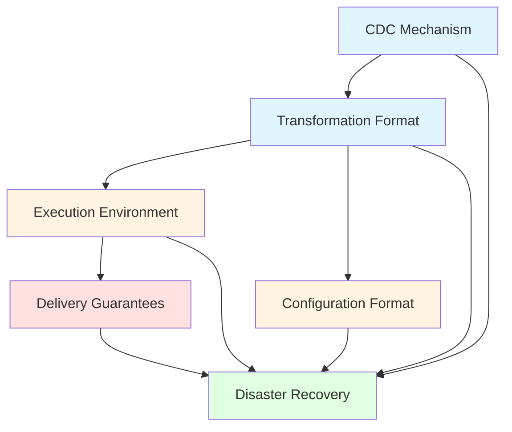

# Architectural Proposals

This folder contains detailed architectural proposals for the Retail Data Streaming platform. Each proposal investigates a specific technical decision area, evaluates multiple options, and provides a recommendation based on platform requirements and persona needs.

## Proposal Status

All proposals are in **Draft** status and require review and validation through proof-of-concept (POC) implementations.

## Available Proposals

| Proposal | Question Addressed | Recommendation | Key Trade-offs |
|----------|-------------------|----------------|----------------|
| [Transformation Format](transformation-format.md) | How should transformations be packaged and executed? | **Binary assemblies** (compiled .NET DLLs) | Performance & type safety vs. flexibility |
| [CDC Mechanism](cdc-mechanism.md) | How should change data capture work from source databases? | **.NET-native CDC** (custom implementation) | Control & integration vs. maturity |
| [Execution Environment](execution-environment.md) | Where and how should transformations run? | **.NET Worker Services + Hangfire** | Simplicity & .NET integration vs. scalability |
| [Configuration Format](configuration-format.md) | How should workflows and mappings be configured? | **Hybrid YAML+JSON** (YAML for workflows, JSON for schemas) | Readability vs. validation |
| [Delivery Guarantees](delivery-guarantees.md) | What delivery semantics should the platform provide? | **Idempotent keys + configurable** (at-least-once default, exactly-once optional) | Reliability vs. complexity |
| [Disaster Recovery](disaster-recovery.md) | How should the platform handle failures and disasters? | **Multi-region active-passive** (Kafka replication + MirrorMaker) | Availability & data durability vs. cost |

## Reading Order

For best understanding of the platform architecture:

1. **Start here**: [Transformation Format](transformation-format.md) - Establishes the execution model
2. [CDC Mechanism](cdc-mechanism.md) - Defines data ingestion approach
3. [Execution Environment](execution-environment.md) - Describes runtime infrastructure
4. [Configuration Format](configuration-format.md) - Explains how workflows are defined
5. [Delivery Guarantees](delivery-guarantees.md) - Clarifies data delivery semantics
6. **Finish here**: [Disaster Recovery](disaster-recovery.md) - Integrates all proposals into resilience strategy

## Proposal Structure

Each proposal follows a consistent format:

- **Executive Summary**: Quick overview and recommendation
- **Problem Statement**: Requirements and constraints from personas
- **Options Analysis**: 3-5 alternatives with detailed comparison
- **Recommendation**: Chosen option with justification
- **Implementation Strategy**: Phased rollout plan
- **Open Questions**: Items requiring POC validation
- **Next Steps**: Actions to move forward

## Cross-Proposal Dependencies

**Legend**:
- Blue: Data ingestion decisions
- Yellow: Execution & configuration decisions
- Red: Delivery semantics decisions
- Green: Cross-cutting resilience decisions

## Key Principles

All proposals adhere to these platform principles:

1. **.NET Ecosystem First**: Leverage .NET technologies and patterns where possible
2. **Cloud-Agnostic**: Avoid vendor lock-in; support multiple cloud providers
3. **Persona-Driven**: Satisfy requirements from clients, developers, platform team, QA, and product owners
4. **Incremental Adoption**: Allow gradual migration and feature rollout
5. **Testability**: All components must be testable in isolation and integration
6. **Observability**: Built-in logging, metrics, and tracing from day one

## Next Steps

1. **Architecture Review** (Week 1-2): Present proposals to stakeholders and gather feedback
2. **POC Planning** (Week 3): Identify critical unknowns and design validation experiments
3. **POC Execution** (Week 4-8): Implement and test key architectural decisions
4. **Decision Gate** (Week 9): Finalize recommendations and proceed to detailed design
5. **Implementation** (Week 10+): Begin platform development with approved architecture

## Related Documentation

- [Architecture Overview](../proposals/architecture-overview.md): High-level platform vision and open questions
- [Personas](../../personas/README.md): Stakeholder requirements and constraints

---

**Last Updated**: November 15, 2025  
**Status**: All proposals complete, pending review
