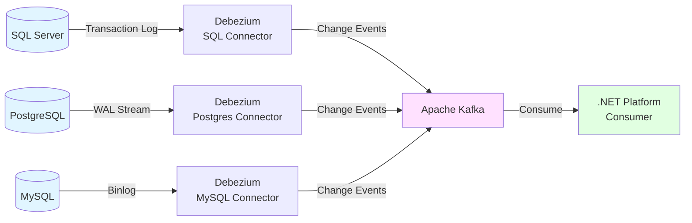
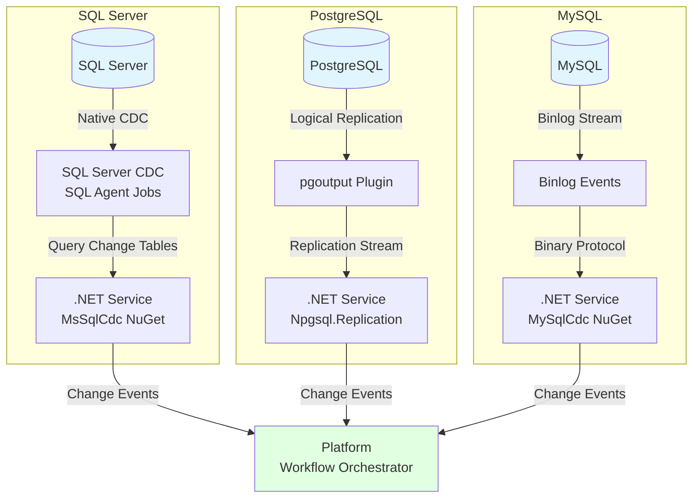
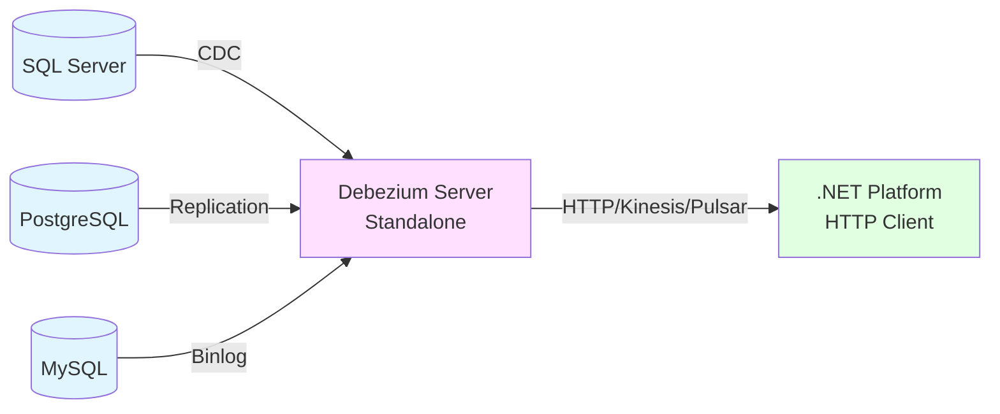
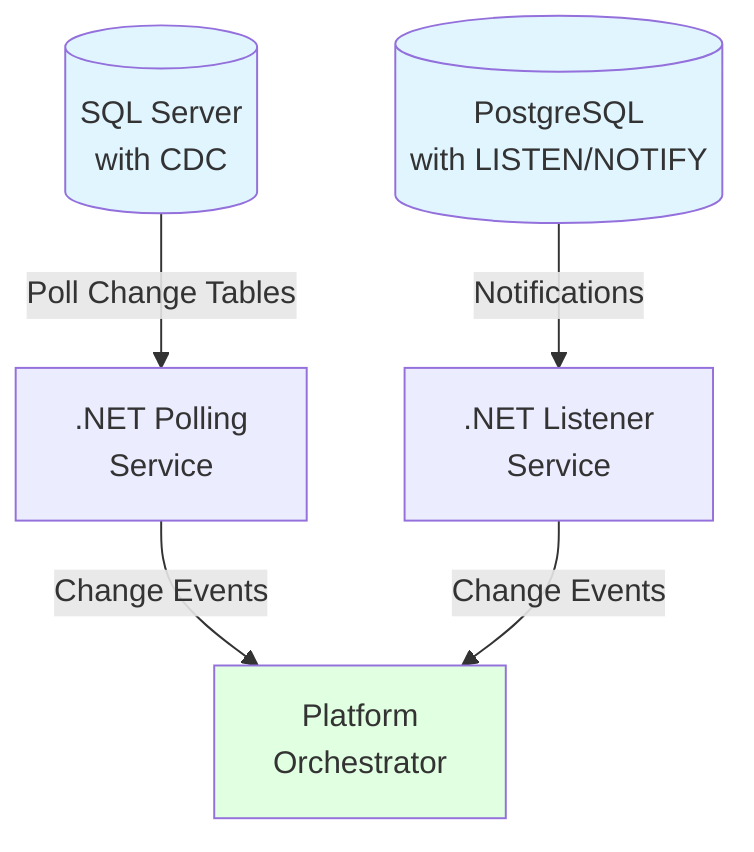

# Proposal: Change Data Capture (CDC) Mechanism Options

**Status**: Draft  
**Created**: 2025-11-15  
**Context**: [Architecture Overview - Open Question #2](../architecture-overview.md#open-questions)

---

## Problem Statement

The platform requires a reliable mechanism to capture database changes in real-time and stream them to the transformation pipeline. The solution must:

1. **Capture data changes** (INSERT, UPDATE, DELETE) from source databases
2. **Minimize performance impact** on source databases
3. **Guarantee data consistency** and ordering
4. **Support multiple database vendors** (SQL Server, PostgreSQL, MySQL, etc.)
5. **Provide reliable delivery** with no data loss
6. **Enable resumability** after failures or restarts

This decision impacts:
- Platform architecture complexity
- Database performance and resource usage
- Reliability and data consistency guarantees
- Multi-database vendor support
- Operational overhead

---

## Constraints from Personas

### Must Satisfy

| Persona | Requirement |
|---------|-------------|
| **Client** | No database performance degradation, transparent operations |
| **Functional Dev** | Clear observability, ability to validate data capture locally |
| **Functional QA** | Test CDC behavior in staging environment, production parity |
| **Platform Team** | Reliable capture mechanism, multi-vendor support, operational simplicity |
| **Platform QA** | Automated testing, regression coverage, backward compatibility validation |
| **Product Owner** | Scalable solution, supports multiple clients/databases |

### Must Avoid

- **Platform coupling** that prevents functional team from testing transformations independently
- **Opaque failures** where CDC issues are unclear to functional developers
- **Breaking changes** to CDC format that invalidate existing transformations
- **Test environment drift** between staging and production CDC behavior
- **Monitoring blind spots** where CDC failures go undetected
- Database performance degradation affecting application operations
- Vendor lock-in to specific database or cloud platforms

---

## Options Analysis

### Option 1: Debezium (Industry Standard)

**Description**: Open-source distributed platform for CDC built on Kafka Connect. Supports multiple database connectors and provides a standardized change event format.



#### Technology Stack

| Component | Technology | Purpose |
|-----------|------------|---------|
| **Core Platform** | [Debezium](https://debezium.io/) (Java) | CDC connectors for multiple databases |
| **Message Bus** | Apache Kafka | Event streaming and durability |
| **Connectors** | Kafka Connect | Plugin framework for Debezium |
| **.NET Consumer** | [Confluent.Kafka](https://www.nuget.org/packages/Confluent.Kafka/) | Consume events from Kafka |
| **Deployment** | Docker/Kubernetes | Container orchestration |

#### Supported Databases

- ✅ **SQL Server** (2017+)
- ✅ **PostgreSQL** (10+)
- ✅ **MySQL** (5.7+, 8.0+)
- ✅ **MariaDB** (10.1+)
- ✅ **MongoDB** (4.0+)
- ✅ **Oracle** (11g+, 12c+)
- ✅ **Db2**
- ✅ **Cassandra**

#### Capture Mechanism by Database

| Database | Capture Method | Configuration Required |
|----------|----------------|------------------------|
| **SQL Server** | Transaction log reader (CDC feature) | Enable CDC on database/tables |
| **PostgreSQL** | Logical replication (pgoutput) | Enable logical replication, create publication |
| **MySQL** | Binlog reader | Enable binlog with ROW format |
| **MariaDB** | Binlog reader | Enable binlog with ROW format |

#### Example: SQL Server Connector Configuration

```json
{
  "name": "sqlserver-connector",
  "config": {
    "connector.class": "io.debezium.connector.sqlserver.SqlServerConnector",
    "database.hostname": "client-db.example.com",
    "database.port": "1433",
    "database.user": "debezium_user",
    "database.password": "password",
    "database.dbname": "RetailDB",
    "database.server.name": "client-abc",
    "table.include.list": "dbo.Tickets,dbo.Products",
    "database.history.kafka.bootstrap.servers": "kafka:9092",
    "database.history.kafka.topic": "schema-changes.client-abc"
  }
}
```

#### .NET Consumer Example

```csharp
using Confluent.Kafka;
using Newtonsoft.Json.Linq;

var config = new ConsumerConfig
{
    BootstrapServers = "kafka:9092",
    GroupId = "retail-streaming-platform",
    AutoOffsetReset = AutoOffsetReset.Earliest,
    EnableAutoCommit = false
};

using var consumer = new ConsumerBuilder<string, string>(config).Build();
consumer.Subscribe("client-abc.dbo.Tickets");

while (true)
{
    var consumeResult = consumer.Consume(cancellationToken);
    var changeEvent = JObject.Parse(consumeResult.Message.Value);
    
    var operation = changeEvent["payload"]["op"].ToString(); // c=create, u=update, d=delete
    var before = changeEvent["payload"]["before"]; // State before change
    var after = changeEvent["payload"]["after"];   // State after change
    
    await ProcessChangeEvent(operation, before, after);
    
    consumer.Commit(consumeResult); // Manual commit for exactly-once semantics
}
```

#### Pros

- ✅ **Industry standard**: Battle-tested, 12K+ GitHub stars, large community
- ✅ **Multi-database support**: Single platform for all database vendors
- ✅ **Standardized format**: Consistent change event schema across databases
- ✅ **Kafka ecosystem**: Leverage Kafka's durability, scalability, partitioning
- ✅ **Exactly-once semantics**: Strong consistency guarantees
- ✅ **Schema evolution**: Tracks DDL changes automatically
- ✅ **Cloud-agnostic**: Runs on-premise or any cloud (AWS, Azure, GCP)
- ✅ **Production-ready**: Used by Netflix, Uber, LinkedIn, etc.
- ✅ **Comprehensive documentation**: Extensive guides and tutorials
- ✅ **Snapshotting**: Initial full snapshot + ongoing incremental changes

#### Cons

- ❌ **Operational complexity**: Requires Kafka cluster management
- ❌ **Java dependency**: Core platform is Java-based (but language-agnostic consumers)
- ❌ **Resource overhead**: Kafka cluster requires significant infrastructure
- ❌ **Learning curve**: Team needs Kafka/Debezium expertise
- ❌ **Latency**: Slight delay from database → Kafka → consumer (typically < 1 second)
- ❌ **.NET integration**: Consumes events in .NET but Debezium itself is Java

#### Industry Examples

- **Netflix**: Real-time analytics pipeline
- **Uber**: Database replication across data centers
- **WePay**: Event sourcing and CQRS
- **Convoy**: Data synchronization for microservices

#### Open-Source References

- [Debezium](https://github.com/debezium/debezium) - CDC platform
- [Debezium Examples](https://github.com/debezium/debezium-examples) - Sample deployments
- [Confluent.Kafka](https://github.com/confluentinc/confluent-kafka-dotnet) - .NET Kafka client
- [Debezium Tutorial](https://debezium.io/documentation/reference/stable/tutorial.html) - Getting started guide

---

### Option 2: .NET-Native CDC Libraries (Database-Specific)

**Description**: Use .NET libraries tailored to each database vendor, providing native integration without external platforms like Kafka.



#### Technology Stack by Database

##### SQL Server

| Component | Technology | Purpose |
|-----------|------------|---------|
| **CDC Feature** | SQL Server CDC (built-in) | Capture changes to tracked tables |
| **.NET Library** | [MsSqlCdc](https://www.nuget.org/packages/MsSqlCdc/) | Query CDC change tables |
| **Alternative** | [CDCSqlMonitor](https://www.nuget.org/packages/CDCSqlMonitor/) | Monitor CDC or Change Tracking |
| **Alternative** | SQL Agent + custom polling | Read change tables directly |

##### PostgreSQL

| Component | Technology | Purpose |
|-----------|------------|---------|
| **Logical Replication** | PostgreSQL pgoutput plugin (built-in) | Stream WAL changes |
| **.NET Library** | [Npgsql.Replication](https://www.npgsql.org/doc/replication.html) | Logical replication client |
| **Setup** | Publication + Replication Slot | Define replicated tables |

##### MySQL/MariaDB

| Component | Technology | Purpose |
|-----------|------------|---------|
| **Binlog** | MySQL binlog (built-in) | Transaction log replication |
| **.NET Library** | [MySqlCdc](https://www.nuget.org/packages/MySqlCdc/) | Binlog stream reader |
| **Setup** | Enable binlog with ROW format | Binary logging configuration |

#### Example: SQL Server CDC with MsSqlCdc

```csharp
using MsSqlCdc;
using System.Data.SqlClient;

// Enable CDC on database and table (one-time setup)
/*
EXEC sys.sp_cdc_enable_db;
EXEC sys.sp_cdc_enable_table
    @source_schema = N'dbo',
    @source_name = N'Tickets',
    @role_name = NULL;
*/

// .NET polling service
var connectionString = "Server=client-db;Database=RetailDB;User=cdc_user;Password=pwd;";

using var connection = new SqlConnection(connectionString);
await connection.OpenAsync();

// Query changes since last LSN
var fromLsn = GetLastProcessedLsn(); // Stored checkpoint
var toLsn = await GetMaxLsn(connection);

var changes = await GetChanges(connection, "dbo_Tickets", fromLsn, toLsn);

foreach (var change in changes)
{
    var operation = change["__$operation"]; // 1=delete, 2=insert, 3/4=update
    await ProcessChange(change);
}

await SaveCheckpoint(toLsn); // Persist progress
```

#### Example: PostgreSQL Logical Replication with Npgsql

```csharp
using Npgsql.Replication;
using Npgsql.Replication.PgOutput;
using Npgsql.Replication.PgOutput.Messages;

// Setup: CREATE PUBLICATION blog_pub FOR TABLE tickets;
// Setup: SELECT pg_create_logical_replication_slot('retail_slot', 'pgoutput');

var connString = "Host=client-db;Username=replication_user;Password=pwd;Database=RetailDB";
await using var conn = new LogicalReplicationConnection(connString);
await conn.Open();

var slot = new PgOutputReplicationSlot("retail_slot");
var options = new PgOutputReplicationOptions("blog_pub", protocolVersion: 1);

await foreach (var message in conn.StartReplication(slot, options, cancellationToken))
{
    switch (message)
    {
        case InsertMessage insert:
            await HandleInsert(insert);
            break;
        case UpdateMessage update:
            await HandleUpdate(update);
            break;
        case DeleteMessage delete:
            await HandleDelete(delete);
            break;
    }
    
    conn.SetReplicationStatus(message.WalEnd); // Acknowledge progress
}
```

#### Example: MySQL Binlog with MySqlCdc

```csharp
using MySqlCdc;
using MySqlCdc.Events;

// Setup: Set binlog_format = ROW in my.cnf
// Setup: Grant REPLICATION SLAVE, REPLICATION CLIENT to user

var client = new BinlogClient(options =>
{
    options.Hostname = "client-db.example.com";
    options.Port = 3306;
    options.Username = "replication_user";
    options.Password = "password";
    options.SslMode = SslMode.Required;
    options.Binlog = BinlogOptions.FromGtid(lastGtid); // Resume from checkpoint
});

await foreach (var (header, binlogEvent) in client.Replicate())
{
    switch (binlogEvent)
    {
        case TableMapEvent tableMap:
            await HandleTableMap(tableMap);
            break;
        case WriteRowsEvent insert:
            await HandleInsert(insert);
            break;
        case UpdateRowsEvent update:
            await HandleUpdate(update);
            break;
        case DeleteRowsEvent delete:
            await HandleDelete(delete);
            break;
    }
    
    await SaveGtidCheckpoint(client.State.Gtid); // Save progress
}
```

#### Pros

- ✅ **Native .NET**: No Java dependencies, pure .NET ecosystem
- ✅ **Lower infrastructure overhead**: No Kafka cluster required
- ✅ **Direct database integration**: Fewer moving parts, simpler architecture
- ✅ **Lower latency**: Direct stream from database to platform (milliseconds)
- ✅ **Simpler deployment**: .NET service + database, no middleware
- ✅ **Cloud-agnostic**: Works on-premise or any cloud
- ✅ **Team expertise**: Leverages existing .NET skills
- ✅ **Local testing**: Functional devs can run CDC locally with Docker databases
- ✅ **Transparent debugging**: Full .NET stack traces and logging

#### Cons

- ❌ **Per-database implementation**: Different library/approach for each vendor
- ❌ **Less mature**: Libraries have smaller communities (MySqlCdc: 135 stars, MsSqlCdc: 27K downloads)
- ❌ **Manual durability**: Must implement own checkpointing and fault tolerance
- ❌ **No standardized format**: Each database returns different event structures
- ❌ **Limited ecosystem**: Fewer tools, less documentation vs. Debezium
- ❌ **Scalability concerns**: No built-in partitioning like Kafka
- ❌ **Vendor-specific setup**: Requires deep knowledge of each database's CDC mechanism

#### Community Maturity

| Library | GitHub Stars | NuGet Downloads | Last Updated |
|---------|--------------|-----------------|--------------|
| **MySqlCdc** | 135 | 82K | Dec 2023 (Active) |
| **MsSqlCdc** | N/A (NuGet only) | 27K | May 2024 (Active) |
| **Npgsql.Replication** | Part of Npgsql (3.6K stars) | Included in Npgsql | Nov 2024 (Active) |

---

### Option 3: Hybrid Approach - Debezium Server + .NET Consumer

**Description**: Use Debezium Server (standalone mode without Kafka) to capture changes and stream them directly to .NET applications via HTTP or other protocols.



#### Technology Stack

| Component | Technology | Purpose |
|-----------|------------|---------|
| **CDC Engine** | [Debezium Server](https://debezium.io/documentation/reference/stable/operations/debezium-server.html) | Standalone CDC without Kafka |
| **Sink Options** | HTTP, Kinesis, Pulsar, Redis, etc. | Output destination |
| **.NET Consumer** | HttpClient / SignalR | Receive change events |
| **Deployment** | Docker container | Lightweight deployment |

#### Example: Debezium Server Configuration

```yaml
# application.properties
debezium.sink.type=http
debezium.sink.http.url=http://dotnet-platform:5000/api/cdc-events

debezium.source.connector.class=io.debezium.connector.sqlserver.SqlServerConnector
debezium.source.database.hostname=client-db.example.com
debezium.source.database.port=1433
debezium.source.database.user=debezium_user
debezium.source.database.password=password
debezium.source.database.dbname=RetailDB
debezium.source.table.include.list=dbo.Tickets,dbo.Products
```

#### .NET Consumer Example

```csharp
// ASP.NET Core API receiving Debezium events via HTTP
[ApiController]
[Route("api/[controller]")]
public class CdcEventsController : ControllerBase
{
    [HttpPost]
    public async Task<IActionResult> ReceiveEvent([FromBody] DebeziumChangeEvent changeEvent)
    {
        var operation = changeEvent.Payload.Op; // c, u, d
        var before = changeEvent.Payload.Before;
        var after = changeEvent.Payload.After;
        
        await _orchestrator.EnqueueChange(changeEvent);
        
        return Ok();
    }
}

public class DebeziumChangeEvent
{
    public ChangePayload Payload { get; set; }
}

public class ChangePayload
{
    public string Op { get; set; } // c=create, u=update, d=delete
    public JObject Before { get; set; }
    public JObject After { get; set; }
    public long TsMs { get; set; }
}
```

#### Pros

- ✅ **No Kafka**: Simpler infrastructure than full Debezium
- ✅ **Multi-database support**: Leverage Debezium's connectors
- ✅ **Standardized format**: Same event structure as Debezium
- ✅ **.NET-friendly**: HTTP/gRPC integration
- ✅ **Lower resource overhead**: Lighter than Kafka cluster
- ✅ **Cloud-agnostic**: Deploy anywhere

#### Cons

- ❌ **Java dependency**: Still requires JVM for Debezium Server
- ❌ **Limited durability**: No built-in event replay like Kafka
- ❌ **Manual fault tolerance**: Must implement own reliability mechanisms
- ❌ **Scalability limits**: Single server per database (no partitioning)
- ❌ **Less mature**: Debezium Server is newer than Kafka Connect mode

---

### Option 4: Native Database Features Only (SQL Server CDC, PostgreSQL Pub/Sub)

**Description**: Use built-in database CDC features and poll change tables directly without any external libraries or platforms.



#### SQL Server: Native CDC Polling

```csharp
// Poll CDC change tables directly
var query = @"
    SELECT *
    FROM cdc.fn_cdc_get_all_changes_dbo_Tickets(@from_lsn, @to_lsn, 'all')
    ORDER BY __$seqval";

using var cmd = new SqlCommand(query, connection);
cmd.Parameters.AddWithValue("@from_lsn", lastLsn);
cmd.Parameters.AddWithValue("@to_lsn", currentLsn);

using var reader = await cmd.ExecuteReaderAsync();
while (await reader.ReadAsync())
{
    var operation = reader["__$operation"]; // 1=delete, 2=insert, 3/4=update
    await ProcessChange(reader);
}
```

#### PostgreSQL: Triggers + NOTIFY

```sql
-- Create trigger to notify on changes
CREATE OR REPLACE FUNCTION notify_ticket_change()
RETURNS TRIGGER AS $$
BEGIN
    PERFORM pg_notify('ticket_changes', row_to_json(NEW)::text);
    RETURN NEW;
END;
$$ LANGUAGE plpgsql;

CREATE TRIGGER ticket_change_trigger
AFTER INSERT OR UPDATE OR DELETE ON tickets
FOR EACH ROW EXECUTE FUNCTION notify_ticket_change();
```

```csharp
// .NET listener
using var conn = new NpgsqlConnection(connectionString);
await conn.OpenAsync();

conn.Notification += (sender, args) =>
{
    var changeData = JsonConvert.DeserializeObject(args.Payload);
    await ProcessChange(changeData);
};

await using var cmd = new NpgsqlCommand("LISTEN ticket_changes", conn);
await cmd.ExecuteNonQueryAsync();

while (true)
{
    await conn.WaitAsync(); // Wait for notifications
}
```

#### Pros

- ✅ **Minimal infrastructure**: No external platforms required
- ✅ **Simplest architecture**: Direct database integration
- ✅ **No additional libraries**: Standard ADO.NET

#### Cons

- ❌ **Database load**: Polling can impact performance
- ❌ **No durability**: Missed changes if service is down
- ❌ **Per-database implementation**: Different approach for each vendor
- ❌ **Limited scalability**: Polling intervals create latency
- ❌ **Manual retry logic**: No built-in fault tolerance
- ❌ **Not recommended for production**: Fragile and inefficient

---

## Comparison Matrix

| Criteria | Debezium + Kafka | .NET Libraries | Debezium Server | Native DB Features |
|----------|------------------|----------------|-----------------|---------------------|
| **Multi-Database Support** | ⭐⭐⭐⭐⭐ (8 vendors) | ⭐⭐⭐ (per-library) | ⭐⭐⭐⭐⭐ (8 vendors) | ⭐⭐ (manual per DB) |
| **.NET Integration** | ⭐⭐⭐⭐ (Kafka client) | ⭐⭐⭐⭐⭐ (native) | ⭐⭐⭐⭐ (HTTP/gRPC) | ⭐⭐⭐⭐⭐ (ADO.NET) |
| **Infrastructure Complexity** | ⭐⭐ (Kafka cluster) | ⭐⭐⭐⭐ (lightweight) | ⭐⭐⭐ (JVM server) | ⭐⭐⭐⭐⭐ (none) |
| **Reliability/Durability** | ⭐⭐⭐⭐⭐ (Kafka) | ⭐⭐⭐ (manual) | ⭐⭐ (limited) | ⭐ (polling gaps) |
| **Exactly-Once Semantics** | ⭐⭐⭐⭐⭐ (Kafka) | ⭐⭐⭐ (manual) | ⭐⭐⭐ (manual) | ⭐ (none) |
| **Scalability** | ⭐⭐⭐⭐⭐ (partitions) | ⭐⭐⭐ (per-DB) | ⭐⭐ (single server) | ⭐ (polling) |
| **Latency** | ⭐⭐⭐⭐ (< 1 sec) | ⭐⭐⭐⭐⭐ (ms) | ⭐⭐⭐⭐ (< 1 sec) | ⭐⭐ (poll interval) |
| **Operational Overhead** | ⭐⭐ (Kafka ops) | ⭐⭐⭐⭐ (simple) | ⭐⭐⭐ (Docker) | ⭐⭐⭐⭐⭐ (none) |
| **Community/Maturity** | ⭐⭐⭐⭐⭐ (12K stars) | ⭐⭐⭐ (smaller) | ⭐⭐⭐ (newer) | ⭐⭐ (DIY) |
| **Cloud-Agnostic** | ⭐⭐⭐⭐⭐ (fully) | ⭐⭐⭐⭐⭐ (fully) | ⭐⭐⭐⭐⭐ (fully) | ⭐⭐⭐⭐⭐ (fully) |
| **Learning Curve** | ⭐⭐ (Kafka/Java) | ⭐⭐⭐⭐ (.NET devs) | ⭐⭐⭐ (Debezium) | ⭐⭐⭐⭐⭐ (simple) |
| **Event Replay** | ⭐⭐⭐⭐⭐ (Kafka retention) | ⭐ (manual) | ⭐ (none) | ⭐ (none) |

**Legend**: ⭐ Poor → ⭐⭐⭐⭐⭐ Excellent

---

## Recommendations

### Primary Recommendation: **Option 2 - .NET-Native CDC Libraries**

**Rationale**:
1. **Best alignment with .NET expertise**: Platform team already proficient in .NET/C#
2. **Lower operational complexity**: No Kafka cluster management required
3. **Cloud-agnostic**: No vendor lock-in, runs on-premise or any cloud
4. **Lower infrastructure costs**: Fewer components to deploy and maintain
5. **Direct integration**: Simpler architecture with fewer moving parts
6. **Good enough maturity**: MySqlCdc, MsSqlCdc, Npgsql.Replication are production-ready
7. **Acceptable trade-off**: Slightly more implementation work per database vs. operational overhead of Kafka

**Implementation Strategy**:
- Create abstraction layer (`ICdcSource`) to standardize different database libraries
- Implement reliable checkpointing using durable storage (database, blob storage)
- Build retry and fault tolerance mechanisms
- Start with one database type, expand incrementally

### Alternative for Large Scale: **Option 1 - Debezium + Kafka**

**When to Consider**:
- If client base grows to 100+ concurrent workflows
- If need for event replay/time-travel debugging becomes critical
- If multiple downstream consumers need the same change stream
- If team can invest in Kafka expertise and infrastructure

**Cautions**:
- ⚠️ Requires significant infrastructure investment (Kafka cluster, ZooKeeper/KRaft)
- ⚠️ Team needs to learn Kafka operations (monitoring, scaling, upgrades)
- ⚠️ Java dependency for Debezium (though .NET consumes events)

### Avoid: **Option 4 - Native DB Features Only**

**Rationale**:
- ❌ Too fragile for production use
- ❌ No durability guarantees
- ❌ Performance impact from polling
- ❌ Difficult to test and debug
- ❌ Limited scalability

---

## Implementation Phases (Option 2 - .NET Libraries)

### Phase 1: Proof of Concept (Week 1-2)

1. **Select initial database**: Start with SQL Server or PostgreSQL (whichever is most common)
2. **Implement basic CDC reader**:
   - Connect to database
   - Read change stream
   - Parse change events
   - Log to console
3. **Validate approach**:
   - Test with sample database changes (INSERT, UPDATE, DELETE)
   - Measure latency and throughput
   - Verify no data loss during restarts

### Phase 2: Abstraction Layer (Week 3-4)

1. **Define `ICdcSource` interface**:
   ```csharp
   public interface ICdcSource
   {
       Task<IAsyncEnumerable<ChangeEvent>> StartCapture(CancellationToken token);
       Task SaveCheckpoint(Checkpoint checkpoint);
       Task<Checkpoint> GetLastCheckpoint();
   }
   
   public class ChangeEvent
   {
       public string TableName { get; set; }
       public ChangeOperation Operation { get; set; } // Insert, Update, Delete
       public Dictionary<string, object> Before { get; set; }
       public Dictionary<string, object> After { get; set; }
       public DateTimeOffset Timestamp { get; set; }
   }
   ```

2. **Implement for first database**: `SqlServerCdcSource`, `PostgresCdcSource`, or `MySqlCdcSource`

3. **Checkpointing mechanism**:
   - Store LSN/GTID in durable storage (Azure Blob, database table)
   - Resume from last checkpoint on restart

### Phase 3: Reliability & Observability (Week 5-6)

1. **Error handling**:
   - Retry transient failures with exponential backoff
   - Dead letter queue for unprocessable events
   - Circuit breaker for database unavailability
   - Clear error messages for functional team debugging

2. **Monitoring & Observability**:
   - **Metrics**: Events captured/sec, lag behind database, checkpoint age
   - **Alerts**: CDC service down, checkpoint not advancing, lag threshold exceeded
   - **Logging**: Structured logs with correlation IDs, change event details
   - **Developer dashboard**: Real-time CDC health per client/table

3. **Testing Strategy**:
   - **Functional QA**: Docker Compose with database + CDC service for isolated testing
   - **Platform QA**: Automated regression suite validating CDC across database versions
   - **Integration tests**: Database containers simulating real change patterns
   - **Chaos testing**: Kill service mid-stream, verify no data loss, checkpoint recovery
   - **Performance benchmarks**: Validate CDC handles expected throughput (e.g., 1000 changes/sec)

### Phase 4: Additional Databases (Week 7+)

1. **Implement additional `ICdcSource` implementations**
2. **Configuration-driven database selection**
3. **Multi-database testing**

---

## Open Questions for Validation

1. **Database distribution**: Which databases are most common among clients?
   - **Decision**: Prioritize implementation order

2. **Change volume**: What's the expected changes/sec per database?
   - **Validation**: Load testing to ensure .NET libraries can handle volume

3. **Functional team testing**: How do functional devs test transformations with real CDC events?
   - **Solution**: Provide Docker Compose templates with database + CDC service
   - **Documentation**: Sample CDC event payloads for unit testing

4. **Platform QA regression coverage**: How to test CDC doesn't break existing transformations?
   - **Strategy**: Catalog of representative CDC events, automated replay tests

5. **Backward compatibility**: What if CDC event format changes (e.g., library upgrade)?
   - **Mitigation**: Version CDC events, maintain compatibility layer

6. **Multi-tenancy**: Will single CDC service handle multiple databases?
   - **Architecture**: One service instance per database vs. multi-tenant service

---

## Next Steps

1. **POC Implementation** (1 week):
   - Build minimal CDC reader for one database type
   - Test with sample data changes
   - Measure performance and reliability

2. **Persona Validation** (3 days):
   - **Platform Team**: Review operational complexity
   - **Product Owner**: Confirm multi-database support plan
   - **Platform QA**: Validate testability and fault tolerance

3. **Decision Gate**:
   - If POC successful → Proceed with Phase 2 (Abstraction Layer)
   - If blockers found → Escalate to Option 1 (Debezium) or hybrid approach

---

## References

### Debezium Resources
- [Debezium Documentation](https://debezium.io/documentation/)
- [Debezium GitHub](https://github.com/debezium/debezium)
- [Debezium Server](https://debezium.io/documentation/reference/stable/operations/debezium-server.html)
- [Debezium Tutorial](https://debezium.io/documentation/reference/stable/tutorial.html)

### .NET CDC Libraries
- [MySqlCdc GitHub](https://github.com/rusuly/MySqlCdc)
- [MsSqlCdc NuGet](https://www.nuget.org/packages/MsSqlCdc/)
- [Npgsql Replication](https://www.npgsql.org/doc/replication.html)
- [CDCSqlMonitor NuGet](https://www.nuget.org/packages/CDCSqlMonitor/)

### Database Documentation
- [SQL Server CDC](https://learn.microsoft.com/en-us/sql/relational-databases/track-changes/about-change-data-capture-sql-server)
- [PostgreSQL Logical Replication](https://www.postgresql.org/docs/current/logical-replication.html)
- [MySQL Binlog Replication](https://dev.mysql.com/doc/refman/8.0/en/replication.html)

### Industry Best Practices
- [Event Sourcing with PostgreSQL](https://event-driven.io/en/push_based_outbox_pattern_with_postgres_logical_replication/)
- [Building CDC Pipelines](https://www.confluent.io/blog/build-real-time-data-pipelines-with-change-data-capture/)

### Related Documents
- [Architecture Overview](../architecture-overview.md)
- [Transformation Format Proposal](transformation-format.md)
- [Platform Developer Persona](../../personas/developer-platform.md)
