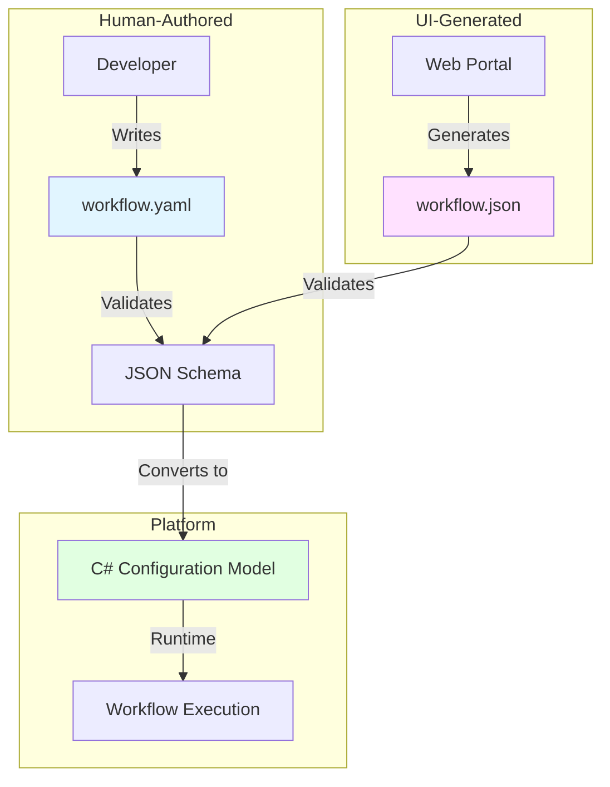

# Proposal: Configuration Format Options

**Status**: Draft  
**Created**: 2025-11-15  
**Context**: [Architecture Overview - Open Question #4](../architecture-overview.md#open-questions)

---

## Problem Statement

The platform requires a configuration format to define workflows, data sources, transformations, and delivery endpoints. The solution must:

1. **Define workflow specifications** (source database, tables to monitor, transformation logic, delivery targets)
2. **Support version control** (track changes, enable rollback, facilitate code review)
3. **Enable validation** (catch errors before deployment, ensure consistency)
4. **Support multiple environments** (dev, staging, production with different settings)
5. **Facilitate maintenance** (easy to read, update, and understand)
6. **Enable automation** (CI/CD pipelines, automated deployment, testing)

This decision impacts:
- Developer experience (ease of creating/updating workflows)
- Platform reliability (configuration validation prevents runtime errors)
- Operational complexity (deployment process, troubleshooting)
- Future extensibility (UI tools, API generation, documentation)

---

## Constraints from Personas

### Must Satisfy

| Persona | Requirement |
|---------|-------------|
| **Client** | Transparent configuration changes, no service disruption |
| **Functional Dev** | Clear, readable configuration format, local testing capability |
| **Functional QA** | Ability to create test configurations, environment parity |
| **Platform Team** | Version control, validation, backward compatibility |
| **Platform QA** | Automated testing of configuration changes, regression coverage |
| **Product Owner** | Easy workflow creation, quick client onboarding |

### Must Avoid

- **Configuration errors** causing runtime failures
- **Breaking changes** to existing workflows without validation
- **Environment drift** between dev, staging, and production
- **Complex syntax** that requires specialized knowledge
- **Un-versioned changes** that can't be audited or rolled back
- **Platform coupling** where functional team can't test configurations locally

---

## Team Context

### Current Familiarity

| Format | Current Usage | Team Expertise |
|--------|---------------|----------------|
| **YAML** | CI/CD pipelines (Azure DevOps, GitHub Actions), Docker Compose, Kubernetes | ⭐⭐⭐⭐ High |
| **JSON** | REST API payloads, data exchange, configuration files | ⭐⭐⭐⭐ High |
| **XML** | Legacy systems, .NET config files (app.config, web.config) | ⭐⭐ Medium |
| **Code (C#)** | Application development, build scripts | ⭐⭐⭐⭐⭐ Expert |

**Industry Observation**:
- **YAML**: Infrastructure/deployment configurations (Kubernetes, CI/CD, Ansible)
- **JSON**: Data transfer, runtime configuration, API contracts
- **Both**: Widely supported, interoperable, extensive tooling

---

## Options Analysis

### Option 1: YAML Configuration Files

**Description**: Use YAML for workflow definitions with JSON Schema validation. YAML provides human-readable syntax with advanced features like anchors, multi-line strings, and comments.

**Note**: JSON Schema validates JSON data structures, not YAML syntax directly. The validation process converts YAML to JSON (since YAML is a superset of JSON), then validates the resulting JSON structure against the schema. This is the standard approach used by tools like Kubernetes.

```mermaid
graph LR
    DEV[Developer] -->|Writes| YAML[workflow.yaml]
    YAML -->|Converts to JSON| SCHEMA[JSON Schema]
    SCHEMA -->|Pass| GIT[Version Control]
    GIT -->|CI/CD| DEPLOY[Deployment]
    DEPLOY -->|Loads| PLATFORM[Platform Runtime]
    
    PLATFORM -->|Parses| CONFIG[Configuration Object]
    CONFIG -->|Executes| WORKFLOW[Workflow Execution]
    
    style YAML fill:#e1f5ff
    style SCHEMA fill:#ffe1ff
    style PLATFORM fill:#e1ffe1
```



#### Example: Workflow Configuration

```yaml
# workflow-client-abc.yaml
version: "1.0"
metadata:
  name: "client-abc-tickets-workflow"
  description: "Capture and transform ticket data for Client ABC"
  owner: "functional-team@company.com"
  created: "2025-11-15"
  tags:
    - retail
    - tickets
    - client-abc

# Source database configuration
source:
  type: sqlserver
  connection:
    server: "${env:CLIENT_ABC_DB_HOST}"
    database: "RetailDB"
    authentication:
      type: managed-identity  # or sql-auth
    options:
      encrypt: true
      trustServerCertificate: false
  
  # Tables to monitor for changes
  tables:
    - schema: dbo
      name: Tickets
      captureMode: cdc  # or change-tracking
      columns:
        include:
          - TicketId
          - Amount
          - Timestamp
          - CustomerId
        exclude:
          - InternalNotes
    
    - schema: dbo
      name: Products
      captureMode: cdc

# Transformation configuration
transformation:
  type: compiled-binary  # or script, container
  source:
    registry: "internal-nuget"
    package: "ClientABC.Transformations"
    version: "2.1.0"
  
  # Transformation-specific settings
  settings:
    aggregationWindow: "5m"
    batchSize: 100
    timeout: "30s"
  
  # Environment variables for transformation
  environment:
    FEATURE_FLAG_NEW_LOGIC: "${env:ENABLE_NEW_LOGIC:false}"
    CLIENT_TIMEZONE: "America/New_York"

# Delivery configuration
delivery:
  targets:
    # Primary delivery endpoint
    - name: "client-api"
      type: http
      endpoint:
        url: "https://client-abc.example.com/api/data"
        method: POST
        headers:
          Authorization: "Bearer ${secret:CLIENT_ABC_API_KEY}"
          Content-Type: "application/json"
      
      retry:
        maxAttempts: 3
        backoff: exponential
        initialDelay: "1s"
        maxDelay: "30s"
      
      validation:
        schema: "client-abc-schema-v2.json"
        failOnValidationError: true
    
    # Backup/archive endpoint
    - name: "data-lake"
      type: blob-storage
      endpoint:
        container: "client-data"
        path: "client-abc/tickets/{date}/{hour}/"
        format: parquet
      
      condition: "success"  # Only if primary delivery succeeds

# Monitoring and observability
monitoring:
  alerts:
    - condition: "delivery.failureRate > 0.05"
      severity: warning
      channels:
        - email: "ops-team@company.com"
        - slack: "#platform-alerts"
    
    - condition: "transformation.latency > 60s"
      severity: critical
      channels:
        - pagerduty: "platform-oncall"
  
  metrics:
    enabled: true
    tags:
      client: client-abc
      environment: "${env:ENVIRONMENT:production}"

# Scheduling (optional)
schedule:
  type: continuous  # or cron
  # cron: "0 */5 * * *"  # Every 5 minutes
  
  # Maintenance windows (pause workflow)
  maintenanceWindows:
    - start: "2025-12-25T00:00:00Z"
      end: "2025-12-25T23:59:59Z"
      reason: "Holiday maintenance"
```

#### Advanced YAML Features

**1. Anchors and Aliases (DRY principle)**
```yaml
# Define reusable configuration
common-retry: &retry-config
  maxAttempts: 3
  backoff: exponential
  initialDelay: "1s"
  maxDelay: "30s"

delivery:
  targets:
    - name: "endpoint-1"
      retry: *retry-config  # Reference the anchor
    
    - name: "endpoint-2"
      retry: *retry-config  # Reuse same configuration
```

**2. Multi-line Strings**
```yaml
transformation:
  settings:
    customQuery: |
      SELECT 
        t.TicketId,
        t.Amount,
        c.CustomerName
      FROM Tickets t
      JOIN Customers c ON t.CustomerId = c.Id
      WHERE t.Status = 'Active'
```

**3. Comments for Documentation**
```yaml
source:
  connection:
    # Production database - read-only replica
    # Contact: dba-team@company.com
    server: "prod-replica-01.database.windows.net"
```

#### Technology Stack

| Component | Technology | Purpose |
|-----------|------------|---------|
| **Schema Validation** | [JSON Schema](https://json-schema.org/) | Define and validate structure (validates JSON representation) |
| **YAML Parser** | [YamlDotNet](https://github.com/aaubry/YamlDotNet) (.NET) | Parse YAML → convert to JSON → validate |
| **Linting** | [yaml-lint](https://www.yamllint.com/), VS Code YAML extension | Catch syntax errors |
| **Version Control** | Git | Track changes, enable rollback |
| **Environment Variables** | Syntax: `${env:VAR_NAME:default}` | Environment-specific values |
| **Secrets** | Syntax: `${secret:SECRET_NAME}` | Secure credential management |

#### JSON Schema for Validation

**Note**: This JSON Schema validates the data structure, not the YAML syntax. During validation, YAML is parsed into an object structure and converted to JSON, which is then validated against this schema.

```json
{
  "$schema": "http://json-schema.org/draft-07/schema#",
  "title": "Workflow Configuration",
  "type": "object",
  "required": ["version", "metadata", "source", "transformation", "delivery"],
  "properties": {
    "version": {
      "type": "string",
      "pattern": "^\\d+\\.\\d+$",
      "description": "Configuration schema version"
    },
    "metadata": {
      "type": "object",
      "required": ["name", "owner"],
      "properties": {
        "name": {
          "type": "string",
          "pattern": "^[a-z0-9-]+$",
          "description": "Workflow name (lowercase, alphanumeric, hyphens)"
        },
        "owner": {
          "type": "string",
          "format": "email"
        }
      }
    },
    "source": {
      "type": "object",
      "required": ["type", "connection", "tables"],
      "properties": {
        "type": {
          "enum": ["sqlserver", "postgresql", "mysql"]
        }
      }
    }
  }
}
```

#### Pros

- ✅ **Human-readable**: Clear structure, easy to understand
- ✅ **Comments**: Inline documentation, context for complex configurations
- ✅ **DRY**: Anchors/aliases reduce duplication
- ✅ **Multi-line strings**: Readable SQL queries, scripts
- ✅ **Team familiarity**: Already used in CI/CD, Kubernetes
- ✅ **Tooling**: Excellent IDE support (VS Code YAML extension, IntelliSense with schema)
- ✅ **Industry standard**: Kubernetes, Docker Compose, Ansible, GitHub Actions
- ✅ **JSON Schema validation**: Strong type checking, prevents errors
- ✅ **Version control friendly**: Diff-friendly format

#### Cons

- ❌ **Whitespace sensitivity**: Indentation errors common (mitigated by linters)
- ❌ **Complex nesting**: Deep hierarchies can be hard to read
- ❌ **Type ambiguity**: Strings vs numbers can be confusing (`"123"` vs `123`)
- ❌ **Anchor complexity**: Overuse makes files harder to understand
- ❌ **No native IDE validation**: Requires JSON Schema + IDE extension

#### When to Use

- ✅ **Primary workflow definitions**: Main configuration format
- ✅ **Environment-specific overrides**: Dev/staging/prod variations
- ✅ **Infrastructure as Code**: Deployment configurations
- ✅ **Human-edited files**: When developers manually create/edit configurations

---

### Option 2: JSON Configuration Files

**Description**: Use JSON for workflow definitions with JSON Schema validation. JSON provides strict syntax, universal tool support, and programmatic generation.

#### Example: Workflow Configuration

```json
{
  "version": "1.0",
  "metadata": {
    "name": "client-abc-tickets-workflow",
    "description": "Capture and transform ticket data for Client ABC",
    "owner": "functional-team@company.com",
    "created": "2025-11-15",
    "tags": ["retail", "tickets", "client-abc"]
  },
  "source": {
    "type": "sqlserver",
    "connection": {
      "server": "${env:CLIENT_ABC_DB_HOST}",
      "database": "RetailDB",
      "authentication": {
        "type": "managed-identity"
      },
      "options": {
        "encrypt": true,
        "trustServerCertificate": false
      }
    },
    "tables": [
      {
        "schema": "dbo",
        "name": "Tickets",
        "captureMode": "cdc",
        "columns": {
          "include": ["TicketId", "Amount", "Timestamp", "CustomerId"],
          "exclude": ["InternalNotes"]
        }
      }
    ]
  },
  "transformation": {
    "type": "compiled-binary",
    "source": {
      "registry": "internal-nuget",
      "package": "ClientABC.Transformations",
      "version": "2.1.0"
    },
    "settings": {
      "aggregationWindow": "5m",
      "batchSize": 100,
      "timeout": "30s"
    }
  },
  "delivery": {
    "targets": [
      {
        "name": "client-api",
        "type": "http",
        "endpoint": {
          "url": "https://client-abc.example.com/api/data",
          "method": "POST",
          "headers": {
            "Authorization": "Bearer ${secret:CLIENT_ABC_API_KEY}",
            "Content-Type": "application/json"
          }
        },
        "retry": {
          "maxAttempts": 3,
          "backoff": "exponential",
          "initialDelay": "1s",
          "maxDelay": "30s"
        }
      }
    ]
  }
}
```

#### Technology Stack

| Component | Technology | Purpose |
|-----------|------------|---------|
| **Schema Validation** | [JSON Schema](https://json-schema.org/) | Define and validate structure |
| **JSON Parser** | System.Text.Json (.NET) | Parse JSON to C# objects |
| **Validation** | [NJsonSchema](https://github.com/RicoSuter/NJsonSchema) | Runtime validation |
| **Linting** | [jsonlint](https://jsonlint.com/), VS Code JSON extension | Catch syntax errors |
| **Code Generation** | JSON Schema → C# classes | Type-safe configuration models |

#### Pros

- ✅ **Strict syntax**: No ambiguity, parser errors are clear
- ✅ **Universal support**: Every language, tool, IDE understands JSON
- ✅ **Programmatic generation**: Easy to generate from code/UI
- ✅ **No whitespace issues**: Structure defined by brackets, not indentation
- ✅ **Native validation**: JSON Schema widely supported
- ✅ **Team familiarity**: Used for REST APIs, data transfer
- ✅ **Fast parsing**: Lightweight, efficient parsers
- ✅ **Type safe**: Can generate C# classes from schema

#### Cons

- ❌ **No comments**: Cannot include inline documentation (use separate README)
- ❌ **Verbose**: More characters than YAML for same structure
- ❌ **No DRY**: No built-in reuse mechanism (must duplicate)
- ❌ **String escaping**: Multi-line strings require `\n` escaping
- ❌ **Trailing commas**: Easy to forget, causes parse errors
- ❌ **Less human-friendly**: Harder to read/write manually

#### When to Use

- ✅ **API payloads**: Runtime configuration from REST endpoints
- ✅ **Programmatic generation**: Configurations created by UI or code
- ✅ **Strict validation**: When syntax errors must be caught immediately
- ✅ **Tool output**: Generated configurations from external systems

---

### Option 3: Hybrid Approach (YAML + JSON)

**Description**: Use YAML for human-edited configurations and JSON for programmatically-generated or runtime configurations. Both share the same JSON Schema for validation.



#### Example Structure

```
workflows/
├── schemas/
│   └── workflow-schema-v1.json       # JSON Schema (single source of truth)
├── manual/
│   ├── client-abc.yaml               # Human-edited YAML
│   └── client-xyz.yaml
├── generated/
│   ├── client-def.json               # UI-generated JSON
│   └── client-ghi.json
└── models/
    └── WorkflowConfiguration.cs      # Generated from schema
```

#### Conversion Utility

```csharp
public class ConfigurationConverter
{
    // Convert YAML to JSON for validation
    public static string YamlToJson(string yamlContent)
    {
        var deserializer = new DeserializerBuilder().Build();
        var yamlObject = deserializer.Deserialize(new StringReader(yamlContent));
        
        var serializer = new SerializerBuilder()
            .JsonCompatible()
            .Build();
        
        return serializer.Serialize(yamlObject);
    }
    
    // Validate against JSON Schema
    public static ValidationResult Validate(string json, string schemaPath)
    {
        var schema = JsonSchema.FromFileAsync(schemaPath).Result;
        var errors = schema.Validate(json);
        
        return new ValidationResult
        {
            IsValid = !errors.Any(),
            Errors = errors.Select(e => e.ToString()).ToList()
        };
    }
}
```

#### Pros

- ✅ **Best of both worlds**: Human-friendly YAML, machine-friendly JSON
- ✅ **Flexibility**: Choose appropriate format for use case
- ✅ **Single schema**: JSON Schema validates both formats
- ✅ **Gradual migration**: Start with YAML, add JSON as UI develops
- ✅ **Tool compatibility**: Both formats widely supported

#### Cons

- ❌ **Complexity**: Two formats to support, convert, test
- ❌ **Consistency**: Must ensure YAML and JSON produce identical models
- ❌ **Training**: Team needs to understand both formats
- ❌ **Tooling**: Need conversion utilities, linters for both

#### When to Use

- ✅ **Phased UI development**: Start with files, add UI later
- ✅ **Mixed authoring**: Some workflows manual, others generated
- ✅ **Migration path**: Transitioning from files to UI-based configuration

---

### Option 4: Code-Based Configuration (C# Fluent API)

**Description**: Define workflows using C# code with a fluent API. Configurations are type-safe, testable, and benefit from full IDE support.

#### Example: Fluent Configuration

```csharp
using DataStreaming.Configuration;

public class ClientAbcWorkflowConfiguration : IWorkflowConfiguration
{
    public void Configure(WorkflowBuilder builder)
    {
        builder
            .WithName("client-abc-tickets-workflow")
            .WithOwner("functional-team@company.com")
            .AddTag("retail")
            .AddTag("tickets")
            
            .Source(source => source
                .UseSqlServer(sql => sql
                    .Server(Environment.GetVariable("CLIENT_ABC_DB_HOST"))
                    .Database("RetailDB")
                    .UseManagedIdentity()
                    .EnableEncryption())
                .CaptureTable("dbo", "Tickets", table => table
                    .UseCdc()
                    .IncludeColumns("TicketId", "Amount", "Timestamp", "CustomerId")
                    .ExcludeColumns("InternalNotes"))
                .CaptureTable("dbo", "Products", table => table.UseCdc()))
            
            .Transform(transform => transform
                .UseCompiledBinary("ClientABC.Transformations", "2.1.0")
                .WithSetting("aggregationWindow", TimeSpan.FromMinutes(5))
                .WithSetting("batchSize", 100)
                .WithEnvironment("CLIENT_TIMEZONE", "America/New_York"))
            
            .Deliver(delivery => delivery
                .ToHttp("client-api", http => http
                    .Url("https://client-abc.example.com/api/data")
                    .Method(HttpMethod.Post)
                    .AddHeader("Authorization", $"Bearer {GetSecret("CLIENT_ABC_API_KEY")}")
                    .WithRetry(retry => retry
                        .MaxAttempts(3)
                        .ExponentialBackoff(TimeSpan.FromSeconds(1), TimeSpan.FromSeconds(30))))
                .ToBlob("data-lake", blob => blob
                    .Container("client-data")
                    .Path("client-abc/tickets/{date}/{hour}/")
                    .Format(BlobFormat.Parquet)
                    .WhenSuccess()))
            
            .Monitor(monitor => monitor
                .AlertWhen("delivery.failureRate > 0.05", alert => alert
                    .Severity(AlertSeverity.Warning)
                    .Email("ops-team@company.com")
                    .Slack("#platform-alerts"))
                .EnableMetrics()
                .AddTag("client", "client-abc"));
    }
}
```

#### Technology Stack

| Component | Technology | Purpose |
|-----------|------------|---------|
| **Configuration API** | Custom fluent API | Type-safe configuration builder |
| **Compilation** | C# compiler | Compile-time validation |
| **Serialization** | Export to JSON/YAML | Generate file-based configuration |
| **Versioning** | NuGet packages | Version configuration library |
| **Testing** | xUnit/NUnit | Unit test configurations |

#### Pros

- ✅ **Type safety**: Compile-time validation, IntelliSense
- ✅ **Refactoring**: IDE refactoring tools work
- ✅ **Testability**: Unit test configurations
- ✅ **Code reuse**: Share common patterns, DRY
- ✅ **Full C# power**: Conditionals, loops, functions
- ✅ **Strong tooling**: Debugging, code coverage, static analysis
- ✅ **Versioning**: NuGet package versioning

#### Cons

- ❌ **Compilation required**: Cannot edit without rebuild
- ❌ **Developer barrier**: Requires C# knowledge
- ❌ **Deployment complexity**: Deploy code, not files
- ❌ **Less transparency**: Configuration hidden in compiled code
- ❌ **Version conflicts**: Breaking changes in configuration API
- ❌ **No UI generation**: Cannot easily build UI for code

#### When to Use

- ✅ **Complex workflows**: Need programming logic in configuration
- ✅ **Shared patterns**: Many workflows with similar structure
- ✅ **Type-safe priority**: Compile-time validation critical
- ❌ **Not recommended**: For platform with UI-based configuration future

---

## Comparison Matrix

| Criteria | YAML | JSON | Hybrid (YAML+JSON) | Code (C#) |
|----------|------|------|---------------------|-----------|
| **Human Readability** | ⭐⭐⭐⭐⭐ (excellent) | ⭐⭐⭐ (verbose) | ⭐⭐⭐⭐ (context-dependent) | ⭐⭐⭐ (requires C#) |
| **Team Familiarity** | ⭐⭐⭐⭐ (CI/CD usage) | ⭐⭐⭐⭐ (API usage) | ⭐⭐⭐⭐ (both formats) | ⭐⭐⭐⭐⭐ (C# experts) |
| **Comments Support** | ⭐⭐⭐⭐⭐ (native) | ⭐ (not supported) | ⭐⭐⭐⭐ (YAML files) | ⭐⭐⭐⭐⭐ (C# comments) |
| **Validation** | ⭐⭐⭐⭐ (JSON Schema) | ⭐⭐⭐⭐⭐ (JSON Schema) | ⭐⭐⭐⭐⭐ (single schema) | ⭐⭐⭐⭐⭐ (compile-time) |
| **UI Generation** | ⭐⭐⭐⭐ (schema → form) | ⭐⭐⭐⭐⭐ (easy) | ⭐⭐⭐⭐⭐ (JSON output) | ⭐⭐ (difficult) |
| **Programmatic Creation** | ⭐⭐⭐ (YAML libraries) | ⭐⭐⭐⭐⭐ (native) | ⭐⭐⭐⭐⭐ (JSON output) | ⭐⭐⭐⭐⭐ (native) |
| **Diff-Friendly** | ⭐⭐⭐⭐ (clear diffs) | ⭐⭐⭐ (bracket noise) | ⭐⭐⭐⭐ (YAML diffs) | ⭐⭐ (code diffs) |
| **Error Messages** | ⭐⭐⭐ (indentation) | ⭐⭐⭐⭐ (syntax clear) | ⭐⭐⭐⭐ (schema errors) | ⭐⭐⭐⭐⭐ (compiler errors) |
| **IDE Support** | ⭐⭐⭐⭐ (with extension) | ⭐⭐⭐⭐⭐ (native) | ⭐⭐⭐⭐⭐ (both) | ⭐⭐⭐⭐⭐ (native) |
| **DRY (Reusability)** | ⭐⭐⭐⭐ (anchors) | ⭐ (none) | ⭐⭐⭐ (YAML anchors) | ⭐⭐⭐⭐⭐ (code reuse) |
| **Multi-line Strings** | ⭐⭐⭐⭐⭐ (native) | ⭐ (escape chars) | ⭐⭐⭐⭐ (YAML feature) | ⭐⭐⭐⭐⭐ (C# strings) |
| **Migration to UI** | ⭐⭐⭐⭐ (generate JSON) | ⭐⭐⭐⭐⭐ (direct use) | ⭐⭐⭐⭐⭐ (use JSON) | ⭐⭐ (needs conversion) |
| **Version Control** | ⭐⭐⭐⭐⭐ (text files) | ⭐⭐⭐⭐⭐ (text files) | ⭐⭐⭐⭐⭐ (text files) | ⭐⭐⭐⭐ (code files) |

**Legend**: ⭐ Poor → ⭐⭐⭐⭐⭐ Excellent

---

## Recommendations

### Primary Recommendation: **Option 3 - Hybrid Approach (YAML for Human, JSON for Machines)**

**Rationale**:
1. **Best developer experience**: YAML for manual workflow creation (comments, readability, team familiarity)
2. **Future-proof**: JSON for UI-generated configurations (when portal is built)
3. **Single source of truth**: JSON Schema validates both formats
4. **Industry alignment**: YAML for infrastructure, JSON for data exchange
5. **Flexible migration**: Start with YAML files, gradually introduce UI
6. **Team expertise**: Leverage existing YAML (CI/CD) and JSON (API) knowledge

### Implementation Strategy

```mermaid
graph TB
    subgraph Phase 1: File-Based POC
        YAML1[YAML Workflows] -->|Validate| SCHEMA1[JSON Schema]
        SCHEMA1 -->|Load| PLATFORM1[Platform]
    end
    
    subgraph Phase 2: Add UI Generation
        UI[Web Portal] -->|Generates| JSON1[JSON Workflows]
        JSON1 -->|Validate| SCHEMA2[JSON Schema]
        YAML2[YAML Workflows] -->|Validate| SCHEMA2
        SCHEMA2 -->|Load| PLATFORM2[Platform]
    end
    
    subgraph Phase 3: Unified Experience
        UI2[Web Portal] -->|Edit/Generate| JSON2[JSON Workflows]
        ADVANCED[Advanced Users] -->|Manual Edit| YAML3[YAML Workflows]
        JSON2 & YAML3 -->|Validate| SCHEMA3[JSON Schema]
        SCHEMA3 -->|Load| PLATFORM3[Platform]
    end
    
    style YAML1 fill:#e1f5ff
    style JSON1 fill:#ffe1ff
    style UI fill:#e1ffe1
    style PLATFORM3 fill:#fff4e1
```



### Recommended File Structure

```
config/
├── schemas/
│   ├── workflow-v1.0.schema.json      # JSON Schema (versioned)
│   ├── workflow-v1.1.schema.json
│   └── latest -> workflow-v1.1.schema.json
│
├── workflows/
│   ├── client-abc/
│   │   ├── tickets-workflow.yaml      # Human-edited
│   │   └── products-workflow.yaml
│   ├── client-xyz/
│   │   └── orders-workflow.json       # UI-generated
│   └── README.md
│
├── environments/
│   ├── dev.yaml                        # Dev-specific overrides
│   ├── staging.yaml
│   └── production.yaml
│
└── templates/
    ├── simple-workflow.yaml            # Templates for quick start
    └── advanced-workflow.yaml
```

### Configuration Loading Strategy

```csharp
public class ConfigurationLoader
{
    private readonly JsonSchema _schema;
    
    public async Task<WorkflowConfiguration> LoadAsync(string filePath)
    {
        var extension = Path.GetExtension(filePath).ToLower();
        
        string jsonContent = extension switch
        {
            ".yaml" or ".yml" => await ConvertYamlToJson(filePath),
            ".json" => await File.ReadAllTextAsync(filePath),
            _ => throw new NotSupportedException($"Unsupported format: {extension}")
        };
        
        // Validate against JSON Schema
        var validationResult = await _schema.ValidateAsync(jsonContent);
        if (!validationResult.IsValid)
        {
            throw new ValidationException(
                $"Configuration validation failed: {string.Join(", ", validationResult.Errors)}");
        }
        
        // Deserialize to strongly-typed model
        return JsonSerializer.Deserialize<WorkflowConfiguration>(jsonContent);
    }
    
    private async Task<string> ConvertYamlToJson(string yamlFilePath)
    {
        var yamlContent = await File.ReadAllTextAsync(yamlFilePath);
        var deserializer = new DeserializerBuilder().Build();
        var yamlObject = deserializer.Deserialize(new StringReader(yamlContent));
        
        return JsonSerializer.Serialize(yamlObject);
    }
}
```

### Validation and Testing Strategy

**1. JSON Schema Validation**
```bash
# Validate YAML workflow
workflow-validator validate workflows/client-abc/tickets-workflow.yaml

# Validate all workflows
workflow-validator validate-all --schema schemas/latest
```

**2. CI/CD Integration**
```yaml
# .github/workflows/validate-configs.yml
name: Validate Configurations

on:
  pull_request:
    paths:
      - 'config/**/*.yaml'
      - 'config/**/*.json'

jobs:
  validate:
    runs-on: ubuntu-latest
    steps:
      - uses: actions/checkout@v3
      
      - name: Validate YAML Syntax
        run: yamllint config/workflows/**/*.yaml
      
      - name: Validate JSON Syntax
        run: jsonlint config/workflows/**/*.json
      
      - name: Validate Against Schema
        run: |
          dotnet run --project tools/ConfigValidator \
            -- validate-all \
            --schema config/schemas/latest \
            --directory config/workflows
      
      - name: Check for Breaking Changes
        run: |
          dotnet run --project tools/ConfigValidator \
            -- check-breaking-changes \
            --base origin/main \
            --head HEAD
```

**3. Unit Testing Configurations**
```csharp
[Fact]
public async Task ClientAbcWorkflow_ValidatesSuccessfully()
{
    // Arrange
    var loader = new ConfigurationLoader(schemaPath: "schemas/workflow-v1.0.schema.json");
    
    // Act
    var config = await loader.LoadAsync("workflows/client-abc/tickets-workflow.yaml");
    
    // Assert
    Assert.Equal("client-abc-tickets-workflow", config.Metadata.Name);
    Assert.Equal("sqlserver", config.Source.Type);
    Assert.Single(config.Delivery.Targets);
}

[Fact]
public async Task InvalidWorkflow_ThrowsValidationException()
{
    // Arrange
    var loader = new ConfigurationLoader(schemaPath: "schemas/workflow-v1.0.schema.json");
    
    // Act & Assert
    await Assert.ThrowsAsync<ValidationException>(
        () => loader.LoadAsync("test-data/invalid-workflow.yaml"));
}
```

---

## Environment-Specific Configuration

### Strategy: Base + Overrides

**Base Configuration** (`workflows/client-abc/tickets-workflow.yaml`):
```yaml
version: "1.0"
metadata:
  name: "client-abc-tickets-workflow"
  owner: "functional-team@company.com"

source:
  type: sqlserver
  connection:
    server: "${env:DB_HOST}"
    database: "RetailDB"

delivery:
  targets:
    - name: "client-api"
      endpoint:
        url: "${env:API_URL}"
```

**Environment Overrides** (`environments/production.yaml`):
```yaml
# Override for production environment
overrides:
  client-abc-tickets-workflow:
    source:
      connection:
        server: "prod-db.company.com"
        options:
          encrypt: true
          minPoolSize: 10
          maxPoolSize: 100
    
    delivery:
      targets:
        - name: "client-api"
          endpoint:
            url: "https://client-abc.example.com/api/data"
          retry:
            maxAttempts: 5
    
    monitoring:
      alerts:
        - condition: "delivery.failureRate > 0.01"  # Stricter in prod
          severity: critical
```

### Loading with Overrides

```csharp
public class ConfigurationMerger
{
    public WorkflowConfiguration MergeWithEnvironment(
        WorkflowConfiguration baseConfig,
        string environmentName)
    {
        var environmentOverrides = LoadEnvironmentOverrides(environmentName);
        
        if (environmentOverrides.TryGetValue(baseConfig.Metadata.Name, out var overrides))
        {
            return JsonMergePatch.Apply(baseConfig, overrides);
        }
        
        return baseConfig;
    }
}
```

---

## Open Questions for Validation

1. **Configuration complexity**: What's the average complexity of a workflow?
   - **Impact**: Determines if YAML readability advantage is significant

2. **UI timeline**: When will the web portal be available?
   - **Impact**: Influences JSON adoption timeline

3. **Environment count**: How many environments (dev, staging, prod, etc.)?
   - **Solution**: Environment override strategy

4. **Functional team preferences**: Do developers prefer files or UI?
   - **Hybrid approach**: Support both based on user preference

5. **Configuration volume**: Expected number of workflows?
   - **Impact**: Determines need for configuration management tooling

6. **Secrets management**: How to handle sensitive configuration values?
   - **Solution**: External secrets manager (Azure Key Vault, HashiCorp Vault)
   - **Syntax**: `${secret:SECRET_NAME}` placeholder

---

## Next Steps

1. **JSON Schema Definition** (1 week):
   - Define workflow configuration schema (v1.0)
   - Include all required fields, validation rules
   - Document schema with descriptions, examples

2. **POC Implementation** (1 week):
   - Build configuration loader (YAML → JSON → C# model)
   - Implement JSON Schema validation
   - Create sample workflows in YAML

3. **Developer Testing** (3 days):
   - **Functional Dev**: Create test workflow in YAML
   - **Platform Team**: Validate loading and parsing
   - **QA Teams**: Test validation error messages

4. **Tooling Development** (1 week):
   - CLI validator tool
   - VS Code snippet templates
   - CI/CD validation pipeline

5. **Decision Gate**:
   - If POC successful → Adopt YAML + JSON hybrid
   - If issues found → Evaluate pure JSON or code-based approach

---

## References

### Configuration Standards
- [JSON Schema Official Site](https://json-schema.org/)
- [YAML Specification](https://yaml.org/spec/1.2.2/)
- [External Configuration Store Pattern](https://learn.microsoft.com/en-us/azure/architecture/patterns/external-configuration-store)

### Tools and Libraries
- [YamlDotNet](https://github.com/aaubry/YamlDotNet) - .NET YAML parser
- [System.Text.Json](https://learn.microsoft.com/en-us/dotnet/api/system.text.json) - .NET JSON parser
- [NJsonSchema](https://github.com/RicoSuter/NJsonSchema) - JSON Schema validation for .NET
- [JSON Schema Validator](https://www.jsonschemavalidator.net/) - Online validation tool

### Industry Examples
- [Kubernetes Configuration](https://kubernetes.io/docs/concepts/configuration/) - YAML for manifests
- [Docker Compose](https://docs.docker.com/compose/compose-file/) - YAML for services
- [GitHub Actions](https://docs.github.com/en/actions/using-workflows/workflow-syntax-for-github-actions) - YAML for CI/CD
- [Terraform](https://www.terraform.io/language/syntax/configuration) - HCL (YAML-like) for infrastructure

### Related Documents
- [Architecture Overview](../architecture-overview.md)
- [CDC Mechanism Proposal](cdc-mechanism.md)
- [Transformation Format Proposal](transformation-format.md)
- [Execution Environment Proposal](execution-environment.md)
- [Functional Developer Persona](../../personas/developer-functional.md)
- [Platform Developer Persona](../../personas/developer-platform.md)
