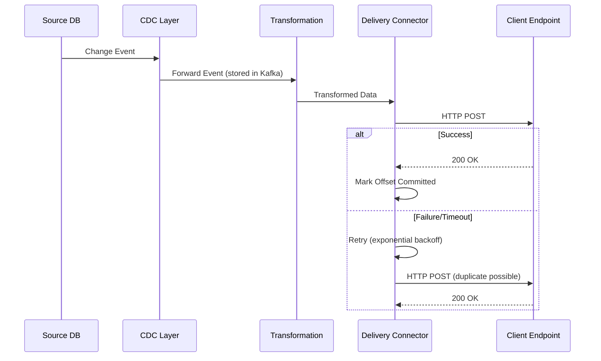
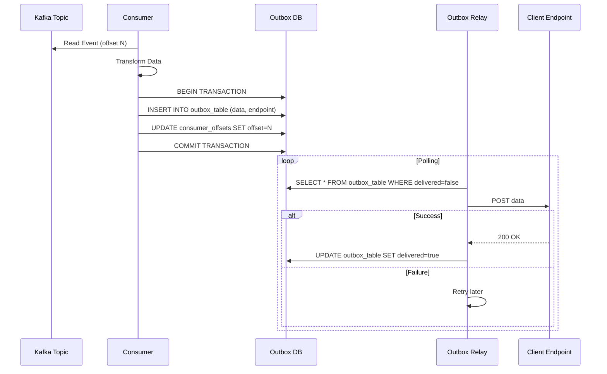
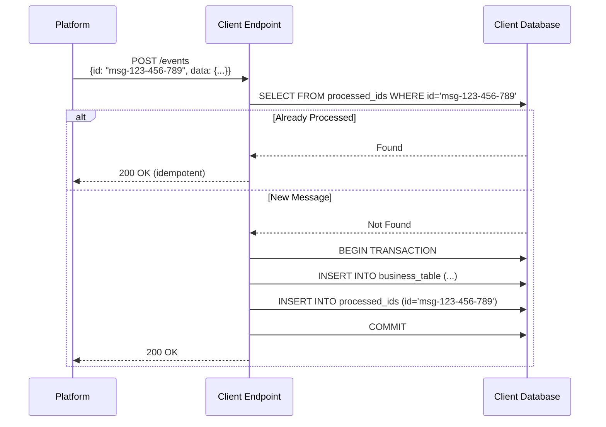

# Delivery Guarantees Proposal

**Status**: Draft  
**Created**: November 15, 2025  
**Target Decision Date**: TBD (after POC validation)

---

## Executive Summary

This proposal analyzes delivery guarantee options for the Retail Data Streaming platform. We evaluate three primary delivery semantics—**at-most-once**, **at-least-once**, and **exactly-once**—along with their implementation complexity, performance implications, and suitability for different client requirements.

**Key Recommendation**: Implement a **configurable delivery guarantee system** that supports both **at-least-once** (default) and **exactly-once** (opt-in) semantics, with strong emphasis on **idempotency patterns** to simplify client integration.

---

## Problem Statement

The platform must reliably deliver transformed data to client endpoints while managing the inherent trade-offs in distributed systems:

1. **Client Requirements Vary**: Different clients have different tolerance for duplicates vs. data loss
2. **Network Failures Are Inevitable**: Distributed systems must handle timeouts, retries, and partial failures
3. **Exactly-Once Is Complex**: True exactly-once semantics require transactional coordination across multiple systems
4. **Performance vs. Reliability**: Stronger guarantees often come with higher latency and resource costs
5. **CAP Theorem Constraints**: During network partitions, systems must choose between consistency and availability
6. **Multiple Workflows**: Parallel execution of workflows increases complexity of global ordering and state management

**Target Outcomes**:
- ✓ Clear delivery guarantee for each workflow (configurable per client)
- ✓ Transparent behavior during failure scenarios
- ✓ Minimal duplicate data for clients requiring exactly-once
- ✓ No data loss for clients requiring at-least-once
- ✓ Performance overhead proportional to guarantee strength

---

## Constraints from Personas

### Must Satisfy

| Persona | Requirement |
|---------|-------------|
| **Client** | MUST receive all data changes accurately, even during failures |
| **Client** | MUST NOT experience silent data loss |
| **Functional Dev** | MUST understand what guarantees their workflow provides |
| **Platform Dev** | MUST be able to reason about failure scenarios |
| **Product Owner** | MUST be able to define SLAs based on delivery guarantees |
| **Platform QA** | MUST be able to test and verify guarantee semantics |

### Must Avoid

| Persona | Anti-Requirement |
|---------|------------------|
| **Client** | MUST NOT receive unbounded duplicates without recourse |
| **Functional Dev** | MUST NOT be forced into exactly-once if unnecessary for use case |
| **Platform Dev** | MUST NOT implement brittle distributed transactions |
| **Product Owner** | MUST NOT promise guarantees the platform cannot deliver |
| **Functional QA** | MUST NOT manually deduplicate data in tests |
| **Platform QA** | MUST NOT spend excessive time on flaky delivery tests |

---

## Understanding Delivery Semantics

### The Three Guarantees

In distributed systems, there are three fundamental delivery semantics:

```mermaid
graph TB
    subgraph "At-Most-Once"
        AMO1[Producer Sends Message] --> AMO2[No Acknowledgment Wait]
        AMO2 --> AMO3[Consumer May Receive 0 or 1 Times]
    end
    
    subgraph "At-Least-Once"
        ALO1[Producer Sends Message] --> ALO2[Wait for Acknowledgment]
        ALO2 -->|Timeout| ALO3[Retry Send]
        ALO2 -->|Success| ALO4[Consumer Receives ≥1 Times]
        ALO3 --> ALO4
    end
    
    subgraph "Exactly-Once"
        EO1[Producer Sends with Transaction ID] --> EO2[Idempotent Write]
        EO2 --> EO3[Deduplication]
        EO3 --> EO4[Consumer Receives Exactly 1 Time]
    end
    
    style AMO3 fill:#ffe1e1
    style ALO4 fill:#fff4e1
    style EO4 fill:#e1ffe1
```



| Guarantee | Behavior | Data Loss Risk | Duplicate Risk | Complexity |
|-----------|----------|----------------|----------------|------------|
| **At-Most-Once** | Send without waiting for acknowledgment | **High** | None | Low |
| **At-Least-Once** | Retry on failure until acknowledged | None | **Medium-High** | Medium |
| **Exactly-Once** | Transactional delivery with deduplication | None | None | **High** |

### CAP Theorem and Exactly-Once

**Important Clarification**: The CAP theorem states that distributed systems cannot simultaneously guarantee:
- **C**onsistency: Every read returns the most recent write
- **A**vailability: Every request receives a response
- **P**artition tolerance: System continues despite network partitions

**This is related to, but not the same as, exactly-once delivery**. Exactly-once semantics are about ensuring each message is processed once, not about distributed consensus. However, achieving exactly-once *does* require trade-offs:

- **More coordination** = higher latency (availability impact)
- **Transactional state** = potential for blocked operations during failures (availability impact)
- **Eventual consistency** = accepting temporary duplicates (consistency impact)

**Key Insight**: True "exactly-once" across distributed systems (source DB → Kafka → transformation → external endpoint) is extremely difficult. Most systems actually provide **"effectively once"** through idempotency, deduplication, or transactional semantics within bounded subsystems.

---

## Option 1: At-Least-Once Only (Default for All Workflows)

### Description

Implement at-least-once delivery as the only supported guarantee. Focus on making retries safe and providing idempotency guidance to clients.



### Implementation Details

**Producer Side (Platform → Client Endpoint)**:
1. **Kafka Consumer** reads with `enable.auto.commit=false`
2. **Transformation Execution** processes the event
3. **Delivery Attempt**:
   ```csharp
   var retryPolicy = Policy
       .HandleResult<HttpResponseMessage>(r => !r.IsSuccessStatusCode)
       .WaitAndRetryAsync(
           retryCount: 5,
           sleepDurationProvider: attempt => TimeSpan.FromSeconds(Math.Pow(2, attempt)),
           onRetry: (outcome, timespan, retryCount, context) =>
           {
               _logger.LogWarning("Delivery attempt {Retry} failed, retrying in {Delay}s", 
                   retryCount, timespan.TotalSeconds);
           });
   
   var response = await retryPolicy.ExecuteAsync(async () =>
       await _httpClient.PostAsync(endpoint, content));
   ```
4. **Offset Commit** only after successful delivery:
   ```csharp
   if (response.IsSuccessStatusCode)
   {
       consumer.CommitAsync(message.TopicPartitionOffset);
   }
   else
   {
       // Let Kafka rewind on restart - message will be reprocessed
       _logger.LogError("Delivery failed after retries, message will be reprocessed");
       throw new DeliveryException($"Failed to deliver to {endpoint}");
   }
   ```

**Consumer Side (Client Endpoint Guidance)**:
Clients implement idempotency using one of these patterns:

1. **Idempotent Operations** (preferred):
   ```csharp
   // Use UPSERT instead of INSERT
   public async Task<IActionResult> ReceiveData([FromBody] DataPayload payload)
   {
       // Natural idempotency: last-write-wins
       await _repository.UpsertAsync(payload.Id, payload.Data);
       return Ok();
   }
   ```

2. **Deduplication by ID**:
   ```csharp
   public async Task<IActionResult> ReceiveData([FromBody] DataPayload payload)
   {
       // Check if already processed
       if (await _processedIds.ContainsAsync(payload.MessageId))
       {
           _logger.LogInformation("Duplicate message {Id}, skipping", payload.MessageId);
           return Ok(); // Idempotent response
       }
       
       await ProcessPayload(payload);
       await _processedIds.AddAsync(payload.MessageId);
       return Ok();
   }
   ```

3. **Database Unique Constraints**:
   ```sql
   -- Natural deduplication via unique constraint
   CREATE TABLE received_events (
       message_id VARCHAR(100) PRIMARY KEY,
       data JSONB NOT NULL,
       received_at TIMESTAMP DEFAULT NOW()
   );
   ```

### Technology Stack

| Component | Technology | Purpose |
|-----------|----------|---------|
| **Message Broker** | Kafka | Durable event log with offset tracking |
| **Consumer** | Confluent.Kafka (.NET) | At-least-once consumption with manual offset control |
| **Retry Logic** | Polly | Exponential backoff with jitter |
| **Delivery Tracking** | Application metrics | Monitor retry rates and success/failure |
| **Client Guidance** | Documentation + SDK | Idempotency patterns and examples |

### Pros & Cons

| ✅ Pros | ❌ Cons |
|---------|---------|
| Simple architecture | Clients receive duplicates during retries |
| No distributed transactions | Clients must implement idempotency |
| High throughput | Duplicate processing can impact client systems |
| Low latency | Difficult to reason about message ordering during failures |
| Easy to debug | No upper bound on duplicates (unbounded retries) |
| Works with any client system | Clients may process same event multiple times |

### Example Scenarios

**Scenario 1: Network Timeout During Delivery**
```
1. Platform sends Product Update (ID=123, Price=99.99)
2. Client receives and processes update
3. Network timeout before 200 OK reaches platform
4. Platform retries → Client receives duplicate
5. Client's UPSERT makes it idempotent (no issue)
```

**Scenario 2: Client Endpoint Crashes Mid-Processing**
```
1. Platform sends Order Event (ID=456)
2. Client starts processing, crashes before responding
3. Platform retries after timeout
4. Client restarts, reprocesses same event
5. If client checks deduplication table → skips duplicate
   If client doesn't → duplicate processing occurs
```

---

## Option 2: Exactly-Once with Transactional Outbox Pattern

### Description

Implement exactly-once semantics using the **Transactional Outbox Pattern**: transformations write results to a database table in the same transaction as offset storage, then a separate process delivers from the outbox.



### Implementation Details

**Outbox Table Schema**:
```sql
CREATE TABLE outbox_events (
    id BIGSERIAL PRIMARY KEY,
    event_id VARCHAR(100) UNIQUE NOT NULL,  -- Deduplication key
    topic VARCHAR(255) NOT NULL,
    partition INT NOT NULL,
    offset BIGINT NOT NULL,
    endpoint_url VARCHAR(500) NOT NULL,
    payload JSONB NOT NULL,
    headers JSONB,
    created_at TIMESTAMP DEFAULT NOW(),
    delivered_at TIMESTAMP NULL,
    delivery_attempts INT DEFAULT 0,
    last_error TEXT NULL,
    INDEX idx_undelivered (endpoint_url, delivered_at) WHERE delivered_at IS NULL
);

CREATE TABLE consumer_offsets (
    topic VARCHAR(255) NOT NULL,
    partition INT NOT NULL,
    offset BIGINT NOT NULL,
    updated_at TIMESTAMP DEFAULT NOW(),
    PRIMARY KEY (topic, partition)
);
```

**Consumer Implementation (Transformation + Outbox Write)**:
```csharp
public async Task ProcessEventAsync(ConsumeResult<string, string> message)
{
    var transformed = await _transformer.TransformAsync(message.Value);
    
    using var transaction = await _dbContext.Database.BeginTransactionAsync();
    try
    {
        // Write to outbox
        var outboxEvent = new OutboxEvent
        {
            EventId = $"{message.Topic}-{message.Partition}-{message.Offset}",
            Topic = message.Topic,
            Partition = message.Partition,
            Offset = message.Offset,
            EndpointUrl = _config.GetEndpoint(message.Topic),
            Payload = JsonSerializer.Serialize(transformed),
            CreatedAt = DateTime.UtcNow
        };
        await _dbContext.OutboxEvents.AddAsync(outboxEvent);
        
        // Update consumer offset
        var consumerOffset = await _dbContext.ConsumerOffsets
            .FindAsync(message.Topic, message.Partition);
        
        if (consumerOffset == null)
        {
            consumerOffset = new ConsumerOffset 
            { 
                Topic = message.Topic, 
                Partition = message.Partition 
            };
            await _dbContext.ConsumerOffsets.AddAsync(consumerOffset);
        }
        
        consumerOffset.Offset = message.Offset;
        consumerOffset.UpdatedAt = DateTime.UtcNow;
        
        await _dbContext.SaveChangesAsync();
        await transaction.CommitAsync();
        
        _logger.LogInformation("Event {EventId} written to outbox", outboxEvent.EventId);
    }
    catch (Exception ex)
    {
        await transaction.RollbackAsync();
        _logger.LogError(ex, "Failed to write event to outbox, will retry");
        throw;
    }
}
```

**Outbox Relay (Separate Process)**:
```csharp
public class OutboxRelayService : BackgroundService
{
    private readonly IServiceProvider _serviceProvider;
    private readonly ILogger<OutboxRelayService> _logger;
    
    protected override async Task ExecuteAsync(CancellationToken stoppingToken)
    {
        while (!stoppingToken.IsCancellationRequested)
        {
            using var scope = _serviceProvider.CreateScope();
            var dbContext = scope.ServiceProvider.GetRequiredService<ApplicationDbContext>();
            var httpClient = scope.ServiceProvider.GetRequiredService<IHttpClientFactory>()
                .CreateClient("DeliveryClient");
            
            var undeliveredEvents = await dbContext.OutboxEvents
                .Where(e => e.DeliveredAt == null && e.DeliveryAttempts < 10)
                .OrderBy(e => e.CreatedAt)
                .Take(100)
                .ToListAsync(stoppingToken);
            
            foreach (var evt in undeliveredEvents)
            {
                try
                {
                    var content = new StringContent(evt.Payload, Encoding.UTF8, "application/json");
                    var response = await httpClient.PostAsync(evt.EndpointUrl, content, stoppingToken);
                    
                    if (response.IsSuccessStatusCode)
                    {
                        evt.DeliveredAt = DateTime.UtcNow;
                        _logger.LogInformation("Delivered event {EventId}", evt.EventId);
                    }
                    else
                    {
                        evt.DeliveryAttempts++;
                        evt.LastError = $"HTTP {response.StatusCode}";
                        _logger.LogWarning("Delivery failed for {EventId}: {Error}", 
                            evt.EventId, evt.LastError);
                    }
                }
                catch (Exception ex)
                {
                    evt.DeliveryAttempts++;
                    evt.LastError = ex.Message;
                    _logger.LogError(ex, "Delivery exception for {EventId}", evt.EventId);
                }
                
                await dbContext.SaveChangesAsync(stoppingToken);
            }
            
            if (!undeliveredEvents.Any())
            {
                await Task.Delay(TimeSpan.FromSeconds(5), stoppingToken);
            }
        }
    }
}
```

### Technology Stack

| Component | Technology | Purpose |
|-----------|----------|---------|
| **Message Broker** | Kafka | Source of change events |
| **Consumer** | Confluent.Kafka (.NET) | Read events |
| **Outbox Database** | PostgreSQL | Transactional outbox + offset storage |
| **ORM** | Entity Framework Core | Transaction management |
| **Relay Service** | .NET Background Service | Poll and deliver from outbox |
| **Delivery Client** | HttpClient with Polly | Fault-tolerant HTTP delivery |
| **Monitoring** | Application Insights | Track delivery lag and failures |

### Pros & Cons

| ✅ Pros | ❌ Cons |
|---------|---------|
| True exactly-once semantics | Requires dedicated database infrastructure |
| No client-side deduplication needed | Additional latency (2-phase: write outbox, then deliver) |
| Natural ordering within transaction | Complex operational setup (outbox relay) |
| Transactional safety | Database becomes bottleneck |
| Replay safety (idempotent writes to outbox) | Outbox table can grow large (requires cleanup) |
| Can track delivery status | Not suitable for high-throughput scenarios |

### Delivery Lag Considerations

With this pattern, there's inherent lag between event consumption and delivery:
```
Total Latency = Kafka Lag + Transformation Time + Outbox Write + Relay Poll Interval + Delivery Time
```

Example timeline:
```
T+0ms:    Event arrives in Kafka
T+10ms:   Consumer reads and transforms
T+15ms:   Outbox write + offset commit completes
T+5000ms: Relay polls outbox (5-second interval)
T+5100ms: HTTP POST to client endpoint
T+5150ms: Client responds 200 OK
T+5160ms: Relay marks delivered
```

**Total: ~5.16 seconds** from event arrival to confirmed delivery (dominated by relay poll interval)

---

## Option 3: Idempotent Delivery Keys (Hybrid Approach)

### Description

Platform includes a **stable, unique idempotency key** with each delivered message. Clients use this key for deduplication. Platform operates in at-least-once mode but provides tools to make exactly-once behavior easy for clients.



### Implementation Details

**Idempotency Key Generation (Platform)**:
The platform generates deterministic keys from source system identifiers:

```csharp
public class IdempotencyKeyGenerator
{
    public string GenerateKey(SourceRecord record)
    {
        // Combine source identifiers to create stable key
        // Format: {source_db}:{table}:{primary_key}:{change_version}
        
        var components = new[]
        {
            record.Database,
            record.Table,
            string.Join(",", record.PrimaryKeyValues),
            record.ChangeVersion.ToString()
        };
        
        var keyString = string.Join(":", components);
        
        // Hash for consistent length (optional)
        using var sha256 = SHA256.Create();
        var hash = sha256.ComputeHash(Encoding.UTF8.GetBytes(keyString));
        var shortHash = Convert.ToBase64String(hash).Substring(0, 12);
        
        // Return both human-readable and hash
        return $"{record.Database}-{record.Table}-{shortHash}";
    }
}
```

**Message Format**:
```json
{
  "idempotencyKey": "sales_db-orders-kJ9mP2xQ8vL1",
  "eventType": "OrderCreated",
  "timestamp": "2025-11-15T10:30:00Z",
  "data": {
    "orderId": 12345,
    "customerId": 67890,
    "amount": 299.99,
    "items": [...]
  }
}
```

**Client-Side Implementation (ASP.NET Core Example)**:
```csharp
[ApiController]
[Route("api/events")]
public class EventsController : ControllerBase
{
    private readonly ApplicationDbContext _db;
    
    [HttpPost]
    public async Task<IActionResult> ReceiveEvent([FromBody] PlatformEvent evt)
    {
        // Check if already processed
        var exists = await _db.ProcessedEvents
            .AnyAsync(e => e.IdempotencyKey == evt.IdempotencyKey);
        
        if (exists)
        {
            _logger.LogInformation("Duplicate event {Key}, returning success", 
                evt.IdempotencyKey);
            return Ok(new { status = "duplicate", key = evt.IdempotencyKey });
        }
        
        // Process in transaction
        using var transaction = await _db.Database.BeginTransactionAsync();
        try
        {
            // Business logic
            await ProcessBusinessLogic(evt.Data);
            
            // Record as processed
            await _db.ProcessedEvents.AddAsync(new ProcessedEvent
            {
                IdempotencyKey = evt.IdempotencyKey,
                EventType = evt.EventType,
                ProcessedAt = DateTime.UtcNow,
                Payload = JsonSerializer.Serialize(evt.Data)
            });
            
            await _db.SaveChangesAsync();
            await transaction.CommitAsync();
            
            return Ok(new { status = "processed", key = evt.IdempotencyKey });
        }
        catch (Exception ex)
        {
            await transaction.RollbackAsync();
            _logger.LogError(ex, "Failed to process event {Key}", evt.IdempotencyKey);
            return StatusCode(500, new { error = "Processing failed" });
        }
    }
}
```

**Client Database Schema**:
```sql
CREATE TABLE processed_events (
    idempotency_key VARCHAR(100) PRIMARY KEY,
    event_type VARCHAR(50) NOT NULL,
    processed_at TIMESTAMP NOT NULL DEFAULT NOW(),
    payload JSONB,
    INDEX idx_processed_at (processed_at)  -- For cleanup queries
);

-- Cleanup old processed events (run periodically)
DELETE FROM processed_events 
WHERE processed_at < NOW() - INTERVAL '30 days';
```

### Platform SDK (Optional)

Provide a client SDK to abstract deduplication logic:

```csharp
// NuGet: Cegid.DataStreaming.ClientSDK

public class EventHandler
{
    private readonly IDeduplicationStore _store;
    
    public async Task<EventResult> HandleAsync<T>(
        PlatformEvent<T> evt, 
        Func<T, Task> processor)
    {
        if (await _store.IsProcessedAsync(evt.IdempotencyKey))
        {
            return EventResult.Duplicate(evt.IdempotencyKey);
        }
        
        await using var transaction = await _store.BeginTransactionAsync();
        try
        {
            await processor(evt.Data);
            await _store.MarkProcessedAsync(evt.IdempotencyKey);
            await transaction.CommitAsync();
            
            return EventResult.Processed(evt.IdempotencyKey);
        }
        catch (Exception ex)
        {
            await transaction.RollbackAsync();
            throw;
        }
    }
}

// Client usage:
public async Task<IActionResult> ReceiveEvent([FromBody] PlatformEvent<OrderData> evt)
{
    var result = await _eventHandler.HandleAsync(evt, async (data) =>
    {
        // Business logic here
        await _orderService.CreateOrderAsync(data);
    });
    
    return Ok(result);
}
```

### Technology Stack

| Component | Technology | Purpose |
|-----------|----------|---------|
| **Key Generation** | SHA256 hashing | Deterministic, collision-resistant keys |
| **Message Format** | JSON with metadata | Include idempotency key in payload |
| **Client SDK** | NuGet package | Optional helper for .NET clients |
| **Client Storage** | Any RDBMS | Store processed idempotency keys |
| **Documentation** | OpenAPI spec | Define message format contract |

### Pros & Cons

| ✅ Pros | ❌ Cons |
|---------|---------|
| Simpler than full exactly-once | Clients still need deduplication logic |
| No platform-side transactions | Each client maintains processed-keys table |
| Works with any client technology | Clients must implement it correctly |
| Deterministic keys aid debugging | Storage overhead for processed keys |
| Flexible client implementation | Cleanup strategy required for old keys |
| Lower platform latency | Not truly "exactly-once" (relies on client) |

---

## Option 4: Per-Workflow Configurable Guarantees

### Description

Allow each workflow to declare its required delivery guarantee in configuration. Platform implements appropriate mechanisms based on the declared level.

**Configuration Example**:
```yaml
workflows:
  - id: sales-orders-to-erp
    delivery:
      guarantee: exactly-once
      mechanism: transactional-outbox
      deduplication:
        keyFields: [database, table, primaryKey]
        ttl: 30d
    
  - id: product-sync-to-search
    delivery:
      guarantee: at-least-once
      mechanism: kafka-offsets
      retries:
        maxAttempts: 5
        backoffMs: [1000, 2000, 5000, 10000, 30000]
    
  - id: audit-logs-to-warehouse
    delivery:
      guarantee: idempotent-keys
      mechanism: generated-keys
      clientGuidance: true
```

### Implementation Details

**Workflow Configuration Schema**:
```csharp
public class DeliveryConfig
{
    public DeliveryGuarantee Guarantee { get; set; }  // AtLeastOnce | ExactlyOnce | IdempotentKeys
    public DeliveryMechanism Mechanism { get; set; }  // TransactionalOutbox | KafkaOffsets | GeneratedKeys
    
    public DeduplicationConfig Deduplication { get; set; }
    public RetryConfig Retries { get; set; }
}

public class DeduplicationConfig
{
    public List<string> KeyFields { get; set; }  // Fields to generate idempotency key
    public TimeSpan Ttl { get; set; }  // How long to store processed keys
}

public class RetryConfig
{
    public int MaxAttempts { get; set; }
    public List<int> BackoffMs { get; set; }  // Exponential backoff schedule
}
```

**Delivery Strategy Factory**:
```csharp
public class DeliveryStrategyFactory
{
    public IDeliveryStrategy CreateStrategy(DeliveryConfig config)
    {
        return config.Guarantee switch
        {
            DeliveryGuarantee.AtLeastOnce => new AtLeastOnceStrategy(config.Retries),
            DeliveryGuarantee.ExactlyOnce => new ExactlyOnceStrategy(config.Deduplication),
            DeliveryGuarantee.IdempotentKeys => new IdempotentKeyStrategy(config.Deduplication),
            _ => throw new ArgumentException($"Unknown guarantee: {config.Guarantee}")
        };
    }
}

public interface IDeliveryStrategy
{
    Task<DeliveryResult> DeliverAsync(TransformedData data, string endpoint);
}
```

**Strategy: At-Least-Once**:
```csharp
public class AtLeastOnceStrategy : IDeliveryStrategy
{
    private readonly RetryConfig _retryConfig;
    private readonly IHttpClientFactory _httpFactory;
    
    public async Task<DeliveryResult> DeliverAsync(TransformedData data, string endpoint)
    {
        var httpClient = _httpFactory.CreateClient();
        
        for (int attempt = 0; attempt < _retryConfig.MaxAttempts; attempt++)
        {
            try
            {
                var content = new StringContent(
                    JsonSerializer.Serialize(data), 
                    Encoding.UTF8, 
                    "application/json");
                
                var response = await httpClient.PostAsync(endpoint, content);
                
                if (response.IsSuccessStatusCode)
                {
                    return DeliveryResult.Success(attempt + 1);
                }
                
                _logger.LogWarning("Attempt {Attempt} failed: {Status}", 
                    attempt + 1, response.StatusCode);
            }
            catch (Exception ex)
            {
                _logger.LogError(ex, "Attempt {Attempt} exception", attempt + 1);
            }
            
            if (attempt < _retryConfig.MaxAttempts - 1)
            {
                var delay = _retryConfig.BackoffMs[Math.Min(attempt, _retryConfig.BackoffMs.Count - 1)];
                await Task.Delay(delay);
            }
        }
        
        return DeliveryResult.Failure($"Failed after {_retryConfig.MaxAttempts} attempts");
    }
}
```

**Strategy: Exactly-Once (with Outbox)**:
```csharp
public class ExactlyOnceStrategy : IDeliveryStrategy
{
    private readonly OutboxDbContext _outbox;
    private readonly DeduplicationConfig _deduplicationConfig;
    
    public async Task<DeliveryResult> DeliverAsync(TransformedData data, string endpoint)
    {
        // Generate idempotency key
        var key = GenerateIdempotencyKey(data, _deduplicationConfig.KeyFields);
        
        // Write to outbox in transaction (with offset commit)
        using var transaction = await _outbox.Database.BeginTransactionAsync();
        try
        {
            var outboxEvent = new OutboxEvent
            {
                IdempotencyKey = key,
                Endpoint = endpoint,
                Payload = JsonSerializer.Serialize(data),
                CreatedAt = DateTime.UtcNow
            };
            
            await _outbox.OutboxEvents.AddAsync(outboxEvent);
            await _outbox.SaveChangesAsync();
            await transaction.CommitAsync();
            
            // Relay will pick up and deliver asynchronously
            return DeliveryResult.Queued(key);
        }
        catch (Exception ex)
        {
            await transaction.RollbackAsync();
            throw;
        }
    }
}
```

### Comparison Matrix

| Workflow Type | Recommended Guarantee | Reasoning |
|---------------|----------------------|-----------|
| **Financial Transactions** | Exactly-Once | No tolerance for duplicates (double-billing) |
| **Product Catalog Sync** | At-Least-Once | Idempotent by nature (updates are upserts) |
| **Audit Logs** | Idempotent Keys | Duplicates acceptable with dedup, prefer performance |
| **Real-time Analytics** | At-Least-Once | Duplicates filtered in aggregation layer |
| **Customer Notifications** | Exactly-Once | Avoid duplicate emails/SMS |
| **Data Warehouse Loads** | Idempotent Keys | Batch processes can deduplicate |

### Pros & Cons

| ✅ Pros | ❌ Cons |
|---------|---------|
| Flexibility for different use cases | Increased platform complexity |
| Optimal performance per workflow | Multiple code paths to maintain |
| Pay for what you need | Configuration errors can cause issues |
| Clear SLA per workflow | Testing requires all permutations |
| Clients choose their trade-offs | Documentation burden (explain each option) |

---

## Comparison: All Options

| Criteria | Option 1:<br/>At-Least-Once Only | Option 2:<br/>Transactional Outbox | Option 3:<br/>Idempotent Keys | Option 4:<br/>Configurable |
|----------|----------------------------------|-------------------------------------|-------------------------------|----------------------------|
| **Complexity** | ⭐ Low | ⭐⭐⭐⭐ Very High | ⭐⭐ Medium | ⭐⭐⭐ High |
| **Performance** | ⭐⭐⭐⭐⭐ Excellent | ⭐⭐ Poor (2-phase) | ⭐⭐⭐⭐ Good | ⭐⭐⭐ Varies |
| **Client Burden** | ⭐⭐ Must implement dedup | ⭐⭐⭐⭐⭐ None | ⭐⭐⭐ Moderate (use SDK) | ⭐⭐⭐ Varies |
| **Platform Burden** | ⭐⭐⭐⭐⭐ Minimal | ⭐ Very High | ⭐⭐⭐⭐ Low | ⭐⭐ High |
| **True Exactly-Once** | ❌ No | ✅ Yes | ⚠️ Depends on client | ⚠️ Optional |
| **Duplicate Risk** | ⭐⭐ Medium-High | ⭐⭐⭐⭐⭐ None | ⭐⭐⭐⭐ Low | ⭐⭐⭐ Varies |
| **Latency** | ⭐⭐⭐⭐⭐ <100ms | ⭐⭐ 2-10s | ⭐⭐⭐⭐ <200ms | ⭐⭐⭐ Varies |
| **Scalability** | ⭐⭐⭐⭐⭐ Excellent | ⭐⭐ Limited by DB | ⭐⭐⭐⭐ Good | ⭐⭐⭐ Varies |
| **Operational Overhead** | ⭐⭐⭐⭐⭐ Low | ⭐ Very High | ⭐⭐⭐⭐ Low | ⭐⭐ High |
| **Debugging** | ⭐⭐⭐ Good | ⭐⭐⭐⭐ Excellent | ⭐⭐⭐⭐ Excellent | ⭐⭐⭐ Good |
| **Failure Recovery** | ⭐⭐⭐⭐ Automatic | ⭐⭐⭐⭐⭐ Transactional | ⭐⭐⭐⭐ Client-side | ⭐⭐⭐ Varies |

---

## Recommendations

### Primary Recommendation: **Option 3 (Idempotent Keys) as Default, Option 4 (Configurable) for Flexibility**

**Rationale**:
1. **Balanced Approach**: Idempotent keys provide "effectively once" semantics with low platform complexity
2. **Client-Friendly**: SDK and clear patterns make implementation straightforward
3. **Performance**: Minimal overhead compared to transactional outbox
4. **Flexibility**: Configurable option allows exactly-once for critical workflows
5. **Proven Pattern**: Industry-standard approach (Stripe API, AWS EventBridge, etc.)

### Implementation Strategy

**Phase 1: Foundation (Sprint 1-2, 2 weeks)**
- ✓ Implement at-least-once delivery with Kafka offset management
- ✓ Design idempotency key generation algorithm
- ✓ Create message format specification (JSON schema)
- ✓ Build retry logic with exponential backoff

**Phase 2: Idempotent Keys (Sprint 3-4, 2 weeks)**
- ✓ Integrate idempotency keys into all outbound messages
- ✓ Document client-side deduplication patterns
- ✓ Create .NET client SDK for deduplication
- ✓ Add monitoring for duplicate detection rates

**Phase 3: Exactly-Once Option (Sprint 5-7, 3 weeks)**
- ✓ Implement transactional outbox database
- ✓ Build outbox relay service
- ✓ Add workflow configuration for delivery guarantees
- ✓ Create migration path from at-least-once to exactly-once

**Phase 4: Validation & Optimization (Sprint 8, 1 week)**
- ✓ Load testing with various guarantee levels
- ✓ Chaos engineering (network partitions, failures)
- ✓ Documentation and runbooks
- ✓ Client onboarding workshops

### Default Configuration

```yaml
# Default for new workflows
delivery:
  guarantee: idempotent-keys
  mechanism: generated-keys
  
  # Idempotency key generation
  idempotencyKey:
    format: "{database}:{table}:{primaryKey}:{changeVersion}"
    hashAlgorithm: SHA256
    includedInPayload: true
  
  # Retry behavior (platform-side)
  retries:
    enabled: true
    maxAttempts: 5
    backoffMs: [1000, 2000, 5000, 10000, 30000]
    giveUpAfter: 1h
  
  # Client guidance
  documentation:
    deduplicationRequired: true
    sdkAvailable: true
    exampleCode: "https://docs.platform/client-dedup-examples"
```

### Client Communication Strategy

**For Clients Requiring Exactly-Once**:
> "Your workflow is configured for **exactly-once** delivery using transactional outbox. The platform guarantees no duplicates, but expect 2-10 second delivery latency. No client-side deduplication needed."

**For Clients Using Idempotent Keys (Default)**:
> "Your workflow uses **idempotent delivery keys**. Each message includes a unique `idempotencyKey` field. To ensure exactly-once processing, check this key before processing and store it after successful processing. See our [SDK documentation](link) for examples."

**For Clients Accepting At-Least-Once**:
> "Your workflow delivers with **at-least-once** semantics. Duplicates may occur during retries. Ensure your processing logic is idempotent (e.g., use UPSERT instead of INSERT)."

---

## Open Questions

1. **Outbox Cleanup Strategy**: How long should we retain delivered events in the outbox table?
   - **Proposal**: 30 days for audit trail, with configurable retention per workflow

2. **Cross-Workflow Ordering**: Can we guarantee order across multiple workflows for the same source entity?
   - **Proposal**: No global ordering guarantee; ordering only within single partition

3. **Failed Delivery Handling**: After max retries, should we dead-letter or alert?
   - **Proposal**: Dead-letter queue + alert, with manual replay capability

4. **Client SDK Adoption**: Should we mandate SDK usage or support raw HTTP?
   - **Proposal**: SDK optional but strongly recommended; provide HTTP examples

5. **Monitoring & SLAs**: What metrics define "successful delivery"?
   - **Proposal**: Track p50/p95/p99 delivery latency, retry rate, duplicate rate

6. **Backwards Compatibility**: How do we migrate existing workflows to new guarantees?
   - **Proposal**: Gradual migration with feature flags; old workflows remain at-least-once

---

## Next Steps

### Immediate Actions (This Week)
1. **Architecture Review**: Present this proposal to platform team for technical validation
2. **Client Interviews**: Survey 3-5 key clients on their duplicate tolerance
3. **POC Scoping**: Define success criteria for idempotent keys POC

### POC Phase (2 Weeks)
1. **Build Idempotent Key System**:
   - Implement key generation algorithm
   - Add keys to sample workflow
   - Create .NET SDK prototype
2. **Test Scenarios**:
   - Simulate network failures
   - Verify deduplication works
   - Measure performance overhead
3. **Client Validation**:
   - One client implements SDK
   - Measure integration time
   - Collect feedback

### Decision Gate
- **If POC successful** → Proceed with Phase 1 implementation
- **If issues found** → Pivot to simpler at-least-once + documentation approach
- **If clients need exactly-once** → Prioritize transactional outbox for specific workflows

---

## References

### Standards & Protocols
- [CAP Theorem (Wikipedia)](https://en.wikipedia.org/wiki/CAP_theorem)
- [Kafka Documentation - Delivery Semantics](https://kafka.apache.org/documentation/#semantics)
- [PACELC Theorem](https://en.wikipedia.org/wiki/PACELC_theorem) (extends CAP with latency considerations)

### Industry Patterns
- [Transactional Outbox Pattern (Microservices.io)](https://microservices.io/patterns/data/transactional-outbox.html)
- [Idempotency Keys (Stripe API)](https://stripe.com/docs/api/idempotent_requests)
- [Event-Driven Architecture Patterns (Martin Fowler)](https://martinfowler.com/articles/201701-event-driven.html)

### Technology References
- [Kafka Connect Exactly-Once](https://kafka.apache.org/documentation/#connect_exactlyoncesource) (source connectors)
- [Kafka Streams Exactly-Once](https://kafka.apache.org/documentation/streams/#semantics) (processing guarantee)
- [Polly Retry Policies](https://github.com/App-vNext/Polly) (.NET resilience library)
- [Debezium CDC](https://debezium.io/) (example of idempotent delivery)

### Related Internal Documents
- [Architecture Overview](../architecture-overview.md) - Overall platform design
- [Transformation Format Proposal](./transformation-format.md) - Related delivery context
- [Execution Environment Proposal](./execution-environment.md) - Runtime constraints
- [Configuration Format Proposal](./configuration-format.md) - Workflow configuration

---

## Appendix A: Idempotency Key Format Specification

### Deterministic Key Generation

**Algorithm**:
```
idempotencyKey = Base64(SHA256(source_db + ":" + table + ":" + pk_values + ":" + change_seq))
```

**Example**:
```
Source DB:      sales_production
Table:          orders
Primary Key:    order_id=12345
Change Seq:     v17 (17th update to this record)

Key Components: "sales_production:orders:12345:17"
SHA256 Hash:    a3f7b2c9...  (64 hex chars)
Base64 Short:   o/eyyT4k...  (12 chars)
Final Key:      sales_production-orders-o/eyyT4k
```

### Key Properties

1. **Deterministic**: Same source event always generates same key
2. **Unique**: Collision probability < 1 in 2^128 (SHA256 strength)
3. **Readable**: Includes source identifiers for debugging
4. **Compact**: ~50 characters (fits in VARCHAR(100))
5. **Versioned**: Change sequence prevents duplicate keys for updates

---

## Appendix B: Client Deduplication Patterns

### Pattern 1: Database Unique Constraint (Simplest)

```sql
CREATE TABLE orders (
    idempotency_key VARCHAR(100) PRIMARY KEY,
    order_id BIGINT NOT NULL,
    customer_id BIGINT NOT NULL,
    amount DECIMAL(10,2),
    created_at TIMESTAMP DEFAULT NOW()
);

-- Attempt to insert (will fail on duplicate)
INSERT INTO orders (idempotency_key, order_id, customer_id, amount)
VALUES ('sales_production-orders-abc123', 12345, 67890, 299.99)
ON CONFLICT (idempotency_key) DO NOTHING;
```

**Pros**: Atomic, no application logic  
**Cons**: Tight coupling of business data and idempotency

### Pattern 2: Separate Deduplication Table (Recommended)

```sql
CREATE TABLE processed_events (
    idempotency_key VARCHAR(100) PRIMARY KEY,
    processed_at TIMESTAMP NOT NULL DEFAULT NOW(),
    payload JSONB
);

CREATE TABLE orders (
    order_id BIGSERIAL PRIMARY KEY,
    customer_id BIGINT NOT NULL,
    amount DECIMAL(10,2)
);

-- Application checks processed_events first
-- If not found, inserts into both tables in transaction
```

**Pros**: Separation of concerns, flexible  
**Cons**: Requires transaction management

### Pattern 3: In-Memory Cache + Database (Performance)

```csharp
public class DeduplicationService
{
    private readonly IMemoryCache _cache;
    private readonly DbContext _db;
    
    public async Task<bool> IsProcessedAsync(string key)
    {
        // Check cache first (fast)
        if (_cache.TryGetValue(key, out _))
            return true;
        
        // Check database (slower, but authoritative)
        var exists = await _db.ProcessedEvents.AnyAsync(e => e.IdempotencyKey == key);
        
        if (exists)
        {
            // Warm cache for future lookups
            _cache.Set(key, true, TimeSpan.FromHours(1));
        }
        
        return exists;
    }
}
```

**Pros**: Low latency for recent duplicates  
**Cons**: Cache invalidation complexity

---

## Appendix C: Failure Scenarios & Behaviors

### Scenario 1: Network Partition During Delivery

**Setup**: Platform delivers to client, network partition occurs before ACK received

```
Platform                    Client
   |                          |
   |---(POST /events)-------->|
   |                          ├─ Receives
   |                          ├─ Processes
   |                          ├─ Commits to DB
   |<---(200 OK)----X         └─ Responds (lost)
   |
   ├─ Timeout (no ACK)
   ├─ Retry #1
   |---(POST /events)-------->|
   |                          ├─ Check idempotency key
   |                          └─ Already processed
   |<---(200 OK)--------------|
   └─ Success (commit offset)
```

**Result**: Client processes once, platform eventually confirms delivery

### Scenario 2: Client Crash Mid-Processing

**Setup**: Client receives event, crashes before committing to database

```
Platform                    Client
   |                          |
   |---(POST /events)-------->|
   |                          ├─ Receives
   |                          ├─ Starts processing
   |                          X (crash)
   |
   ├─ Timeout (no response)
   ├─ Wait (client restart)
   ├─ Retry #1
   |---(POST /events)-------->|
   |                          ├─ Check idempotency key
   |                          └─ Not found (DB rolled back)
   |                          ├─ Process again
   |                          └─ Commit
   |<---(200 OK)--------------|
   └─ Success
```

**Result**: Client processes on retry (safe because DB transaction rolled back)

### Scenario 3: Platform Crash After Delivery, Before Offset Commit

**Setup**: Platform delivers successfully but crashes before committing Kafka offset

```
Platform                    Client
   |                          |
   |---(POST /events)-------->|
   |                          ├─ Processes
   |                          └─ Commits
   |<---(200 OK)--------------|
   X (crash before offset commit)

(Platform restarts)
   |
   ├─ Replay from last offset
   |---(POST /events)-------->|
   |                          ├─ Check idempotency key
   |                          └─ Already processed
   |<---(200 OK)--------------|
   └─ Commit offset
```

**Result**: Idempotent key prevents duplicate processing

---

**End of Document**
