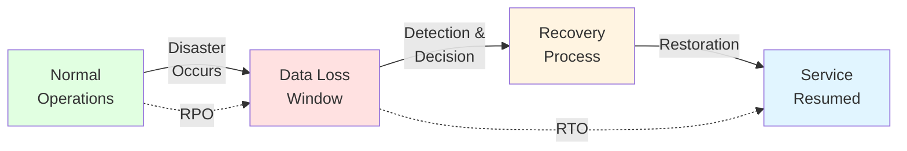
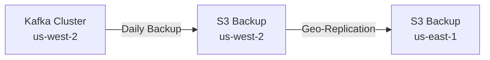
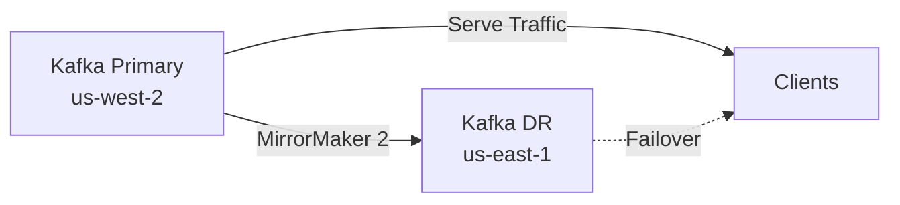
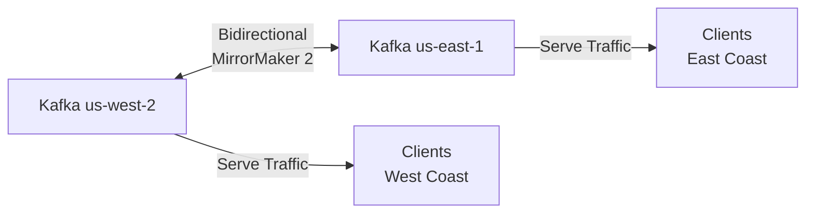
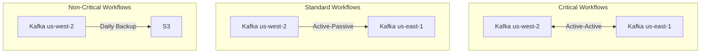

# Disaster Recovery Strategy

**Status**: Draft Proposal  
**Created**: 2025-11-15  
**Related Proposals**: [Transformation Format](transformation-format.md), [CDC Mechanism](cdc-mechanism.md), [Execution Environment](execution-environment.md), [Configuration Format](configuration-format.md), [Delivery Guarantees](delivery-guarantees.md)

---

## Executive Summary

This proposal defines disaster recovery (DR) strategies for the Retail Data Streaming platform, addressing both **partial failures** (individual component outages) and **full disasters** (complete site/cluster loss). The approach balances **Recovery Time Objective (RTO)** and **Recovery Point Objective (RPO)** against operational complexity and cost, while considering the specific requirements of each platform component and persona.

**Key Recommendation**: Implement a **tiered recovery strategy** with:
- **Critical components** (Kafka, metadata): RPO < 5 minutes, RTO < 30 minutes
- **Standard components** (transformations, configurations): RPO < 1 hour, RTO < 2 hours  
- **Non-critical components** (logs, metrics): RPO < 24 hours, RTO < 4 hours

This strategy leverages Kafka's native replication (3+ replicas), continuous backup of metadata and configurations, and automated recovery procedures that align with each previous proposal's architectural decisions.

---

## Problem Statement

### Requirements

1. **Data Durability**: The platform must survive hardware failures, software bugs, natural disasters, and human errors without losing committed data
2. **Service Availability**: Minimize downtime during recovery to meet client SLAs (target 99.9% availability)
3. **Recovery Granularity**: Support both component-level recovery (e.g., single transformation) and full disaster recovery
4. **Cost Efficiency**: DR infrastructure should not duplicate the entire production environment unnecessarily
5. **Operational Simplicity**: Recovery procedures must be executable by on-call engineers without specialized DR expertise
6. **Persona Alignment**: DR strategy must support requirements from all personas (clients, developers, platform team, QA, product owners)

### Constraints from Personas

**Must Satisfy**:
- **Clients**: Transparent recovery with minimal data loss; clients should not need to implement complex retry logic beyond idempotency
- **Functional Developers**: Transformation code and configurations must be recoverable to any previous version
- **Platform Team**: Automated recovery procedures with clear runbooks; no manual data reconstruction
- **Product Owners**: Measurable SLAs for recovery time and data loss; predictable costs
- **QA Teams**: DR procedures must be testable in non-production environments

**Must Avoid**:
- **Clients**: Duplicate data delivery during recovery (conflicts with delivery guarantees)
- **Functional Developers**: Loss of deployed transformation versions or their execution history
- **Platform Team**: Complex, error-prone manual recovery steps; single points of failure in DR infrastructure
- **Product Owners**: Unpredictable recovery times that prevent SLA commitments
- **QA Teams**: Untestable recovery procedures that only work in production

---

## Understanding Disaster Recovery Concepts

### Recovery Objectives



| Objective | Definition | Platform Target | Rationale |
|-----------|------------|-----------------|-----------|
| **RPO** (Recovery Point Objective) | Maximum acceptable data loss measured in time | 5 minutes (critical)<br/>1 hour (standard) | Kafka's replication can achieve near-zero data loss; transformations are idempotent |
| **RTO** (Recovery Time Objective) | Maximum acceptable downtime measured in time | 30 minutes (critical)<br/>2 hours (standard) | Automated procedures can restore services quickly; manual validation adds time |
| **RGO** (Recovery Granularity Objective) | Smallest unit that can be recovered independently | Per-workflow | Enables surgical recovery without affecting unrelated workflows |
| **MTBF** (Mean Time Between Failures) | Average time between failures | > 720 hours (30 days) | Based on industry standards for distributed systems |
| **MTTR** (Mean Time To Repair) | Average time to recover from failure | < 2 hours | Includes detection, diagnosis, and restoration |

### Backup Strategies (3-2-1 Rule)

The industry-standard **3-2-1 backup rule** states:
- **3 copies** of data (1 primary + 2 backups)
- **2 different media types** (e.g., disk + tape, or disk + cloud)
- **1 offsite copy** (geographically separated)

For our platform:
- **3 copies**: Kafka's `replication.factor=3` provides this for event data
- **2 media types**: Live Kafka cluster (disk) + S3/Azure Blob (object storage) for backups
- **1 offsite**: Backup storage in different availability zone or region

### Failure Modes

| Failure Type | Scope | Detection Time | Recovery Approach |
|-------------|-------|----------------|-------------------|
| **Disk Failure** | Single broker/node | < 1 minute (automated) | Kafka rebalances to replicas; replace disk |
| **Node Failure** | Single server | < 5 minutes (automated) | Kafka elects new leader; decommission node |
| **Network Partition** | Subset of cluster | < 5 minutes (automated) | Kafka ISR handles gracefully; resolve partition |
| **Data Corruption** | Topic/partition | Minutes to hours (monitoring) | Restore from backup; replay from CDC source |
| **Software Bug** | All nodes running bad version | Minutes to hours (monitoring) | Rollback deployment; restore from backup if needed |
| **Site Disaster** | Entire data center | Minutes to hours (manual) | Failover to DR site; restore from offsite backup |
| **Human Error** | Variable (config, deployment) | Minutes to days (varies) | Restore configuration/deployment from version control |

---

## Component-Level Recovery Strategies

### 1. Kafka Cluster Recovery

Kafka is the **heart of the platform** and requires the most robust DR strategy.

#### Partial Failure (Node/Disk Loss)

**Kafka's Native Replication** handles most failures automatically:

```yaml
# Kafka Broker Configuration for High Availability
replication.factor: 3                        # 3 copies of each partition
min.insync.replicas: 2                       # Require 2 ACKs for writes
unclean.leader.election.enable: false        # Never elect out-of-sync replica as leader
num.recovery.threads.per.data.dir: 4         # Parallel recovery on restart
```

**Recovery Procedure** (Automated):
1. **Detection**: Kafka controller detects broker failure via heartbeat timeout (< 30 seconds)
2. **Leader Election**: Controller elects new leader from ISR for affected partitions (< 10 seconds)
3. **Rebalancing**: Consumers and producers reconnect to new leaders automatically (< 1 minute)
4. **Replica Recovery**: When failed node returns, it catches up from new leader (minutes to hours depending on data volume)

**RTO**: < 1 minute (for automated failover)  
**RPO**: 0 (no data loss if `min.insync.replicas=2`)

#### Full Cluster Loss (Disaster Scenario)

**Multi-Region Replication** with MirrorMaker 2:

```yaml
# MirrorMaker 2 Configuration for Geo-Replication
clusters: primary, dr
primary.bootstrap.servers: kafka-us-west:9092
dr.bootstrap.servers: kafka-us-east:9092

# Replication flow (unidirectional for cost efficiency)
primary->dr.enabled: true
primary->dr.topics: .*                       # Replicate all topics
primary->dr.groups: .*                       # Replicate consumer groups
primary->dr.sync.group.offsets.enabled: true

# Lag monitoring threshold
replication.policy.separator: _              # Topics appear as "primary_topicname" in DR
offset.lag.max: 1000                         # Alert if DR lags by 1000 messages
```

**Recovery Procedure** (Manual Decision, Automated Execution):
1. **Detection**: Monitoring detects primary site unavailable (< 5 minutes)
2. **Decision**: On-call engineer declares disaster and initiates DR failover (< 15 minutes)
3. **DNS/Load Balancer Update**: Point clients to DR cluster (< 5 minutes)
4. **Validation**: Verify DR cluster is healthy and accepting traffic (< 5 minutes)
5. **Post-Recovery**: Rebuild primary site, reverse replication direction, failback when ready (days to weeks)

**RTO**: < 30 minutes (for DR failover)  
**RPO**: < 5 minutes (MirrorMaker replication lag)

**Impact on Delivery Guarantees Proposal**:
- With `exactly-once` semantics and idempotent keys, DR failover **will not cause duplicate deliveries**
- Consumer groups' offsets are replicated, so clients resume from last committed position
- Transactional outbox (if used) must also be replicated to DR site

#### Incremental Backup Strategy

For **long-term data retention** and **compliance** (beyond Kafka's retention window):

```bash
# Daily Kafka Topic Backup to S3 (using Kafka Connect S3 Sink)
{
  "name": "kafka-backup-s3-sink",
  "config": {
    "connector.class": "io.confluent.connect.s3.S3SinkConnector",
    "topics.regex": ".*",
    "s3.bucket.name": "retail-streaming-backups",
    "s3.region": "us-west-2",
    "flush.size": 10000,
    "rotate.schedule.interval.ms": 86400000,  # Daily rotation
    "storage.class": "io.confluent.connect.s3.storage.S3Storage",
    "format.class": "io.confluent.connect.s3.format.parquet.ParquetFormat",
    "partitioner.class": "io.confluent.connect.storage.partitioner.TimeBasedPartitioner",
    "path.format": "'year'=YYYY/'month'=MM/'day'=dd",
    "timestamp.extractor": "Record"
  }
}
```

**Retention Policy**:
- **Kafka Live Data**: 7 days (configurable per topic)
- **S3 Standard**: 90 days (for recent queries and re-processing)
- **S3 Glacier**: 7 years (for compliance and audit)

**RTO**: 2-4 hours (to restore specific topic/partition from S3)  
**RPO**: 24 hours (daily backups)

### 2. Metadata & Configuration Recovery

**Critical metadata** includes:
- Workflow configurations (YAML/JSON from Configuration Format proposal)
- Transformation deployments (binaries from Transformation Format proposal)
- CDC source mappings (from CDC Mechanism proposal)
- Consumer group offsets (stored in Kafka `__consumer_offsets` topic)

#### Git-Based Configuration Management

```bash
# Repository Structure
retail-streaming-configs/
├── workflows/
│   ├── client-A/
│   │   ├── workflow-1.yaml
│   │   └── workflow-2.yaml
│   └── client-B/
│       └── workflow-1.yaml
├── transformations/
│   ├── client-A-workflow-1-v1.0.0.dll
│   └── client-A-workflow-1-v1.1.0.dll
└── cdc-mappings/
    ├── source-db-1.yaml
    └── source-db-2.yaml
```

**Recovery Procedure**:
1. **Detection**: Configuration corruption or accidental deletion detected
2. **Identify Version**: Find last known-good commit in Git
3. **Restore**: `git checkout <commit-hash>` and re-deploy
4. **Validation**: Run configuration validation tests

**RTO**: < 30 minutes (for configuration restore)  
**RPO**: 0 (Git commits are synchronous; no data loss)

**Impact on Configuration Format Proposal**:
- YAML/JSON configurations are **text files** easily tracked in Git
- Schema validation prevents invalid configurations from being committed
- Deployment pipeline ensures only validated configs reach production

#### Binary Transformation Backup

From **Transformation Format Proposal** (binaries recommended):

```bash
# Transformation Binary Versioning in Artifact Repository (e.g., Azure Artifacts, Artifactory)
# Each deployment is immutable and tagged
retail-streaming-transformations/
├── client-A/
│   └── workflow-1/
│       ├── v1.0.0/
│       │   ├── transformation.dll
│       │   ├── transformation.pdb
│       │   └── manifest.json
│       └── v1.1.0/
│           ├── transformation.dll
│           ├── transformation.pdb
│           └── manifest.json
```

**Recovery Procedure**:
1. **Detection**: Transformation bug causes data corruption
2. **Identify Version**: Find last known-good version (via manifest or logs)
3. **Rollback**: Deploy previous version via deployment pipeline
4. **Re-process**: Optionally rewind Kafka consumer offset and re-process recent data

**RTO**: < 1 hour (for transformation rollback)  
**RPO**: 0 (binary artifacts are immutable; no loss)

**Impact on Transformation Format Proposal**:
- Binary transformations are **versioned artifacts** stored in artifact repository
- Each version is **immutable** and **cryptographically signed** (integrity check)
- Rollback is a standard deployment operation (no special DR procedure)

### 3. Execution Environment Recovery

From **Execution Environment Proposal** (Worker Services + Hangfire recommended):

#### Worker Node Failure

**.NET Worker Services** on Kubernetes/Docker Swarm:

```yaml
# Kubernetes Deployment for Worker Service
apiVersion: apps/v1
kind: Deployment
metadata:
  name: transformation-worker
spec:
  replicas: 3                                # Multiple instances for HA
  selector:
    matchLabels:
      app: transformation-worker
  template:
    metadata:
      labels:
        app: transformation-worker
    spec:
      containers:
      - name: worker
        image: retail-streaming/worker:v1.2.0
        resources:
          requests:
            memory: "512Mi"
            cpu: "500m"
          limits:
            memory: "1Gi"
            cpu: "1000m"
        livenessProbe:                       # Auto-restart if unhealthy
          httpGet:
            path: /health
            port: 8080
          initialDelaySeconds: 30
          periodSeconds: 10
        readinessProbe:                      # Remove from load balancer if not ready
          httpGet:
            path: /ready
            port: 8080
          initialDelaySeconds: 10
          periodSeconds: 5
```

**Recovery Procedure** (Automated):
1. **Detection**: Kubernetes liveness probe fails (< 30 seconds)
2. **Restart**: Kubernetes restarts container (< 1 minute)
3. **Rebalance**: Hangfire redistributes jobs to healthy workers (< 2 minutes)

**RTO**: < 3 minutes (for automated worker restart)  
**RPO**: 0 (Hangfire jobs are retried from last checkpoint)

#### Hangfire Database Failure

**Hangfire Metadata** (job queue, execution history) stored in **SQL Server** or **PostgreSQL**:

```bash
# Automated Database Backups (Azure SQL Database example)
# - Point-in-time restore: Last 7-35 days (configurable)
# - Geo-redundant backup: Automatically replicated to paired region
# - Recovery SLA: < 1 hour for database restore

# Manual Restore Command
az sql db restore --resource-group retail-streaming \
  --server hangfire-db-server \
  --name hangfire-prod \
  --dest-name hangfire-prod-restored \
  --time "2025-11-15T10:30:00Z"
```

**Recovery Procedure**:
1. **Detection**: Hangfire database unavailable (< 1 minute)
2. **Assess**: Determine if corruption or transient failure
3. **Restore**: Initiate point-in-time restore to new database (< 30 minutes)
4. **Redirect**: Update connection string in worker services (< 5 minutes)
5. **Validation**: Verify job queue integrity (< 10 minutes)

**RTO**: < 1 hour (for database restore)  
**RPO**: < 5 minutes (automated backups every 5 minutes)

**Impact on Execution Environment Proposal**:
- Worker Services are **stateless** and can be restarted without data loss
- Hangfire's **retry logic** ensures jobs are re-executed after failures
- Database backups are **managed service feature** (minimal operational overhead)

### 4. CDC Source Recovery

From **CDC Mechanism Proposal** (.NET-native CDC recommended):

#### Source Database Failure

**CDC captures changes from source databases**. If source fails:

```csharp
// CDC Reader with Retry Logic (Polly library)
var retryPolicy = Policy
    .Handle<SqlException>()
    .WaitAndRetryAsync(
        retryCount: 5,
        sleepDurationProvider: attempt => TimeSpan.FromSeconds(Math.Pow(2, attempt)),
        onRetry: (exception, timeSpan, retryCount, context) =>
        {
            _logger.LogWarning($"CDC read failed. Retry {retryCount} after {timeSpan.TotalSeconds}s. Error: {exception.Message}");
        });

await retryPolicy.ExecuteAsync(async () =>
{
    await _cdcReader.ReadChangesAsync(lastCheckpoint);
});
```

**Recovery Procedure**:
1. **Detection**: CDC reader fails to connect to source database (< 1 minute)
2. **Retry**: Exponential backoff retries for transient failures (< 5 minutes)
3. **Alert**: If retries exhausted, alert platform team (< 10 minutes)
4. **Manual Intervention**: DBA restores source database or fixes connectivity
5. **Resume**: CDC reader resumes from last checkpoint (automatic)

**RTO**: < 30 minutes (depends on source database recovery)  
**RPO**: 0 (CDC checkpoint stored in Kafka; no data loss once source recovers)

**Impact on CDC Mechanism Proposal**:
- .NET-native CDC maintains **checkpoint offsets** in Kafka (durable, replicated)
- CDC reader is **idempotent** (can safely re-read changes without duplicates)
- Database triggers (alternative CDC) are **more fragile** during recovery (another reason to prefer .NET-native)

### 5. Client Endpoint Recovery

**Client endpoints** are external systems (client-controlled). Platform responsibilities:

#### Endpoint Unavailability

```csharp
// Delivery Connector with Circuit Breaker (Polly library)
var circuitBreakerPolicy = Policy
    .Handle<HttpRequestException>()
    .CircuitBreakerAsync(
        handledEventsAllowedBeforeBreaking: 3,
        durationOfBreak: TimeSpan.FromMinutes(1),
        onBreak: (exception, duration) =>
        {
            _logger.LogError($"Circuit breaker opened. Client endpoint unavailable. Retry in {duration.TotalMinutes} minutes.");
        },
        onReset: () =>
        {
            _logger.LogInformation("Circuit breaker closed. Client endpoint recovered.");
        });

await circuitBreakerPolicy.ExecuteAsync(async () =>
{
    await _httpClient.PostAsync(clientEndpoint, eventData);
});
```

**Recovery Procedure**:
1. **Detection**: Delivery connector detects repeated failures (< 30 seconds)
2. **Circuit Breaker**: Stop attempting delivery temporarily (prevent overload)
3. **Backoff**: Retry with exponential backoff (1 min, 2 min, 4 min, ...)
4. **Dead Letter Queue**: After max retries, move event to DLQ for manual intervention
5. **Client Fixes Endpoint**: Client resolves endpoint issue
6. **Replay from DLQ**: Platform team or client triggers replay from DLQ

**RTO**: Depends on client (platform retries indefinitely with backoff)  
**RPO**: 0 (events buffered in Kafka or DLQ; no data loss)

**Impact on Delivery Guarantees Proposal**:
- **At-least-once** guarantees mean platform will retry until success
- **Idempotent keys** prevent duplicate processing when client endpoint recovers
- **Dead Letter Queue** provides visibility and manual recovery path

---

## Disaster Recovery Testing

### DR Drill Procedures

**Quarterly DR Drills** ensure recovery procedures work and teams are trained:

| Test Type | Frequency | Scope | Success Criteria |
|-----------|-----------|-------|------------------|
| **Node Failover** | Monthly | Kill single Kafka broker | RTO < 1 min, RPO = 0 |
| **Configuration Rollback** | Monthly | Deploy bad config, rollback | RTO < 30 min, RPO = 0 |
| **Transformation Rollback** | Monthly | Deploy buggy binary, rollback | RTO < 1 hour, RPO = 0 |
| **Database Restore** | Quarterly | Restore Hangfire DB from backup | RTO < 1 hour, RPO < 5 min |
| **Full Site Failover** | Annually | Failover to DR site (non-prod) | RTO < 30 min, RPO < 5 min |
| **Chaos Engineering** | Continuous | Random failures in test environment | System self-heals within SLA |

#### Example DR Drill Runbook

```markdown
# DR Drill: Kafka Broker Failure Simulation

**Objective**: Validate automated failover when Kafka broker fails  
**Duration**: 30 minutes  
**Participants**: Platform team (2 engineers), QA team (1 engineer)

## Pre-Drill Checklist
- [ ] Notify stakeholders (email sent 1 week prior)
- [ ] Verify monitoring dashboards are accessible
- [ ] Confirm test workflows are running in test environment
- [ ] Baseline metrics captured (throughput, latency, error rate)

## Drill Steps
1. **T+0 min**: Kill Kafka broker-2 (simulate disk failure)
   ```bash
   kubectl delete pod kafka-broker-2 -n streaming-platform
   ```
2. **T+1 min**: Observe Kafka controller electing new leaders
   - Check Kafka logs: `kubectl logs kafka-controller -n streaming-platform`
   - Verify ISR changes: `kafka-topics.sh --describe --topic test-topic`
3. **T+2 min**: Verify clients reconnect to new leaders
   - Check producer/consumer logs for reconnection messages
   - Confirm no error spike in application metrics
4. **T+5 min**: Measure recovery time
   - RTO: Time from failure to full service restoration
   - RPO: Confirm no data loss (compare message counts)
5. **T+10 min**: Allow Kafka to recreate broker-2 pod (auto-healing)
6. **T+20 min**: Verify broker-2 rejoins cluster and catches up
7. **T+30 min**: End drill and document results

## Success Criteria
- RTO < 1 minute (service restored)
- RPO = 0 (no messages lost)
- No manual intervention required
- All monitoring alerts fired correctly

## Post-Drill Actions
- [ ] Update runbook based on learnings
- [ ] File issues for any gaps discovered
- [ ] Share results with stakeholders
```

### Chaos Engineering Integration

**Continuous chaos testing** (inspired by Netflix's Chaos Monkey):

```yaml
# Chaos Mesh Experiment (Kubernetes chaos engineering)
apiVersion: chaos-mesh.org/v1alpha1
kind: PodChaos
metadata:
  name: kafka-broker-failure
spec:
  action: pod-kill                            # Kill random pod
  mode: one                                   # Kill one pod at a time
  selector:
    namespaces:
      - streaming-platform
    labelSelectors:
      app: kafka
  scheduler:
    cron: "0 */6 * * *"                       # Every 6 hours
```

**Benefits**:
- **Proactive**: Failures triggered before they occur naturally
- **Realistic**: Tests real failure modes in production-like environment
- **Continuous**: Ongoing validation rather than one-off drills

---

## Recovery Scenarios and Procedures

### Scenario 1: Individual Workflow Failure

**Situation**: Transformation for `Client-A-Workflow-1` crashes due to bug.

**Symptoms**:
- Workflow execution errors in monitoring dashboard
- Client-A reports missing data for past 2 hours
- Dead letter queue accumulating events

**Recovery Steps**:
1. **Stop Workflow** (prevent further errors):
   ```bash
   kubectl scale deployment transformation-worker-client-a-wf-1 --replicas=0
   ```
2. **Identify Root Cause**:
   - Review logs: `kubectl logs transformation-worker-client-a-wf-1`
   - Identify buggy transformation version: `v2.3.0` (deployed 3 hours ago)
3. **Rollback Transformation**:
   ```bash
   # Deployment pipeline command
   ./deploy-transformation.sh --client client-a --workflow workflow-1 --version v2.2.0
   ```
4. **Rewind Kafka Consumer Offset** (reprocess past 2 hours):
   ```bash
   kafka-consumer-groups.sh --bootstrap-server kafka:9092 \
     --group client-a-workflow-1 \
     --topic client-a-source-changes \
     --reset-offsets --to-datetime 2025-11-15T08:00:00.000 \
     --execute
   ```
5. **Restart Workflow**:
   ```bash
   kubectl scale deployment transformation-worker-client-a-wf-1 --replicas=3
   ```
6. **Monitor Recovery**:
   - Verify events re-processed successfully
   - Confirm client-A endpoint receiving data
   - Check for duplicate deliveries (should be none due to idempotent keys)

**RTO**: 1 hour (rollback + reprocess)  
**RPO**: 0 (all data re-processed from Kafka)

**Impact on Personas**:
- **Client-A**: Experiences 2-hour data gap, but platform recovers automatically
- **Functional Developer**: Notified of bug; can fix and deploy new version
- **Platform Team**: Follows runbook; minimal manual work
- **QA**: Post-incident review validates testing gaps

---

### Scenario 2: Full Kafka Cluster Loss

**Situation**: Primary Kafka cluster in `us-west-2` is destroyed (e.g., AWS availability zone failure).

**Symptoms**:
- All workflows fail to produce/consume from Kafka
- Monitoring dashboards show 0 throughput
- Kafka brokers unreachable

**Recovery Steps**:
1. **Declare Disaster** (on-call engineer decision):
   - Confirm primary cluster is unrecoverable (e.g., AWS reports extended outage)
   - Initiate DR failover procedure
2. **Failover to DR Cluster** (us-east-1):
   ```bash
   # Update DNS to point to DR cluster
   aws route53 change-resource-record-sets \
     --hosted-zone-id Z1234567890ABC \
     --change-batch '{
       "Changes": [{
         "Action": "UPSERT",
         "ResourceRecordSet": {
           "Name": "kafka.retail-streaming.com",
           "Type": "CNAME",
           "TTL": 60,
           "ResourceRecords": [{"Value": "kafka-dr.us-east-1.amazonaws.com"}]
         }
       }]
     }'
   
   # Update Kafka connection strings in all services
   kubectl set env deployment/transformation-worker \
     KAFKA_BOOTSTRAP_SERVERS=kafka-dr.us-east-1.amazonaws.com:9092
   ```
3. **Validate DR Cluster**:
   - Check replication lag: Should be < 5 minutes
   - Verify consumer group offsets replicated
   - Confirm all topics present in DR cluster
4. **Resume Operations**:
   - Restart all transformation workers (they reconnect to DR cluster)
   - Monitor for errors or data gaps
5. **Post-Disaster Actions**:
   - Rebuild primary cluster in us-west-2 (or new region)
   - Reverse MirrorMaker replication direction (DR → Primary)
   - Failback when primary fully recovered (planned maintenance window)

**RTO**: 30 minutes (DNS propagation + validation)  
**RPO**: 5 minutes (MirrorMaker replication lag)

**Impact on Personas**:
- **All Clients**: Experience 30-minute outage; minimal data loss (5 minutes)
- **Functional Developers**: No action required; transformations run on DR cluster
- **Platform Team**: Executes DR runbook; then rebuilds primary cluster (days/weeks)
- **Product Owners**: Communicate outage to clients; provide incident report

---

### Scenario 3: Configuration Repository Corruption

**Situation**: Accidental `git push --force` overwrites workflow configurations.

**Symptoms**:
- Deployment pipeline fails with "configuration not found" errors
- Platform team receives alerts from CI/CD system

**Recovery Steps**:
1. **Assess Damage**:
   ```bash
   # Check Git reflog to find last known-good commit
   git reflog
   # Example output:
   # a1b2c3d HEAD@{0}: reset: moving to HEAD~10  (BAD)
   # e4f5g6h HEAD@{1}: commit: Update client-B workflows  (GOOD)
   ```
2. **Restore from Reflog**:
   ```bash
   # Reset to last known-good commit
   git reset --hard e4f5g6h
   git push --force
   ```
3. **Validate Configurations**:
   ```bash
   # Run schema validation
   ./validate-configs.sh
   ```
4. **Re-deploy Workflows**:
   ```bash
   # Deployment pipeline automatically picks up restored configs
   ./deploy-all-workflows.sh
   ```

**RTO**: 15 minutes (reflog recovery + validation)  
**RPO**: 0 (Git history is append-only; nothing truly lost)

**Alternative** (if reflog also corrupted):
- Restore entire Git repository from backup (hourly S3 snapshots)
- RTO: 1 hour (restore + validation)
- RPO: < 1 hour (hourly backups)

**Impact on Personas**:
- **Functional Developers**: Briefly unable to deploy changes; minimal impact
- **Platform Team**: Quick recovery using Git tools
- **Clients**: No impact (production workflows continue running)

---

## Impact on Previous Proposals

### 1. Transformation Format (Binaries Recommended)

**DR Considerations**:
- **Binary Versioning**: Each transformation version is immutable artifact in repository
- **Rollback**: Simple deployment of previous version (no recompilation needed)
- **Recovery**: Binaries + manifests stored in artifact repository with retention policy
  - **Active versions**: Indefinite retention
  - **Historical versions**: 90 days (for rollback window)
  - **Archived versions**: 7 years (for compliance)

**Recommendation Unchanged**: Binaries remain best choice. DR requirements **reinforce** this decision:
- Immutable artifacts are easier to version and rollback
- Scripts (alternative) would require source code management and rebuild during recovery
- Containers (alternative) add complexity without DR benefits

---

### 2. CDC Mechanism (.NET-Native Recommended)

**DR Considerations**:
- **Checkpoint Management**: CDC offsets stored in Kafka (replicated, durable)
- **Idempotent Reads**: CDC reader can safely re-read changes without duplicates
- **Source Database Failure**: CDC reader retries until source recovers; no data loss

**Recommendation Unchanged**: .NET-native CDC remains best choice. DR requirements **reinforce** this decision:
- Database triggers (alternative) are harder to recover if source database restored from backup
- Third-party CDC tools (alternative) introduce external dependency and recovery complexity

**Enhancement**: Add **CDC lag monitoring** to detect source database failures quickly:
```csharp
// Alert if CDC lag exceeds threshold
if (currentTimestamp - lastCdcCheckpoint > TimeSpan.FromMinutes(10))
{
    _alerting.RaiseCritical("CDC lag exceeds 10 minutes. Source database may be unavailable.");
}
```

---

### 3. Execution Environment (Worker Services + Hangfire Recommended)

**DR Considerations**:
- **Stateless Workers**: Can be restarted without data loss (state in Kafka/Hangfire)
- **Hangfire Database**: Requires backup and point-in-time restore capability
- **Job Retry**: Hangfire automatically retries failed jobs (natural resilience)

**Recommendation Unchanged**: Worker Services + Hangfire remains best choice. DR requirements **reinforce** this decision:
- Serverless (alternative) has cold start penalties during recovery
- VMs (alternative) have slower restart times than containers

**Enhancement**: Add **Hangfire database replication** for faster recovery:
- Primary: SQL Server in availability group (synchronous replication)
- Standby: Read-only replica in different availability zone
- RTO improvement: < 5 minutes (failover to standby) vs. < 1 hour (restore from backup)

---

### 4. Configuration Format (Hybrid YAML+JSON Recommended)

**DR Considerations**:
- **Version Control**: YAML/JSON files tracked in Git (full history, easy rollback)
- **Schema Validation**: Prevents invalid configurations from causing failures
- **Backup**: Git repository backed up hourly to S3

**Recommendation Unchanged**: Hybrid YAML+JSON remains best choice. DR requirements **reinforce** this decision:
- Text-based formats are easy to diff, review, and rollback in Git
- Database-driven configs (alternative) require database backups and are harder to audit

**Enhancement**: Add **configuration drift detection**:
```bash
# Scheduled job to detect if deployed configs differ from Git
./detect-config-drift.sh
# If drift detected, alert platform team and optionally auto-reconcile
```

---

### 5. Delivery Guarantees (Idempotent Keys + Configurable Recommended)

**DR Considerations**:
- **Idempotent Keys**: Prevent duplicate deliveries during recovery (critical!)
- **Consumer Group Offsets**: Replicated to DR cluster (resume from last position)
- **Exactly-Once Workflows**: Require additional DR procedures (outbox database backup)

**Recommendation Unchanged**: Idempotent keys + configurable remains best choice. DR requirements **strongly reinforce** this decision:
- At-least-once (alternative) would cause duplicates during DR failover
- Exactly-once only (alternative) would increase DR complexity for all workflows unnecessarily

**Critical DR Interaction**:
During DR failover or recovery, **idempotent keys prevent duplicate processing** when:
1. Consumer offset lags behind actual processing (consumer crashed before committing offset)
2. Network partition causes duplicate message delivery
3. Kafka rebalances and multiple consumers process same partition

**Enhancement for Exactly-Once Workflows**:
If using transactional outbox pattern (Option 2 from Delivery Guarantees proposal):
```sql
-- Backup outbox database with same RTO/RPO as Hangfire database
-- Outbox tables must be included in database backup/restore procedures

-- Validate outbox integrity after restore
SELECT COUNT(*) FROM outbox_events WHERE status = 'PENDING' AND created_at < NOW() - INTERVAL '1 hour';
-- Alert if stale pending events detected (may indicate incomplete transaction recovery)
```

---

## Comparison of Recovery Strategies

### Recovery Strategy Options

| Strategy | Description | RTO | RPO | Cost | Complexity | Best For |
|----------|-------------|-----|-----|------|------------|----------|
| **Option 1: Single-Site with Backups** | One Kafka cluster, daily backups to S3 | 2-4 hours | 24 hours | $ | Low | Non-critical workloads, tight budgets |
| **Option 2: Multi-Region Active-Passive** | Primary cluster + DR cluster (MirrorMaker replication) | 30 minutes | 5 minutes | $$$ | Medium | **Recommended for production** |
| **Option 3: Multi-Region Active-Active** | Two clusters, both serving traffic (bidirectional MirrorMaker) | < 1 minute | < 1 minute | $$$$ | High | Mission-critical, 99.99% SLA |
| **Option 4: Hybrid (Critical vs. Standard)** | Critical workflows use Option 3, standard use Option 2 | Variable | Variable | $$$ | High | Cost-optimized with tiered SLAs |

### Detailed Comparison

#### Option 1: Single-Site with Backups

**Architecture**:


**Pros**:
- ✅ Lowest cost (no DR cluster)
- ✅ Simplest operations
- ✅ Adequate for non-critical workloads

**Cons**:
- ❌ High RTO (hours to restore from S3)
- ❌ High RPO (24 hours data loss)
- ❌ Manual recovery process
- ❌ No automatic failover

**Use Cases**:
- Development/test environments
- Low-tier clients with relaxed SLAs
- Cost-constrained deployments

---

#### Option 2: Multi-Region Active-Passive (Recommended)

**Architecture**:


**Pros**:
- ✅ Fast RTO (< 30 minutes)
- ✅ Low RPO (< 5 minutes)
- ✅ Automated replication
- ✅ Cost-effective (DR cluster smaller than primary)

**Cons**:
- ⚠️ DR cluster idle during normal operations (wasted capacity)
- ⚠️ Manual failover decision required
- ⚠️ Potential for replication lag under heavy load

**Configuration**:
```yaml
# DR cluster sizing: 50% of primary capacity
# Primary: 9 brokers, 128GB RAM each
# DR: 5 brokers, 128GB RAM each (sufficient for failover, not peak load)

# MirrorMaker 2 configuration
primary->dr.enabled: true
primary->dr.topics: .*
primary->dr.groups: .*
primary->dr.sync.group.offsets.enabled: true
primary->dr.sync.group.offsets.interval.seconds: 60
replication.factor: 3                           # Data replicated 3x in DR cluster too
```

**Use Cases**:
- **Recommended for production environments**
- Standard enterprise SLAs (99.9% uptime)
- Balanced cost vs. availability

---

#### Option 3: Multi-Region Active-Active

**Architecture**:


**Pros**:
- ✅ Fastest RTO (< 1 minute, automatic failover)
- ✅ Lowest RPO (< 1 minute)
- ✅ Both clusters serve traffic (no wasted capacity)
- ✅ Geographic load distribution

**Cons**:
- ❌ Highest cost (two full-size clusters)
- ❌ Complex conflict resolution (bidirectional replication)
- ❌ Potential for duplicates if both clusters process same event

**Conflict Resolution**:
```yaml
# MirrorMaker 2 bidirectional configuration
clusters: west, east
west.bootstrap.servers: kafka-west:9092
east.bootstrap.servers: kafka-east:9092

# West -> East replication
west->east.enabled: true
west->east.topics: .*

# East -> West replication
east->west.enabled: true
east->west.topics: .*

# Conflict resolution: Last-write-wins based on Kafka timestamp
# Idempotent keys (from Delivery Guarantees proposal) prevent duplicate processing
```

**Use Cases**:
- Mission-critical workloads (financial transactions)
- 99.99% SLA requirements
- Global clients requiring low latency in multiple regions

---

#### Option 4: Hybrid (Tiered Recovery)

**Architecture**:


**Pros**:
- ✅ Cost-optimized (pay for DR based on criticality)
- ✅ Flexible (different SLAs for different clients)
- ✅ Scalable (add tiers as needed)

**Cons**:
- ⚠️ Higher operational complexity (multiple recovery procedures)
- ⚠️ Risk of misconfiguration (assigning workflow to wrong tier)

**Configuration**:
```yaml
# Workflow configuration with DR tier
workflows:
  - name: client-a-financial-transactions
    tier: critical                              # Active-Active DR
    rto: 1 minute
    rpo: 1 minute
  
  - name: client-b-catalog-sync
    tier: standard                              # Active-Passive DR
    rto: 30 minutes
    rpo: 5 minutes
  
  - name: client-c-analytics-export
    tier: non-critical                          # Backup-only
    rto: 4 hours
    rpo: 24 hours
```

**Use Cases**:
- Multi-tenant platforms with varied client SLAs
- Cost-conscious deployments
- Gradual migration from lower to higher DR tiers

---

## Recommendations

### Primary Recommendation: Option 2 (Multi-Region Active-Passive)

**Rationale**:
1. **Balances Cost and Availability**: DR cluster is 50-60% size of primary (idle capacity acceptable)
2. **Meets Enterprise SLAs**: 99.9% uptime achievable with 30-minute RTO
3. **Simple Operations**: One-directional replication easier to manage than bidirectional
4. **Aligns with Proposals**: Works seamlessly with all previous architectural decisions

**Implementation Roadmap**:

| Phase | Duration | Activities | Success Criteria |
|-------|----------|------------|------------------|
| **Phase 1: Foundation** | Week 1-2 | - Provision DR cluster in us-east-1<br/>- Configure MirrorMaker 2 replication<br/>- Set up monitoring dashboards | - DR cluster replicating all topics<br/>- Replication lag < 5 minutes |
| **Phase 2: Procedures** | Week 3-4 | - Write DR runbooks<br/>- Train platform team<br/>- Automate failover scripts | - Runbooks reviewed by all personas<br/>- DR drill successfully completed |
| **Phase 3: Backup & Recovery** | Week 5-6 | - Configure S3 backups<br/>- Implement point-in-time restore<br/>- Test recovery scenarios | - All components recoverable from backup<br/>- RTO/RPO validated |
| **Phase 4: Validation** | Week 7-8 | - Monthly DR drills<br/>- Chaos engineering experiments<br/>- Performance testing | - All drills pass success criteria<br/>- No regressions in RTO/RPO |

---

### Secondary Recommendation: Option 4 (Hybrid) for Cost-Constrained Deployments

**When to Use**:
- Platform serves clients with diverse SLA requirements
- Budget limitations prevent full Active-Passive for all workflows
- Gradual migration to higher DR tiers desired

**Implementation Notes**:
- Start with **Option 1** (backups only) for all workflows
- Migrate high-value clients to **Option 2** (Active-Passive) over 6 months
- Reserve **Option 3** (Active-Active) for mission-critical workflows only (e.g., payment processing)

---

## Open Questions for POC

1. **MirrorMaker 2 Performance**: Can single MirrorMaker instance handle replication lag < 5 minutes under peak load? (Test with 10k events/sec)
2. **Failover Automation**: Should DR failover be fully automated (risk of false positives) or manual (slower but safer)?
3. **Cross-Region Latency**: What is acceptable latency for MirrorMaker replication? (Measure us-west-2 ↔ us-east-1)
4. **Cost Modeling**: What is TCO for Option 2 vs. Option 4 over 3 years for 100 workflows?
5. **Client Communication**: How should platform notify clients during DR failover? (Email, webhook, status page?)
6. **Backup Retention**: What retention policy for S3 backups? (90 days standard, 7 years compliance?)

---

## Next Steps

1. **Architecture Review** (1 week)
   - Present this proposal to platform team and stakeholders
   - Gather feedback on RTO/RPO targets and cost constraints
   - Finalize recovery strategy (Option 2 or Option 4)

2. **POC Scoping** (2 weeks)
   - Provision test DR cluster in secondary region
   - Configure MirrorMaker 2 with sample workflows
   - Execute DR drill (node failure, cluster failover, configuration rollback)
   - Measure actual RTO/RPO vs. targets

3. **Decision Gate** (End of Week 3)
   - **Proceed**: Begin production DR implementation (8-week roadmap)
   - **Pivot**: Adjust strategy based on POC learnings
   - **Enhance**: Add features (e.g., automated failover, chaos engineering)

---

## References

### Standards and Industry Best Practices
- [3-2-1 Backup Rule](https://en.wikipedia.org/wiki/Backup#3-2-1_Backup_Rule) (Wikipedia)
- [RTO and RPO in Disaster Recovery](https://en.wikipedia.org/wiki/IT_disaster_recovery) (Wikipedia)
- [AWS Disaster Recovery Strategies](https://aws.amazon.com/disaster-recovery/)

### Kafka-Specific DR Patterns
- [Kafka Replication Documentation](https://kafka.apache.org/documentation/#replication) (Apache Kafka 4.1)
- [Kafka Geo-Replication with MirrorMaker 2](https://kafka.apache.org/documentation/#georeplication) (Apache Kafka 4.1)
- [Kafka High Availability and Disaster Recovery](https://kafka.apache.org/documentation/#design_replication) (Apache Kafka 4.1)

### Related Proposals
- [Transformation Format Proposal](transformation-format.md) - Binary versioning and rollback
- [CDC Mechanism Proposal](cdc-mechanism.md) - Checkpoint management and idempotency
- [Execution Environment Proposal](execution-environment.md) - Worker node recovery and Hangfire backup
- [Configuration Format Proposal](configuration-format.md) - Git-based version control
- [Delivery Guarantees Proposal](delivery-guarantees.md) - Idempotent keys preventing duplicates during recovery

---

## Appendices

### Appendix A: DR Checklist for Each Component

#### Kafka Cluster
- [ ] Replication factor = 3 for all topics
- [ ] `min.insync.replicas = 2` enforced
- [ ] MirrorMaker 2 replicating to DR cluster
- [ ] Monitoring alerts for replication lag > 1 minute
- [ ] Monthly failover drill scheduled

#### Metadata & Configuration
- [ ] All configurations committed to Git
- [ ] Git repository backed up hourly to S3
- [ ] Schema validation enforced in CI/CD pipeline
- [ ] Rollback procedure documented and tested

#### Transformation Binaries
- [ ] Artifact repository with 90-day retention
- [ ] Each version tagged and cryptographically signed
- [ ] Rollback procedure tested monthly

#### Execution Environment
- [ ] Worker services running >= 3 replicas
- [ ] Hangfire database in availability group
- [ ] Database backups every 5 minutes
- [ ] Point-in-time restore tested quarterly

#### CDC Readers
- [ ] Checkpoint offsets stored in Kafka (replicated)
- [ ] Retry logic with exponential backoff
- [ ] Alert if CDC lag > 10 minutes

#### Client Endpoints
- [ ] Circuit breaker pattern implemented
- [ ] Dead letter queue for failed deliveries
- [ ] Idempotent keys prevent duplicates

---

### Appendix B: Sample Monitoring Dashboard

**Disaster Recovery Health Dashboard** (Grafana example):

```yaml
Dashboard: Disaster Recovery Readiness
Panels:
  - Kafka Replication Lag (by topic)
    - Alert: Lag > 5 minutes (Warning), Lag > 10 minutes (Critical)
  - DR Cluster Health
    - Alert: DR cluster unavailable
  - Backup Age (S3, Git, Database)
    - Alert: Last backup > 24 hours
  - Last DR Drill Date
    - Alert: Last drill > 90 days ago
  - Recovery Time Objective (RTO) - Historical
    - Trend: Are RTO targets improving or degrading?
  - Recovery Point Objective (RPO) - Historical
    - Trend: Are RPO targets improving or degrading?
```

---

### Appendix C: Cost Estimation for Option 2 (Active-Passive)

**Assumptions**:
- Primary Kafka cluster: 9 brokers (c5.4xlarge, 16 vCPU, 32GB RAM)
- DR Kafka cluster: 5 brokers (c5.4xlarge, 16 vCPU, 32GB RAM)
- MirrorMaker: 2 instances (c5.2xlarge, 8 vCPU, 16GB RAM)
- S3 backup: 10TB total, 7-year retention with lifecycle policies
- Network transfer: 1TB/month primary → DR

**Monthly Cost** (AWS us-west-2 and us-east-1):

| Component | Quantity | Unit Cost | Total |
|-----------|----------|-----------|-------|
| Primary Kafka brokers | 9 x c5.4xlarge | $0.68/hour x 730 | $4,471 |
| DR Kafka brokers | 5 x c5.4xlarge | $0.68/hour x 730 | $2,484 |
| MirrorMaker instances | 2 x c5.2xlarge | $0.34/hour x 730 | $496 |
| S3 storage (Standard) | 500GB | $0.023/GB | $11.50 |
| S3 storage (Glacier) | 9.5TB | $0.004/GB | $38.96 |
| Data transfer (cross-region) | 1TB | $0.02/GB | $20 |
| **Total Monthly Cost** | | | **$7,521** |

**Annual Cost**: $90,252

**Cost Breakdown**:
- Primary cluster: 59% of DR cost
- DR cluster: 33% of DR cost
- MirrorMaker + Backups: 8% of DR cost

**Cost Optimization**:
- Use Reserved Instances for primary cluster (save 30-40%)
- Scale down DR cluster to 3 brokers if acceptable (save $1,490/month)
- Reduce backup retention to 2 years (save ~$30/month)

---

**End of Disaster Recovery Proposal**
