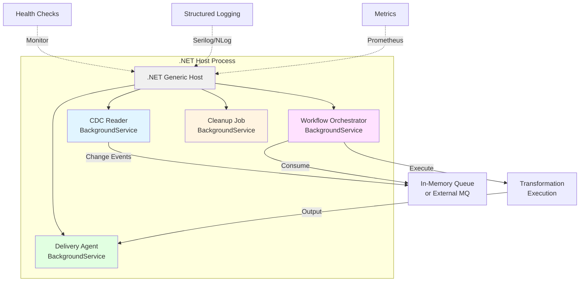
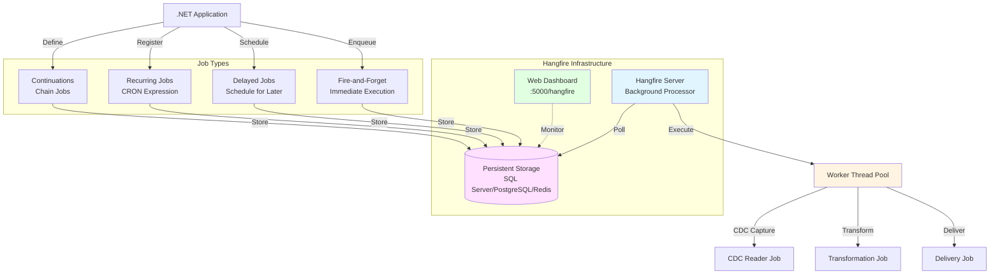
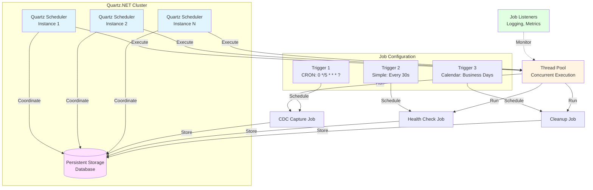
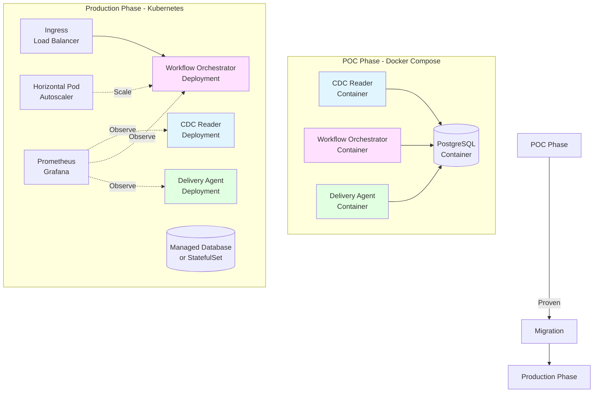
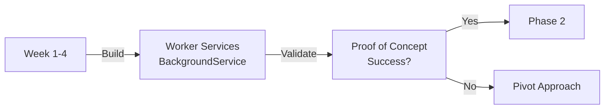
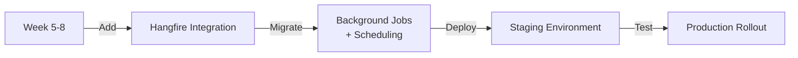
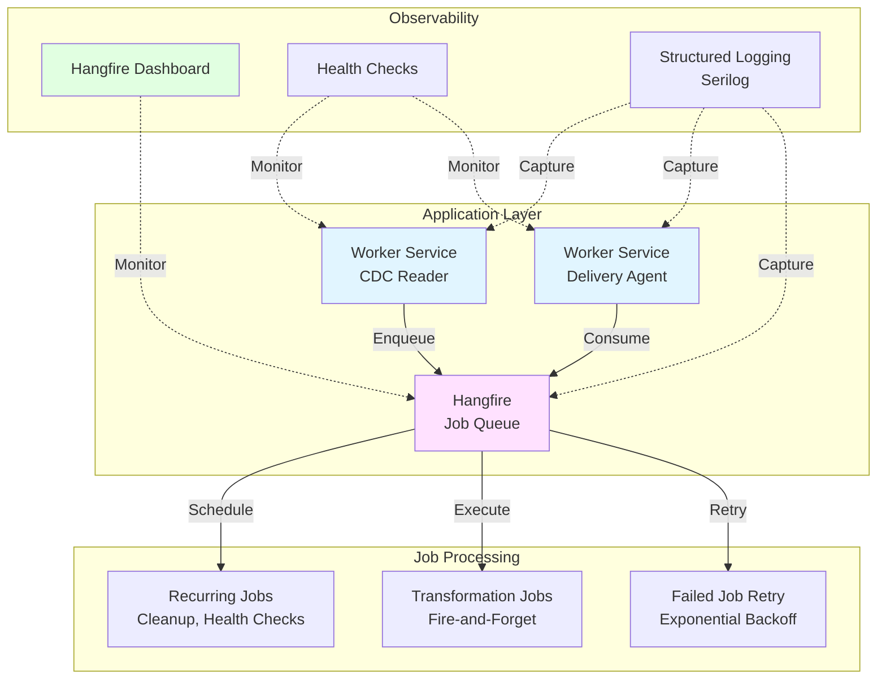
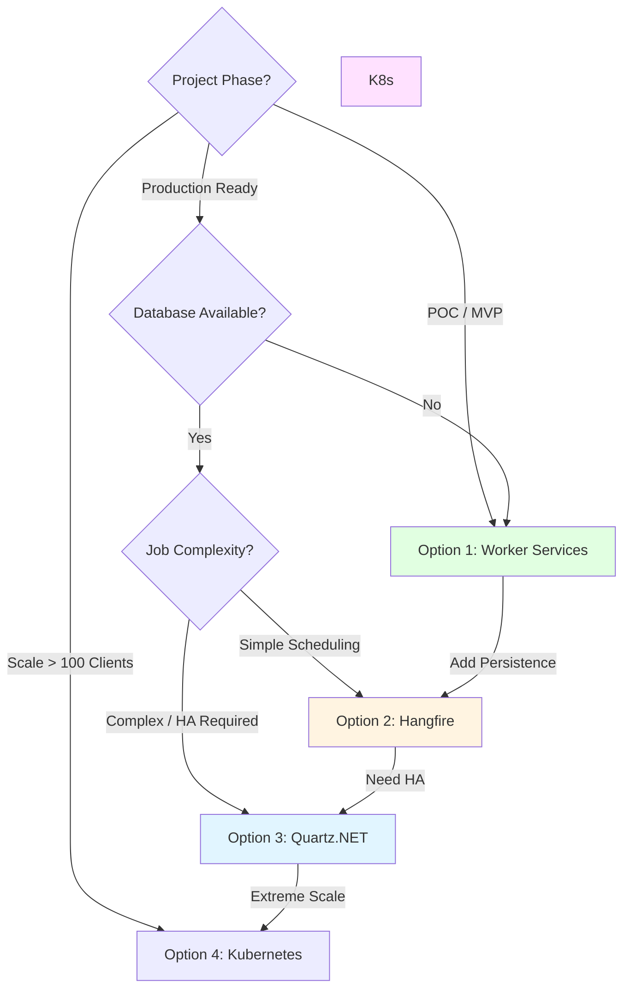

# Proposal: Execution Environment Options

**Status**: Draft  
**Created**: 2025-11-15  
**Context**: [Architecture Overview - Open Question #3](../architecture-overview.md#open-questions)

---

## Problem Statement

The platform requires an execution environment to run background services, orchestrate workflows, schedule tasks, and coordinate between CDC capture, transformation execution, and data delivery. The solution must:

1. **Execute background processes** reliably (CDC readers, workflow orchestrators, delivery agents)
2. **Schedule recurring tasks** (health checks, cleanup jobs, retry mechanisms)
3. **Coordinate workflows** across multiple clients and data sources
4. **Scale from POC to production** without requiring infrastructure redesign
5. **Provide operational visibility** (health checks, metrics, logging)
6. **Support development workflows** (local testing, debugging, staging environments)

This decision impacts:
- Infrastructure complexity and operational overhead
- Development and debugging experience
- Scalability and resource efficiency
- Deployment model and hosting flexibility
- Observability and monitoring capabilities

---

## Constraints from Personas

### Must Satisfy

| Persona | Requirement |
|---------|-------------|
| **Client** | Reliable background processing, transparent operations, no service disruptions |
| **Functional Dev** | Ability to test workflow execution locally, clear error visibility |
| **Functional QA** | Test complete workflows end-to-end, production-like staging environment |
| **Platform Team** | Simple POC deployment, scalable architecture, operational manageability |
| **Platform QA** | Automated testing of background jobs, regression coverage, staging environment parity, performance benchmarks |
| **Product Owner** | Fast time-to-market for POC, predictable scaling path, cost control |

### Must Avoid

- **Cloud vendor lock-in** (Azure Functions, AWS Lambda, GCP-specific services)
- **Complex infrastructure** during POC phase (avoid premature Kubernetes/orchestration complexity)
- **Platform opacity** where background job failures are invisible
- **Environment drift** between local development, staging, and production
- **Operational burden** requiring dedicated DevOps team from day one
- **Brittle scheduling** that fails under load or network issues
- **Test environment unavailability** preventing functional QA from validating workflows
- **Untestable background jobs** that can't be validated in automated test suites

---

## Options Analysis

### Option 1: .NET Worker Services (Native Background Services)

**Description**: Use .NET's built-in BackgroundService and IHostedService to create long-running services that execute within a .NET host process. These services can run as console apps, Windows Services, or Linux systemd daemons.



#### Technology Stack

| Component | Technology | Purpose |
|-----------|------------|---------|
| **Service Host** | [.NET Generic Host](https://learn.microsoft.com/en-us/dotnet/core/extensions/generic-host) | Application lifetime management |
| **Background Services** | [BackgroundService](https://learn.microsoft.com/en-us/dotnet/core/extensions/workers) | Base class for long-running tasks |
| **Dependency Injection** | Microsoft.Extensions.DependencyInjection | Service registration and lifecycle |
| **Configuration** | Microsoft.Extensions.Configuration | Settings management (JSON, env vars) |
| **Logging** | Microsoft.Extensions.Logging + Serilog | Structured logging |
| **Health Checks** | Microsoft.Extensions.Diagnostics.HealthChecks | Service health monitoring |
| **Deployment** | Console app, Docker, Windows Service, systemd | Cross-platform hosting |

#### Example: CDC Reader Background Service

```csharp
using Microsoft.Extensions.Hosting;
using Microsoft.Extensions.Logging;

public class CdcReaderService : BackgroundService
{
    private readonly ILogger<CdcReaderService> _logger;
    private readonly ICdcSource _cdcSource;
    private readonly IWorkflowQueue _queue;

    public CdcReaderService(
        ILogger<CdcReaderService> logger,
        ICdcSource cdcSource,
        IWorkflowQueue queue)
    {
        _logger = logger;
        _cdcSource = cdcSource;
        _queue = queue;
    }

    protected override async Task ExecuteAsync(CancellationToken stoppingToken)
    {
        _logger.LogInformation("CDC Reader Service starting...");

        try
        {
            await foreach (var changeEvent in _cdcSource.StartCapture(stoppingToken))
            {
                _logger.LogDebug("Captured change: {Table} {Operation}", 
                    changeEvent.TableName, changeEvent.Operation);
                
                await _queue.EnqueueAsync(changeEvent, stoppingToken);
            }
        }
        catch (OperationCanceledException)
        {
            _logger.LogInformation("CDC Reader Service stopping gracefully");
        }
        catch (Exception ex)
        {
            _logger.LogError(ex, "Fatal error in CDC Reader Service");
            throw; // Trigger host shutdown
        }
    }
}
```

#### Example: Host Configuration

```csharp
// Program.cs
using Microsoft.Extensions.DependencyInjection;
using Microsoft.Extensions.Hosting;

var builder = Host.CreateApplicationBuilder(args);

// Register services
builder.Services.AddSingleton<ICdcSource, SqlServerCdcSource>();
builder.Services.AddSingleton<IWorkflowQueue, InMemoryQueue>();

// Register background services
builder.Services.AddHostedService<CdcReaderService>();
builder.Services.AddHostedService<WorkflowOrchestrator>();
builder.Services.AddHostedService<DeliveryAgent>();

// Add health checks
builder.Services.AddHealthChecks()
    .AddCheck<CdcReaderHealthCheck>("cdc-reader")
    .AddCheck<DatabaseHealthCheck>("database");

// Configure logging
builder.Services.AddLogging(logging =>
{
    logging.AddConsole();
    logging.AddSerilog();
});

var host = builder.Build();
await host.RunAsync();
```

#### Deployment Options

**1. Console Application (Development/POC)**
```bash
dotnet run
```

**2. Docker Container (Staging/Production)**
```dockerfile
FROM mcr.microsoft.com/dotnet/runtime:9.0
WORKDIR /app
COPY bin/Release/net9.0/publish/ .
ENTRYPOINT ["dotnet", "DataStreamingPlatform.dll"]
```

**3. Windows Service**
```bash
sc create DataStreamingPlatform binPath="C:\Services\DataStreamingPlatform.exe"
sc start DataStreamingPlatform
```

**4. Linux systemd**
```ini
[Unit]
Description=Data Streaming Platform
After=network.target

[Service]
Type=notify
ExecStart=/usr/local/bin/DataStreamingPlatform
Restart=always

[Install]
WantedBy=multi-user.target
```

#### Pros

- ✅ **Native .NET**: Built-in framework with zero external dependencies
- ✅ **Lightweight**: Runs as a single process, minimal resource overhead
- ✅ **Simple POC deployment**: `dotnet run` locally, Docker container in staging
- ✅ **Full control**: Custom scheduling, retry logic, resource management
- ✅ **Excellent debugging**: Attach debugger, full IDE support
- ✅ **Cloud-agnostic**: Runs anywhere .NET runs (Windows, Linux, containers)
- ✅ **Graceful shutdown**: Built-in support for signal handling and cleanup
- ✅ **Dependency injection**: First-class DI container integration
- ✅ **Health checks**: Native health check endpoints for monitoring
- ✅ **Low cost**: No external infrastructure required

#### Cons

- ❌ **Manual scheduling**: No built-in CRON or delayed job support
- ❌ **No persistence**: Job state lost on restart (need external storage)
- ❌ **No distributed coordination**: Single host, no built-in clustering
- ❌ **Manual retry logic**: Must implement own retry/backoff mechanisms
- ❌ **No admin UI**: No built-in dashboard for monitoring jobs
- ❌ **Process management**: Need systemd/Windows Service for auto-restart
- ❌ **Horizontal scaling**: Requires external coordination (Redis, database)

#### When to Use

- ✅ **POC phase**: Simplest deployment model for early validation
- ✅ **Single-tenant deployments**: One platform instance per client
- ✅ **Low-volume workloads**: < 10 concurrent workflows
- ✅ **Simple scheduling**: Basic continuous polling or event-driven processing

---

### Option 2: Hangfire (Persistent Background Job Processing)

**Description**: Open-source library that provides persistent job storage, automatic retry, delayed/recurring jobs, and a web-based dashboard for monitoring. Jobs are stored in a database and executed by background worker threads.



#### Technology Stack

| Component | Technology | Purpose |
|-----------|------------|---------|
| **Core Library** | [Hangfire.Core](https://www.nuget.org/packages/Hangfire.Core/) | Job processing engine |
| **Storage** | [Hangfire.SqlServer](https://www.nuget.org/packages/Hangfire.SqlServer/) / [Hangfire.PostgreSql](https://www.nuget.org/packages/Hangfire.PostgreSql/) | Persistent job storage |
| **Alternative Storage** | [Hangfire.Redis](https://www.nuget.org/packages/Hangfire.Pro.Redis/) | High-performance storage |
| **Dashboard** | Hangfire.Dashboard (built-in) | Web UI for monitoring |
| **Deployment** | ASP.NET Core / Console App | Hosting options |
| **License** | LGPL v3 (Core) / Commercial (Pro features) | Open-source with paid extensions |

#### Example: Hangfire Configuration

```csharp
// Program.cs (ASP.NET Core)
using Hangfire;
using Hangfire.SqlServer;

var builder = WebApplication.CreateBuilder(args);

// Configure Hangfire
builder.Services.AddHangfire(config =>
{
    config.UseSqlServerStorage(
        builder.Configuration.GetConnectionString("HangfireDb"),
        new SqlServerStorageOptions
        {
            CommandBatchMaxTimeout = TimeSpan.FromMinutes(5),
            SlidingInvisibilityTimeout = TimeSpan.FromMinutes(5),
            QueuePollInterval = TimeSpan.FromSeconds(15),
            UseRecommendedIsolationLevel = true,
            DisableGlobalLocks = true
        });
});

// Add Hangfire server
builder.Services.AddHangfireServer(options =>
{
    options.WorkerCount = 10; // Concurrent job processing
});

var app = builder.Build();

// Enable dashboard
app.UseHangfireDashboard("/hangfire", new DashboardOptions
{
    Authorization = new[] { new HangfireAuthorizationFilter() }
});

app.Run();
```

#### Example: Job Definitions

```csharp
public class CdcJobService
{
    private readonly ICdcSource _cdcSource;
    private readonly IBackgroundJobClient _jobClient;

    public CdcJobService(ICdcSource cdcSource, IBackgroundJobClient jobClient)
    {
        _cdcSource = cdcSource;
        _jobClient = jobClient;
    }

    // Fire-and-forget: Immediate execution
    public async Task ProcessCdcBatch(string clientId, List<ChangeEvent> changes)
    {
        foreach (var change in changes)
        {
            // Enqueue transformation job
            _jobClient.Enqueue<TransformationService>(
                x => x.ExecuteTransformation(clientId, change));
        }
    }

    // Delayed job: Execute after 5 minutes
    public void ScheduleRetry(string workflowId)
    {
        _jobClient.Schedule<WorkflowService>(
            x => x.RetryWorkflow(workflowId),
            TimeSpan.FromMinutes(5));
    }

    // Recurring job: CRON schedule
    public void SetupRecurringJobs()
    {
        RecurringJob.AddOrUpdate<CleanupService>(
            "cleanup-old-logs",
            x => x.CleanupOldLogs(),
            Cron.Daily(2)); // 2 AM daily

        RecurringJob.AddOrUpdate<HealthCheckService>(
            "health-check",
            x => x.CheckAllWorkflows(),
            Cron.Minutely()); // Every minute
    }

    // Continuation: Chain jobs
    public void ProcessWithRetry(string workflowId)
    {
        var jobId = _jobClient.Enqueue<WorkflowService>(
            x => x.ProcessWorkflow(workflowId));

        // If job fails, schedule retry
        _jobClient.ContinueJobWith<WorkflowService>(
            jobId,
            x => x.HandleFailure(workflowId));
    }
}
```

#### Dashboard Features

- **Job Monitoring**: Real-time view of enqueued, processing, succeeded, failed jobs
- **Retry Management**: Automatic retry with exponential backoff
- **Job Details**: Execution history, parameters, exceptions, duration
- **Queue Management**: Multiple queues with different priorities
- **Server Monitoring**: Worker thread utilization, server health

#### Pros

- ✅ **Persistent job storage**: Jobs survive application restarts
- ✅ **Automatic retry**: Configurable retry policies with backoff
- ✅ **Web dashboard**: Real-time job monitoring and management
- ✅ **Rich scheduling**: Fire-and-forget, delayed, recurring (CRON), continuations
- ✅ **Open-source**: LGPL v3 license, large community (9.9K GitHub stars)
- ✅ **Battle-tested**: Used by 11.5K+ projects in production
- ✅ **No separate process**: Runs within existing .NET application
- ✅ **Multiple storage backends**: SQL Server, PostgreSQL, Redis, MySQL
- ✅ **Cloud-agnostic**: No vendor lock-in
- ✅ **Horizontal scaling**: Multiple servers can process same queue

#### Cons

- ❌ **Database dependency**: Requires persistent storage (SQL/Redis)
- ❌ **Polling overhead**: Continuous database polling for jobs
- ❌ **License consideration**: Pro features (advanced Redis, better dashboards) require commercial license
- ❌ **Dashboard security**: Must implement authorization filter
- ❌ **Complexity for simple scenarios**: Overhead for basic background tasks
- ❌ **Storage schema**: Hangfire tables in database (20+ tables)

#### When to Use

- ✅ **Multi-step workflows**: Jobs that chain together or require retries
- ✅ **Scheduled tasks**: CRON-based recurring jobs
- ✅ **Operational visibility**: Need dashboard for non-technical users
- ✅ **Medium-scale workloads**: 10-100 concurrent workflows
- ✅ **Database-backed platform**: Already using SQL Server/PostgreSQL

---

### Option 3: Quartz.NET (Enterprise Job Scheduler)

**Description**: Full-featured job scheduling library with clustering, persistence, CRON scheduling, and listener extensibility. Designed for enterprise applications requiring complex scheduling and high availability.



#### Technology Stack

| Component | Technology | Purpose |
|-----------|------------|---------|
| **Core Library** | [Quartz](https://www.nuget.org/packages/Quartz/) | Job scheduling engine |
| **ASP.NET Integration** | [Quartz.Extensions.Hosting](https://www.nuget.org/packages/Quartz.Extensions.Hosting/) | .NET Generic Host integration |
| **Persistence** | [Quartz.Serialization.Json](https://www.nuget.org/packages/Quartz.Serialization.Json/) | Job/trigger storage |
| **Storage Backends** | SQL Server, PostgreSQL, MySQL, Oracle | Database support |
| **Clustering** | Database-based locking | High availability |
| **License** | Apache 2.0 | Fully open-source |

#### Example: Quartz Configuration

```csharp
// Program.cs
using Quartz;

var builder = WebApplication.CreateBuilder(args);

// Configure Quartz
builder.Services.AddQuartz(q =>
{
    // Use JSON serialization
    q.UseMicrosoftDependencyInjectionJobFactory();
    q.UseSimpleTypeLoader();
    q.UseInMemoryStore(); // Or UsePersistentStore for database

    // Configure clustering (optional, requires database)
    q.UsePersistentStore(store =>
    {
        store.UseProperties = true;
        store.UseSqlServer(connectionString);
        store.UseJsonSerializer();
        store.UseClustering(c =>
        {
            c.CheckinInterval = TimeSpan.FromSeconds(10);
            c.CheckinMisfireThreshold = TimeSpan.FromSeconds(20);
        });
    });

    // Job 1: CDC Capture (every 5 seconds)
    q.AddJob<CdcCaptureJob>(opts => opts.WithIdentity("cdc-capture"))
        .AddTrigger(opts => opts
            .ForJob("cdc-capture")
            .WithIdentity("cdc-trigger")
            .WithSimpleSchedule(x => x
                .WithIntervalInSeconds(5)
                .RepeatForever()));

    // Job 2: Cleanup (daily at 2 AM)
    q.AddJob<CleanupJob>(opts => opts.WithIdentity("cleanup"))
        .AddTrigger(opts => opts
            .ForJob("cleanup")
            .WithIdentity("cleanup-trigger")
            .WithCronSchedule("0 0 2 * * ?"));

    // Job 3: Health Check (every minute, only on weekdays)
    q.AddJob<HealthCheckJob>(opts => opts.WithIdentity("health-check"))
        .AddTrigger(opts => opts
            .ForJob("health-check")
            .WithIdentity("health-trigger")
            .WithCronSchedule("0 * * ? * MON-FRI"));
});

// Add Quartz hosted service
builder.Services.AddQuartzHostedService(options =>
{
    options.WaitForJobsToComplete = true; // Graceful shutdown
});

var app = builder.Build();
app.Run();
```

#### Example: Job Implementation

```csharp
using Quartz;

public class CdcCaptureJob : IJob
{
    private readonly ICdcSource _cdcSource;
    private readonly IWorkflowQueue _queue;
    private readonly ILogger<CdcCaptureJob> _logger;

    public CdcCaptureJob(
        ICdcSource cdcSource,
        IWorkflowQueue queue,
        ILogger<CdcCaptureJob> logger)
    {
        _cdcSource = cdcSource;
        _queue = queue;
        _logger = logger;
    }

    public async Task Execute(IJobExecutionContext context)
    {
        var startTime = DateTime.UtcNow;
        _logger.LogInformation("CDC Capture Job starting");

        try
        {
            var changes = await _cdcSource.GetChangesSinceLastCheckpoint();
            
            foreach (var change in changes)
            {
                await _queue.EnqueueAsync(change);
            }

            await _cdcSource.SaveCheckpoint();

            var duration = DateTime.UtcNow - startTime;
            _logger.LogInformation(
                "CDC Capture completed. Captured {Count} changes in {Duration}ms",
                changes.Count, duration.TotalMilliseconds);
        }
        catch (Exception ex)
        {
            _logger.LogError(ex, "CDC Capture Job failed");
            
            // Optionally throw to trigger job retry
            var jobException = new JobExecutionException(ex)
            {
                RefireImmediately = false // Don't retry immediately
            };
            throw jobException;
        }
    }
}
```

#### Advanced Features

**1. Job Listeners (Observability)**
```csharp
public class JobMonitoringListener : IJobListener
{
    public string Name => "JobMonitoring";

    public Task JobToBeExecuted(IJobExecutionContext context, CancellationToken cancellationToken)
    {
        // Log job start, record metrics
        return Task.CompletedTask;
    }

    public Task JobWasExecuted(IJobExecutionContext context, 
        JobExecutionException? jobException, CancellationToken cancellationToken)
    {
        // Log job completion, update metrics, alert on failure
        return Task.CompletedTask;
    }

    public Task JobExecutionVetoed(IJobExecutionContext context, CancellationToken cancellationToken)
    {
        return Task.CompletedTask;
    }
}
```

**2. Calendar-Based Exclusions**
```csharp
// Define holidays calendar
var holidays = new HolidayCalendar();
holidays.AddExcludedDate(new DateTime(2025, 12, 25)); // Christmas
holidays.AddExcludedDate(new DateTime(2025, 1, 1));   // New Year

q.AddCalendar<HolidayCalendar>("holidays", holidays, true, true);

// Use calendar in trigger
q.AddTrigger(opts => opts
    .ForJob("business-day-job")
    .WithCronSchedule("0 9 * * MON-FRI")
    .ModifiedByCalendar("holidays")); // Skip holidays
```

#### Pros

- ✅ **Enterprise-grade**: Production-ready with 6.9K GitHub stars
- ✅ **Clustering support**: High availability with load balancing and failover
- ✅ **Flexible scheduling**: CRON, simple intervals, calendars, custom triggers
- ✅ **Persistent jobs**: Survive application restarts
- ✅ **Listener extensibility**: Plugin architecture for monitoring, auditing
- ✅ **Fully open-source**: Apache 2.0 license, no commercial restrictions
- ✅ **Dependency injection**: First-class .NET DI integration
- ✅ **Graceful shutdown**: Wait for jobs to complete before stopping
- ✅ **Cloud-agnostic**: No vendor lock-in
- ✅ **Mature**: 20+ years of development (Java origin, .NET port)

#### Cons

- ❌ **Database required**: Clustering and persistence need database
- ❌ **No built-in dashboard**: Must integrate third-party UI (e.g., QuartzHosted)
- ❌ **Learning curve**: Complex API for advanced features
- ❌ **Polling overhead**: Database polling for clustered triggers
- ❌ **Heavier than Hangfire**: More configuration for simple scenarios
- ❌ **Fire-and-forget limitations**: Primarily schedule-based, not queue-based

#### When to Use

- ✅ **High availability required**: Need clustering for zero downtime
- ✅ **Complex scheduling**: CRON expressions, calendar exclusions, chained jobs
- ✅ **Enterprise workloads**: 100+ scheduled jobs across multiple servers
- ✅ **Long-running jobs**: Jobs that may take hours to complete
- ✅ **Regulatory compliance**: Need job execution auditing and history

---

### Option 4: Hybrid Approach - Docker Compose (POC) → Kubernetes (Production)

**Description**: Start with simple Docker Compose for local development and POC, then migrate to Kubernetes for production scalability and orchestration. Gradual migration path that avoids premature complexity.



#### Technology Stack

| Phase | Component | Technology |
|-------|-----------|------------|
| **POC** | Orchestration | Docker Compose |
| **POC** | Containers | Multi-stage Dockerfiles |
| **POC** | Networking | Docker networks |
| **POC** | Volumes | Docker volumes for persistence |
| **Production** | Orchestration | Kubernetes (K8s) |
| **Production** | Deployment | Helm charts |
| **Production** | Service Mesh | Istio/Linkerd (optional) |
| **Production** | Monitoring | Prometheus + Grafana |
| **Production** | Logging | Fluentd/Fluent Bit + ELK/Loki |

#### Example: Docker Compose (POC)

```yaml
version: '3.8'

services:
  cdc-reader:
    build:
      context: .
      dockerfile: src/CdcReader/Dockerfile
    environment:
      - ConnectionStrings__SourceDb=Server=client-db;Database=RetailDB;...
      - ConnectionStrings__PlatformDb=Server=platform-db;Database=Platform;...
    depends_on:
      - platform-db
    restart: unless-stopped
    networks:
      - platform-network

  workflow-orchestrator:
    build:
      context: .
      dockerfile: src/WorkflowOrchestrator/Dockerfile
    ports:
      - "5000:5000"
    environment:
      - ConnectionStrings__PlatformDb=Server=platform-db;Database=Platform;...
      - Hangfire__Dashboard__Enabled=true
    depends_on:
      - platform-db
    restart: unless-stopped
    networks:
      - platform-network

  delivery-agent:
    build:
      context: .
      dockerfile: src/DeliveryAgent/Dockerfile
    environment:
      - ConnectionStrings__PlatformDb=Server=platform-db;Database=Platform;...
    depends_on:
      - platform-db
    restart: unless-stopped
    networks:
      - platform-network

  platform-db:
    image: postgres:16
    environment:
      - POSTGRES_USER=platform
      - POSTGRES_PASSWORD=platform_password
      - POSTGRES_DB=Platform
    volumes:
      - platform-db-data:/var/lib/postgresql/data
    ports:
      - "5432:5432"
    networks:
      - platform-network

  # Optional: Hangfire Dashboard (if using Option 2)
  hangfire-dashboard:
    image: nginx:alpine
    ports:
      - "8080:80"
    volumes:
      - ./nginx.conf:/etc/nginx/nginx.conf
    depends_on:
      - workflow-orchestrator
    networks:
      - platform-network

volumes:
  platform-db-data:

networks:
  platform-network:
    driver: bridge
```

**Local Development Workflow**:
```bash
# Start all services
docker-compose up -d

# View logs
docker-compose logs -f cdc-reader

# Restart service after code change
docker-compose build cdc-reader
docker-compose up -d cdc-reader

# Tear down
docker-compose down -v
```

#### Example: Kubernetes Migration (Production)

```yaml
# k8s/cdc-reader-deployment.yaml
apiVersion: apps/v1
kind: Deployment
metadata:
  name: cdc-reader
  namespace: data-streaming
spec:
  replicas: 2
  selector:
    matchLabels:
      app: cdc-reader
  template:
    metadata:
      labels:
        app: cdc-reader
    spec:
      containers:
      - name: cdc-reader
        image: registry.company.com/cdc-reader:v1.0.0
        env:
        - name: ConnectionStrings__SourceDb
          valueFrom:
            secretKeyRef:
              name: database-secrets
              key: source-db-connection
        - name: ConnectionStrings__PlatformDb
          valueFrom:
            secretKeyRef:
              name: database-secrets
              key: platform-db-connection
        resources:
          requests:
            memory: "256Mi"
            cpu: "250m"
          limits:
            memory: "512Mi"
            cpu: "500m"
        livenessProbe:
          httpGet:
            path: /health
            port: 8080
          initialDelaySeconds: 30
          periodSeconds: 10
        readinessProbe:
          httpGet:
            path: /ready
            port: 8080
          initialDelaySeconds: 10
          periodSeconds: 5
---
apiVersion: v1
kind: Service
metadata:
  name: cdc-reader
  namespace: data-streaming
spec:
  selector:
    app: cdc-reader
  ports:
  - port: 8080
    targetPort: 8080
```

#### Migration Path

**Phase 1: POC (Week 1-4)**
- Docker Compose for all services
- Local PostgreSQL database
- Single-instance services
- Manual scaling (docker-compose up --scale)

**Phase 2: Staging (Week 5-8)**
- Migrate to managed Kubernetes (AKS, EKS, GKE, or on-premise)
- Use Helm charts for deployment
- Add health checks and readiness probes
- Implement basic monitoring (Prometheus)

**Phase 3: Production Hardening (Week 9-12)**
- Horizontal Pod Autoscaler (HPA) for auto-scaling
- Service mesh for traffic management (optional)
- Centralized logging (Fluentd → Elasticsearch)
- Advanced monitoring (Grafana dashboards, alerts)
- GitOps (ArgoCD/Flux for automated deployments)

#### Pros

- ✅ **Gradual complexity**: Start simple (Docker Compose), scale when needed
- ✅ **Production-proven**: Kubernetes is industry standard for orchestration
- ✅ **Local development**: Docker Compose provides production-like environment
- ✅ **Auto-scaling**: HPA automatically adjusts replicas based on metrics
- ✅ **Self-healing**: Kubernetes restarts failed pods automatically
- ✅ **Service discovery**: Built-in DNS and load balancing
- ✅ **Rolling updates**: Zero-downtime deployments
- ✅ **Cloud-agnostic**: Runs on any Kubernetes cluster (AKS, EKS, GKE, on-prem)
- ✅ **Ecosystem**: Rich tooling (Helm, Prometheus, Istio, etc.)

#### Cons

- ❌ **Operational complexity**: Kubernetes requires dedicated expertise
- ❌ **Infrastructure overhead**: Control plane, worker nodes, networking
- ❌ **Learning curve**: Steep for teams new to Kubernetes
- ❌ **Overkill for POC**: Too complex for early validation
- ❌ **Cost**: Infrastructure costs higher than simple VMs
- ❌ **Debugging complexity**: Distributed systems harder to troubleshoot

#### When to Use

- ✅ **Long-term production**: Platform expected to scale to 100+ clients
- ✅ **High availability**: Need zero-downtime and auto-recovery
- ✅ **Multi-environment**: Dev, staging, production parity
- ✅ **Team expertise**: Team has or will invest in Kubernetes skills
- ✅ **Cloud deployment**: Platform will run on cloud providers

---

## Comparison Matrix

| Criteria | Worker Services | Hangfire | Quartz.NET | Docker → K8s |
|----------|-----------------|----------|------------|--------------|
| **POC Simplicity** | ⭐⭐⭐⭐⭐ (dotnet run) | ⭐⭐⭐⭐ (add NuGet) | ⭐⭐⭐ (config overhead) | ⭐⭐⭐ (Docker Compose) |
| **Production Scalability** | ⭐⭐ (manual scaling) | ⭐⭐⭐⭐ (horizontal) | ⭐⭐⭐⭐⭐ (clustering) | ⭐⭐⭐⭐⭐ (K8s HPA) |
| **Job Persistence** | ⭐ (none built-in) | ⭐⭐⭐⭐⭐ (database) | ⭐⭐⭐⭐⭐ (database) | ⭐⭐⭐⭐ (volumes/DB) |
| **Scheduling** | ⭐⭐ (manual timers) | ⭐⭐⭐⭐⭐ (CRON/delayed) | ⭐⭐⭐⭐⭐ (CRON/calendar) | ⭐⭐⭐ (CronJobs) |
| **Automatic Retry** | ⭐ (manual) | ⭐⭐⭐⭐⭐ (built-in) | ⭐⭐⭐⭐ (configurable) | ⭐⭐⭐ (restart policies) |
| **Admin Dashboard** | ⭐ (none) | ⭐⭐⭐⭐⭐ (web UI) | ⭐ (3rd-party) | ⭐⭐⭐⭐ (K8s dashboard) |
| **Operational Complexity** | ⭐⭐⭐⭐⭐ (minimal) | ⭐⭐⭐⭐ (add database) | ⭐⭐⭐⭐ (add database) | ⭐⭐ (K8s complexity) |
| **Resource Efficiency** | ⭐⭐⭐⭐⭐ (lightweight) | ⭐⭐⭐⭐ (polling overhead) | ⭐⭐⭐⭐ (polling overhead) | ⭐⭐⭐ (pod overhead) |
| **Debugging Experience** | ⭐⭐⭐⭐⭐ (attach debugger) | ⭐⭐⭐⭐ (logs + dashboard) | ⭐⭐⭐⭐ (logs + listeners) | ⭐⭐⭐ (distributed logs) |
| **Automated Testing** | ⭐⭐⭐⭐⭐ (integration tests) | ⭐⭐⭐⭐⭐ (in-memory storage) | ⭐⭐⭐⭐ (test scheduler) | ⭐⭐⭐ (test cluster) |
| **Cloud-Agnostic** | ⭐⭐⭐⭐⭐ (fully) | ⭐⭐⭐⭐⭐ (fully) | ⭐⭐⭐⭐⭐ (fully) | ⭐⭐⭐⭐⭐ (fully) |
| **High Availability** | ⭐ (single process) | ⭐⭐⭐⭐ (multi-server) | ⭐⭐⭐⭐⭐ (clustering) | ⭐⭐⭐⭐⭐ (K8s replicas) |
| **Learning Curve** | ⭐⭐⭐⭐⭐ (simple) | ⭐⭐⭐⭐ (straightforward) | ⭐⭐⭐ (moderate) | ⭐⭐ (K8s steep) |
| **Community/Ecosystem** | ⭐⭐⭐⭐⭐ (built-in .NET) | ⭐⭐⭐⭐⭐ (9.9K stars) | ⭐⭐⭐⭐ (6.9K stars) | ⭐⭐⭐⭐⭐ (K8s standard) |
| **License** | MIT (free) | LGPL v3 (free/paid) | Apache 2.0 (free) | Apache 2.0 (free) |
| **Infrastructure Cost** | ⭐⭐⭐⭐⭐ (minimal) | ⭐⭐⭐⭐ (database only) | ⭐⭐⭐⭐ (database only) | ⭐⭐ (K8s cluster) |

**Legend**: ⭐ Poor → ⭐⭐⭐⭐⭐ Excellent

---

## Recommendations

### Primary Recommendation: **Option 1 - Worker Services (POC) + Option 2 - Hangfire (Production)**

**Rationale**:
1. **Start simple, scale gradually**: Begin with native Worker Services for POC validation
2. **Add persistence when proven**: Migrate to Hangfire when job persistence and retry become critical
3. **Avoid vendor lock-in**: Both options are cloud-agnostic and .NET-native
4. **No premature complexity**: Defer Kubernetes until platform scales beyond 50-100 clients
5. **Best developer experience**: Full .NET stack, excellent debugging, local development
6. **Operational dashboard**: Hangfire provides built-in web UI without separate infrastructure
7. **Backward compatible**: Worker Services can coexist with Hangfire (gradual migration)

### Implementation Strategy

**Phase 1: POC (Worker Services)**


**Phase 2: Add Persistence (Hangfire)**


### Alternative for High Availability: **Option 3 - Quartz.NET with Clustering**

**When to Consider**:
- Need for high availability from day one
- Complex scheduling requirements (calendars, advanced CRON)
- Already have database infrastructure
- Team has enterprise job scheduling experience

**Cautions**:
- ⚠️ More complex than Hangfire for simple scenarios
- ⚠️ No built-in dashboard (requires third-party integration)
- ⚠️ Heavier learning curve for scheduling API

### Future-Proof Option: **Option 4 - Docker Compose → Kubernetes**

**When to Consider**:
- Platform expected to scale to 100+ clients within 12 months
- Team has or will invest in Kubernetes expertise
- Multi-cloud or hybrid cloud deployment strategy
- Need for advanced orchestration (service mesh, auto-scaling)

**Migration Timeline**:
- Month 1-3: Docker Compose POC
- Month 4-6: Migrate to managed Kubernetes
- Month 7-12: Production hardening (HPA, monitoring, GitOps)

---

## Hybrid Approach: Best of Both Worlds

### Recommended Architecture



**Benefits**:
- ✅ Continuous CDC capture in dedicated Worker Service
- ✅ Job persistence and retry via Hangfire
- ✅ Unified dashboard for all background operations
- ✅ Simple deployment (console app or Docker container)
- ✅ Scalable: Add more Worker Services or Hangfire servers as needed

---

## Implementation Phases

### Phase 1: POC with Worker Services (Week 1-2)

**Goal**: Validate core platform concepts with minimal infrastructure

1. **Create Worker Services**:
   - CDC Reader: Continuous database change capture
   - Workflow Orchestrator: Coordinate transformations
   - Delivery Agent: Send data to endpoints

2. **Local Development**:
   - `dotnet run` for each service
   - In-memory queue or basic file-based persistence
   - Console logging for observability

3. **Validation Criteria**:
   - CDC captures database changes reliably
   - Transformations execute successfully
   - Data delivered to test endpoint
   - End-to-end latency < 1 minute

### Phase 2: Add Hangfire (Week 3-4)

**Goal**: Add job persistence, scheduling, and retry capabilities

1. **Hangfire Integration**:
   - Install Hangfire NuGet packages
   - Configure SQL Server or PostgreSQL storage
   - Enable Hangfire Dashboard

2. **Migrate Jobs**:
   - Convert Worker Service polling to Hangfire recurring jobs
   - Implement fire-and-forget jobs for transformations
   - Add delayed jobs for retry logic

3. **Validation Criteria**:
   - Jobs survive application restarts
   - Automatic retry on transient failures
   - Dashboard shows job history and status
   - Recurring jobs execute on schedule

### Phase 3: Observability & Reliability (Week 5-6)

**Goal**: Production-ready monitoring and error handling

1. **Observability**:
   - Structured logging with Serilog
   - Prometheus metrics export
   - Health check endpoints
   - Custom Hangfire dashboard authorization

2. **Reliability**:
   - Retry policies with exponential backoff
   - Dead letter queue for permanently failed jobs
   - Circuit breaker for external service calls
   - Graceful shutdown handling

3. **Validation Criteria**:
   - Logs aggregated in central system (ELK, Seq, etc.)
   - Metrics scraped by Prometheus
   - Health checks accessible to load balancer
   - Failed jobs visible in dashboard

### Phase 4: Production Deployment (Week 7-8)

**Goal**: Deploy to staging and production environments

1. **Containerization**:
   - Multi-stage Dockerfiles for each service
   - Docker Compose for local/staging
   - Environment-specific configuration

2. **Deployment**:
   - CI/CD pipeline (GitHub Actions, Azure DevOps)
   - Automated testing before deployment
   - Blue-green or canary deployment strategy

3. **Validation Criteria**:
   - Staging environment mirrors production
   - Automated deployment from git push
   - Zero-downtime deployments
   - Rollback plan tested

---

## Testing Strategy

### Functional QA Testing

**Local Testing (Docker Compose)**:
```yaml
# docker-compose.test.yml - For functional QA
services:
  test-platform:
    build: .
    environment:
      - ASPNETCORE_ENVIRONMENT=Testing
      - ConnectionStrings__PlatformDb=Server=test-db;Database=TestPlatform;...
    depends_on:
      - test-db
      - test-hangfire

  test-db:
    image: postgres:16
    environment:
      - POSTGRES_DB=TestPlatform

  test-hangfire:
    build: .
    environment:
      - Hangfire__Storage=InMemory  # Fast test execution
    ports:
      - "5050:5000"  # Access dashboard during testing
```

**Integration Test Example**:
```csharp
public class WorkflowExecutionTests : IClassFixture<PlatformTestFixture>
{
    [Fact]
    public async Task CdcCapture_EnqueuesTransformationJobs()
    {
        // Arrange: Insert test data into source database
        await InsertTestTicket(new Ticket { Id = 123, Amount = 100.0m });
        
        // Act: Trigger CDC capture
        await TriggerCdcCapture();
        
        // Assert: Verify job enqueued in Hangfire
        var enqueuedJobs = await GetEnqueuedJobs();
        Assert.Contains(enqueuedJobs, j => j.Type == "TransformationJob" && j.Args.Contains("123"));
    }

    [Fact]
    public async Task BackgroundJob_RetriesOnTransientFailure()
    {
        // Arrange: Configure transformation to fail first attempt
        ConfigureTransientFailure(attemptCount: 1);
        
        // Act: Enqueue job and wait for retry
        var jobId = EnqueueJob();
        await WaitForJobCompletion(jobId, timeout: TimeSpan.FromSeconds(30));
        
        // Assert: Job succeeded on retry
        var jobState = await GetJobState(jobId);
        Assert.Equal(JobStatus.Succeeded, jobState.Status);
        Assert.Equal(2, jobState.AttemptCount); // Failed once, succeeded on retry
    }
}
```

### Platform QA Regression Testing

**Regression Test Suite**:
```csharp
public class PlatformRegressionTests
{
    // Test that platform updates don't break existing workflows
    [Theory]
    [MemberData(nameof(GetActiveWorkflowConfigurations))]
    public async Task ExistingWorkflow_StillExecutesSuccessfully(WorkflowConfig config)
    {
        // Load historical workflow configuration
        var workflow = await LoadWorkflow(config);
        
        // Execute workflow with test data
        var result = await ExecuteWorkflow(workflow, testData);
        
        // Assert: Workflow completes without errors
        Assert.True(result.Success, $"Workflow {config.Name} failed: {result.Error}");
        Assert.Equal(config.ExpectedOutputSchema, result.OutputSchema);
    }

    // Test performance benchmarks
    [Fact]
    public async Task BackgroundJobs_MeetPerformanceBenchmarks()
    {
        // Arrange: Load 100 concurrent workflows
        var workflows = Enumerable.Range(1, 100).Select(i => CreateTestWorkflow(i));
        
        // Act: Execute all workflows
        var stopwatch = Stopwatch.StartNew();
        await Task.WhenAll(workflows.Select(w => ExecuteWorkflow(w)));
        stopwatch.Stop();
        
        // Assert: All complete within 5 minutes
        Assert.True(stopwatch.Elapsed < TimeSpan.FromMinutes(5),
            $"Workflows took {stopwatch.Elapsed.TotalMinutes:F2} minutes (threshold: 5 min)");
    }

    public static IEnumerable<object[]> GetActiveWorkflowConfigurations()
    {
        // Load all production workflows for regression testing
        var workflowCatalog = LoadWorkflowCatalog();
        return workflowCatalog.Select(w => new object[] { w });
    }
}
```

**Staging Environment Parity**:
- **Database**: Use same database engine and version as production (PostgreSQL 16)
- **Job Storage**: Same Hangfire storage backend (SQL Server/PostgreSQL, not in-memory)
- **Configuration**: Load production-equivalent settings (connection strings sanitized)
- **Monitoring**: Same health checks, metrics, logging as production
- **Data Volume**: Representative dataset size (minimum 10% of production scale)

**Continuous Regression Validation**:
```yaml
# .github/workflows/regression-tests.yml
name: Platform Regression Tests

on:
  pull_request:
    branches: [main]
  schedule:
    - cron: '0 2 * * *'  # Daily at 2 AM

jobs:
  regression:
    runs-on: ubuntu-latest
    steps:
      - uses: actions/checkout@v3
      
      - name: Start Test Environment
        run: docker-compose -f docker-compose.test.yml up -d
      
      - name: Run Regression Suite
        run: dotnet test --filter "Category=Regression" --logger "trx"
      
      - name: Performance Benchmarks
        run: dotnet test --filter "Category=Performance" --logger "trx"
      
      - name: Upload Test Results
        uses: actions/upload-artifact@v3
        with:
          name: test-results
          path: '**/*.trx'
```

---

## Decision Framework



**Decision Criteria**:

| Factor | Worker Services | Hangfire | Quartz.NET | Docker→K8s |
|--------|-----------------|----------|------------|------------|
| **Project Phase** | POC/MVP | Production | Enterprise | Large Scale |
| **Client Count** | < 10 | 10-100 | 50-500 | 100+ |
| **Team Size** | 1-3 devs | 3-5 devs | 5+ devs | 10+ devs |
| **Infrastructure Budget** | Low | Medium | Medium | High |
| **Time to Deploy** | Days | 1-2 weeks | 2-3 weeks | 1-3 months |
| **HA Requirement** | No | Nice-to-have | Required | Critical |
| **K8s Expertise** | None | None | None | Required |

---

## Open Questions for Validation

1. **Job volume**: Expected jobs/minute during peak load?
   - **Impact**: Determines if Hangfire polling is acceptable or need Quartz clustering

2. **High availability**: Can platform tolerate brief downtime for updates?
   - **Impact**: Single Worker Service sufficient or need clustering/K8s

3. **Functional QA testing**: How do functional testers validate complete workflows?
   - **Solution**: Docker Compose test environment with Hangfire dashboard, integration test fixtures

4. **Platform QA regression**: How to ensure platform updates don't break existing workflows?
   - **Strategy**: Automated regression suite testing catalog of active workflows, performance benchmarks
   - **Environment**: Staging environment with production parity (same DB, same storage, same config)
   - **Coverage**: Test suite includes all client workflow configurations and transformation types

5. **Monitoring integration**: Existing monitoring stack (Prometheus, Datadog, etc.)?
   - **Implementation**: Custom metrics exporters for chosen execution environment

6. **Database infrastructure**: SQL Server, PostgreSQL, or other?
   - **Impact**: Determines Hangfire/Quartz storage provider selection

---

## Next Steps

1. **POC Implementation** (1 week):
   - Build minimal Worker Service for CDC capture
   - Test local execution with `dotnet run`
   - Measure CPU/memory footprint

2. **Hangfire Evaluation** (3 days):
   - Add Hangfire to POC project
   - Configure database storage
   - Test dashboard and job scheduling

3. **Persona Validation** (3 days):
   - **Platform Team**: Review operational complexity
   - **Functional Dev**: Validate local testing workflow
   - **Product Owner**: Confirm scaling path and costs

4. **Decision Gate**:
   - If POC successful → Proceed with Worker Services + Hangfire
   - If high availability required → Evaluate Quartz.NET
   - If scale requirements exceed estimates → Plan Kubernetes migration

---

## References

### .NET Worker Services
- [Worker Services Documentation](https://learn.microsoft.com/en-us/dotnet/core/extensions/workers)
- [BackgroundService Class](https://learn.microsoft.com/en-us/dotnet/api/microsoft.extensions.hosting.backgroundservice)
- [IHostedService Interface](https://learn.microsoft.com/en-us/dotnet/api/microsoft.extensions.hosting.ihostedservice)

### Hangfire
- [Hangfire Website](https://www.hangfire.io/)
- [Hangfire Documentation](https://docs.hangfire.io/)
- [Hangfire GitHub](https://github.com/HangfireIO/Hangfire)
- [Hangfire Dashboard](https://docs.hangfire.io/en/latest/configuration/using-dashboard.html)

### Quartz.NET
- [Quartz.NET Website](https://www.quartz-scheduler.net/)
- [Quartz.NET Documentation](https://www.quartz-scheduler.net/documentation/)
- [Quartz.NET GitHub](https://github.com/quartznet/quartznet)
- [Quartz.NET with ASP.NET Core](https://www.quartz-scheduler.net/documentation/quartz-3.x/tutorial/using-quartz.html)

### Kubernetes & Docker
- [Docker Compose Documentation](https://docs.docker.com/compose/)
- [Kubernetes Documentation](https://kubernetes.io/docs/)
- [.NET Microservices eBook](https://learn.microsoft.com/en-us/dotnet/architecture/microservices/)

### Industry Best Practices
- [Background Processing in ASP.NET Core](https://learn.microsoft.com/en-us/aspnet/core/fundamentals/host/hosted-services)
- [Building Resilient Microservices](https://learn.microsoft.com/en-us/dotnet/architecture/microservices/implement-resilient-applications/)

### Related Documents
- [Architecture Overview](../architecture-overview.md)
- [CDC Mechanism Proposal](cdc-mechanism.md)
- [Transformation Format Proposal](transformation-format.md)
- [Platform Developer Persona](../../personas/developer-platform.md)
