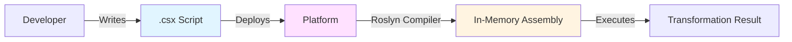
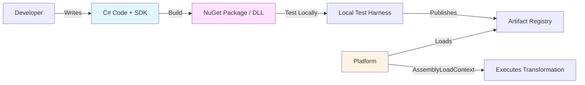
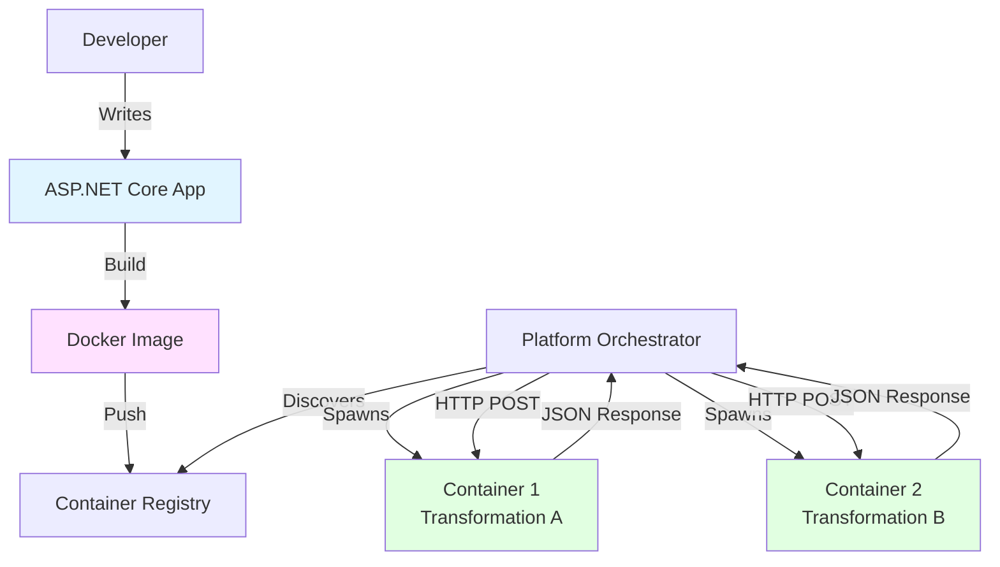
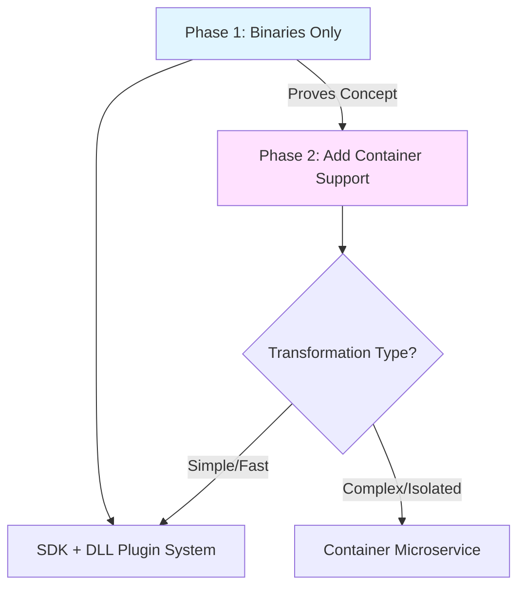

# Proposal: Transformation Format Options

**Status**: Draft  
**Created**: 2025-11-15  
**Context**: [Architecture Overview - Open Question #1](../architecture-overview.md#open-questions)

---

## Problem Statement

The Functional Team needs to deliver data transformation logic to the Platform. The team is proficient in **.NET/C#** but the platform must determine:

1. **What format** should transformations be delivered in?
2. **Where does compilation happen** (if applicable)?
3. **How is the transformation executed** by the platform?
4. **What contract/interface** ensures compatibility?

This decision impacts:
- Developer experience (local dev, testing, debugging)
- Platform complexity (hosting, security, versioning)
- Deployment workflow (CI/CD, rollback)
- Observability (error tracking, performance metrics)

---

## Constraints from Personas

### Must Satisfy

| Persona | Requirement |
|---------|-------------|
| **Functional Dev** | Local development capability, clear contract, no platform coupling |
| **Functional QA** | Local testing environment, integration testing on staging |
| **Platform Team** | Sandboxing/isolation, backward compatibility, automated deployment |
| **Platform QA** | Regression testing across all transformations, production parity |
| **Client** | Reliability, no disruption from functional team changes |

### Must Avoid

- Platform coupling that prevents local development
- Opaque execution failures
- Breaking changes to deployed transformations
- Security vulnerabilities from untrusted code execution

---

## Options Analysis

### Option 1: C# Scripts (Runtime Compilation)

**Description**: Functional team delivers `.csx` files or C# code as text. Platform compiles at runtime using Roslyn compiler.



#### Technology Stack

| Component | Technology | Purpose |
|-----------|------------|---------|
| **Script Format** | C# Script (`.csx`) | Source code delivery |
| **Compiler** | [Roslyn (Microsoft.CodeAnalysis)](https://github.com/dotnet/roslyn) | Runtime compilation |
| **Execution** | In-process via compiled assembly | Direct method invocation |
| **Sandboxing** | [AssemblyLoadContext](https://learn.microsoft.com/en-us/dotnet/api/system.runtime.loader.assemblyloadcontext) | Isolation between transformations |

#### Pros

- ✅ **Fastest iteration**: No build step, immediate deployment
- ✅ **Transparent**: Source code visible in production for debugging
- ✅ **Lightweight**: No binaries to manage
- ✅ **Version control friendly**: Plain text in git
- ✅ **Hot reload potential**: Recompile without platform restart

#### Cons

- ❌ **Performance overhead**: Compilation on first execution (can be mitigated with caching)
- ❌ **Security risk**: Unrestricted code execution if not sandboxed properly
- ❌ **Limited testing parity**: Local script runner needed to match platform behavior
- ❌ **Dependency management**: NuGet packages harder to handle (requires external references)
- ❌ **Debugging complexity**: Harder to attach debugger to runtime-compiled code

#### Industry Examples

- **Azure Functions** (C# Script support)
- **LINQPad** (C# scripting environment)
- **Jupyter .NET Interactive** (C# notebooks)

#### Open-Source References

- [Roslyn Scripting API](https://github.com/dotnet/roslyn/wiki/Scripting-API-Samples)
- [dotnet-script](https://github.com/dotnet-script/dotnet-script) - Execute C# scripts from CLI
- [CS-Script](https://github.com/oleg-shilo/cs-script) - Advanced C# scripting engine

---

### Option 2: Compiled Binaries (NuGet Packages / DLLs)

**Description**: Functional team builds and tests transformations locally, producing compiled assemblies (DLLs or NuGet packages) that implement a platform-defined SDK interface.



#### Technology Stack

| Component | Technology | Purpose |
|-----------|------------|---------|
| **SDK** | .NET Class Library (NuGet) | Defines `ITransformation` interface |
| **Build** | `dotnet build` / MSBuild | Produces DLLs |
| **Packaging** | NuGet (`.nupkg`) | Versioned distribution |
| **Loading** | [AssemblyLoadContext](https://learn.microsoft.com/en-us/dotnet/core/tutorials/creating-app-with-plugin-support) | Plugin isolation |
| **Execution** | Direct interface invocation | Type-safe method calls |

#### SDK Contract Example

```csharp
// Platform SDK (shared NuGet package)
namespace DataStreaming.SDK
{
    public interface ITransformation
    {
        string Name { get; }
        string Version { get; }
        
        Task<TransformationResult> ExecuteAsync(
            TransformationContext context, 
            CancellationToken cancellationToken);
    }
    
    public class TransformationContext
    {
        public IReadOnlyDictionary<string, object> InputData { get; init; }
        public ILogger Logger { get; init; }
        public IMetrics Metrics { get; init; }
    }
    
    public class TransformationResult
    {
        public object OutputData { get; init; }
        public TransformationStatus Status { get; init; }
        public string? ErrorMessage { get; init; }
    }
}
```

#### Pros

- ✅ **Production-ready**: Compiled, optimized code
- ✅ **Strong typing**: Compile-time contract validation
- ✅ **Full IDE support**: IntelliSense, refactoring, debugging
- ✅ **True local testing**: Exact same binary runs locally and in production
- ✅ **Dependency management**: NuGet handles versioning, transitive dependencies
- ✅ **Security**: Less attack surface (no compiler in production)
- ✅ **Performance**: No runtime compilation overhead

#### Cons

- ❌ **Build complexity**: Requires CI/CD pipeline for compilation
- ❌ **Deployment overhead**: Binary artifacts need storage/registry
- ❌ **Slower iteration**: Build → publish → deploy cycle
- ❌ **SDK coupling**: Breaking SDK changes affect all transformations
- ❌ **Versioning complexity**: Multiple transformation versions in flight

#### Industry Examples

- **Azure Durable Functions** (.NET isolated worker model)
- **AWS Lambda** (.NET runtime with compiled assemblies)
- **Plugin architectures** (VS Code extensions, .NET plugin systems)

#### Open-Source References

- [.NET Plugin Architecture](https://learn.microsoft.com/en-us/dotnet/core/tutorials/creating-app-with-plugin-support)
- [McMaster.NETCore.Plugins](https://github.com/natemcmaster/DotNetCorePlugins) - Plugin loading library
- [Nuke Build](https://github.com/nuke-build/nuke) - Build automation for .NET

---

### Option 3: Containerized Applications (REST API)

**Description**: Each transformation is a self-contained microservice packaged as a Docker container, exposing standardized REST endpoints that the platform invokes.



#### Technology Stack

| Component | Technology | Purpose |
|-----------|------------|---------|
| **Application Framework** | ASP.NET Core Minimal API | Lightweight HTTP server |
| **Containerization** | Docker | Packaging & isolation |
| **Orchestration** | Kubernetes / Docker Compose | Container lifecycle management |
| **Service Discovery** | Kubernetes Service / Consul | Endpoint discovery |
| **Contract** | OpenAPI/Swagger | REST API specification |

#### API Contract Example

```http
POST /transform HTTP/1.1
Host: transformation-service:8080
Content-Type: application/json

{
  "workflowId": "wf-12345",
  "inputData": {
    "tickets": [...],
    "products": [...]
  },
  "configuration": {
    "clientId": "client-abc"
  }
}

---

HTTP/1.1 200 OK
Content-Type: application/json

{
  "transformationId": "tx-67890",
  "outputData": {...},
  "status": "completed",
  "metrics": {
    "duration": "125ms",
    "recordsProcessed": 450
  }
}
```

#### Pros

- ✅ **Ultimate isolation**: Each transformation has own runtime, resources, dependencies
- ✅ **Language agnostic**: Could support non-.NET transformations in future
- ✅ **Scalability**: Independent horizontal scaling per transformation
- ✅ **Standard tooling**: Docker, Kubernetes ecosystem
- ✅ **True local parity**: `docker run` locally = production
- ✅ **Security**: Container sandbox, resource limits, network policies
- ✅ **Observability**: Container logs, metrics, health checks

#### Cons

- ❌ **Operational complexity**: Container orchestration, image registry, networking
- ❌ **Resource overhead**: Each container has memory/CPU footprint
- ❌ **Cold start latency**: Container spin-up time (can be mitigated with warm pools)
- ❌ **Developer burden**: Dockerfile, container knowledge required
- ❌ **Network overhead**: HTTP calls vs in-process invocation
- ❌ **Cost**: More infrastructure resources consumed

#### Industry Examples

- **Knative** (Kubernetes-based serverless containers)
- **AWS Fargate** (Serverless container execution)
- **Azure Container Apps** (Managed container platform)

#### Open-Source References

- [Dapr](https://github.com/dapr/dapr) - Distributed application runtime with sidecar pattern
- [Temporal](https://temporal.io/) - Workflow orchestration calling containerized activities
- [Kubernetes Jobs](https://kubernetes.io/docs/concepts/workloads/controllers/job/) - Batch processing pattern

---

## Comparison Matrix

| Criteria | Scripts | Binaries | Containers |
|----------|---------|----------|------------|
| **Local Dev Experience** | ⭐⭐⭐ (simple runner) | ⭐⭐⭐⭐⭐ (full IDE) | ⭐⭐⭐⭐ (Docker Desktop) |
| **Production Performance** | ⭐⭐⭐ (cache compiled) | ⭐⭐⭐⭐⭐ (AOT possible) | ⭐⭐⭐ (network latency) |
| **Deployment Speed** | ⭐⭐⭐⭐⭐ (instant) | ⭐⭐⭐ (build pipeline) | ⭐⭐ (image build/push) |
| **Isolation/Security** | ⭐⭐ (needs sandboxing) | ⭐⭐⭐ (AssemblyLoadContext) | ⭐⭐⭐⭐⭐ (container runtime) |
| **Platform Complexity** | ⭐⭐⭐ (Roslyn integration) | ⭐⭐ (plugin loading) | ⭐ (orchestration) |
| **Debugging** | ⭐⭐ (runtime code) | ⭐⭐⭐⭐⭐ (attach debugger) | ⭐⭐⭐ (remote debug) |
| **Dependency Management** | ⭐⭐ (manual refs) | ⭐⭐⭐⭐⭐ (NuGet) | ⭐⭐⭐⭐ (Dockerfile COPY) |
| **Versioning/Rollback** | ⭐⭐⭐ (file versions) | ⭐⭐⭐⭐ (NuGet versions) | ⭐⭐⭐⭐⭐ (image tags) |
| **Resource Efficiency** | ⭐⭐⭐⭐ (shared process) | ⭐⭐⭐⭐⭐ (shared process) | ⭐⭐ (per-container overhead) |
| **Test Parity** | ⭐⭐ (needs harness) | ⭐⭐⭐⭐⭐ (same DLL) | ⭐⭐⭐⭐⭐ (same image) |

**Legend**: ⭐ Poor → ⭐⭐⭐⭐⭐ Excellent

---

## Hybrid Approach Consideration

**Could we combine options?**

### Scenario: Start with Binaries, Add Containers Later



**Benefits**:
- Start simple (binaries), iterate quickly
- Add containers for edge cases (heavy dependencies, non-.NET, extreme isolation)
- Platform evolves to support both patterns

**Risks**:
- Maintaining two execution paths
- Confusion about when to use which
- More complex testing matrix

---

## Recommendations

### Recommended: **Option 2 - Compiled Binaries (NuGet Packages)**

**Rationale**:
1. **Best alignment with .NET expertise**: Functional team already knows this workflow
2. **Superior local development**: Full Visual Studio/Rider experience
3. **Production-grade quality**: Compile-time validation, unit testing, debugging
4. **Manageable platform complexity**: Well-documented .NET plugin patterns
5. **Clear upgrade path**: Can add containers later if isolation requirements grow

### Implementation Phases

#### Phase 1: MVP (Weeks 1-4)
- Define `ITransformation` SDK contract
- Publish SDK as internal NuGet package
- Create sample transformation project
- Build plugin loader using `AssemblyLoadContext`
- Implement local test harness

#### Phase 2: Developer Experience (Weeks 5-8)
- Template project (`dotnet new transformation`)
- CI/CD pipeline for automated builds
- Staging environment for integration testing
- Documentation & tutorials

#### Phase 3: Production Hardening (Weeks 9-12)
- Versioning strategy (semantic versioning)
- Rollback mechanism
- Performance monitoring
- Security sandboxing (AppDomain/AssemblyLoadContext isolation)

---

## Open Questions for Validation

1. **Dependency hell**: How do we handle conflicting NuGet package versions across transformations?
   - **Mitigation**: Each transformation in isolated `AssemblyLoadContext`

2. **SDK evolution**: How to introduce breaking changes without disrupting existing transformations?
   - **Mitigation**: SDK versioning, interface inheritance for backward compatibility

3. **Performance benchmarks**: What's acceptable transformation execution time?
   - **Need**: Performance testing framework to validate SLA targets

4. **Security boundaries**: Can functional team code crash the platform?
   - **Mitigation**: Execute transformations in separate processes or AppDomains

---

## Next Steps

1. **POC Implementation** (1 week):
   - Build minimal SDK with `ITransformation` interface
   - Create sample transformation DLL
   - Implement basic plugin loader
   - Validate local dev → platform deployment workflow

2. **Persona Validation** (3 days):
   - Demo to Functional Developer: Gather feedback on SDK usability
   - Demo to Platform Team: Review security/isolation approach
   - Demo to QA Teams: Validate testing strategy

3. **Decision Gate**:
   - If POC successful → Proceed with Phase 1 implementation
   - If blockers found → Revisit Option 1 (Scripts) or Option 3 (Containers)

---

## References

### Industry Best Practices
- [Microsoft: Plugin Architecture Guidance](https://learn.microsoft.com/en-us/dotnet/core/tutorials/creating-app-with-plugin-support)
- [Martin Fowler: Plugin Pattern](https://martinfowler.com/articles/plugins.html)
- [AWS Lambda Best Practices (.NET)](https://docs.aws.amazon.com/lambda/latest/dg/lambda-csharp.html)

### Open-Source Projects
- [McMaster.NETCore.Plugins](https://github.com/natemcmaster/DotNetCorePlugins) - .NET plugin loading
- [Roslyn Compiler API](https://github.com/dotnet/roslyn) - Runtime C# compilation
- [Dapr](https://github.com/dapr/dapr) - Distributed application building blocks
- [Temporal Workflows](https://temporal.io/) - Durable execution orchestration

### Related Documents
- [Architecture Overview](../architecture-overview.md)
- [Personas: Functional Developer](../../personas/developer-functional.md)
- [Personas: Platform Developer](../../personas/developer-platform.md)
