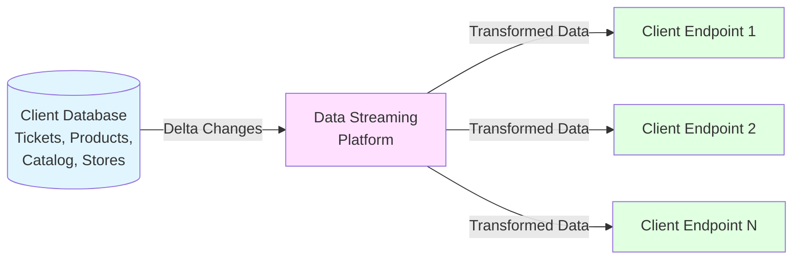
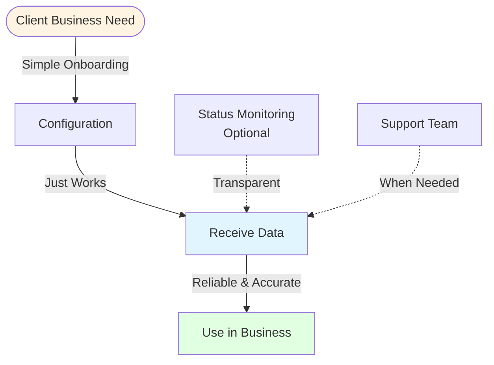
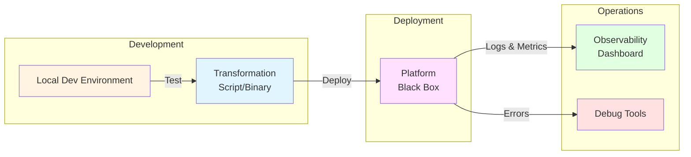
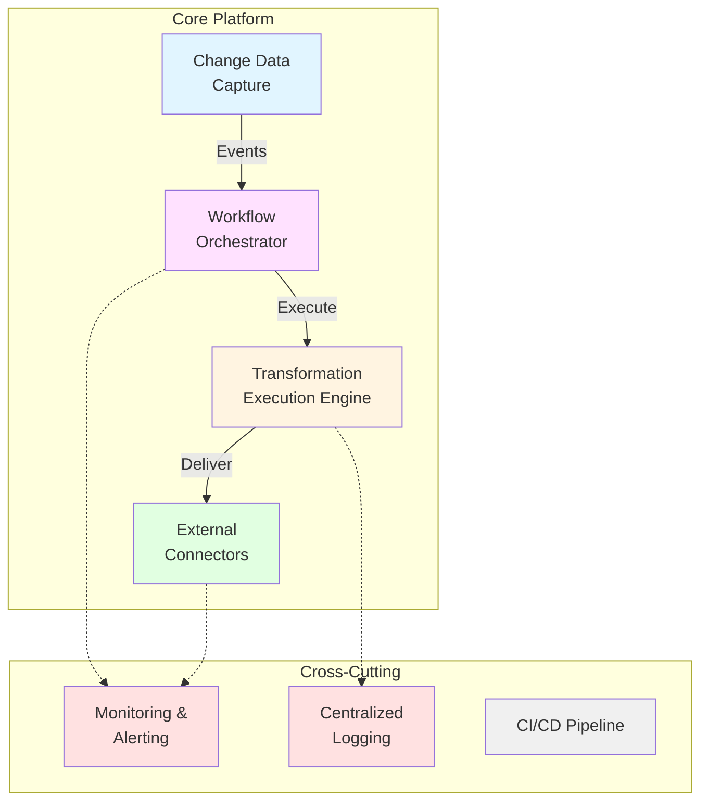
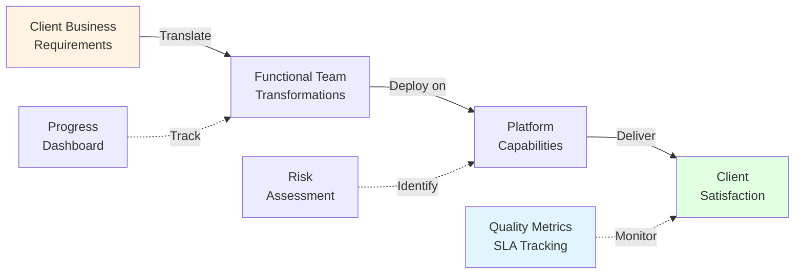
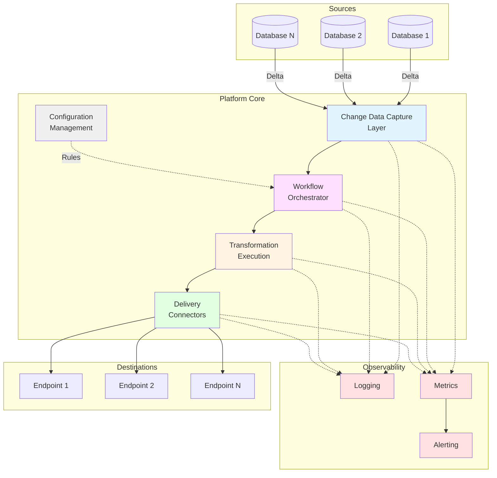
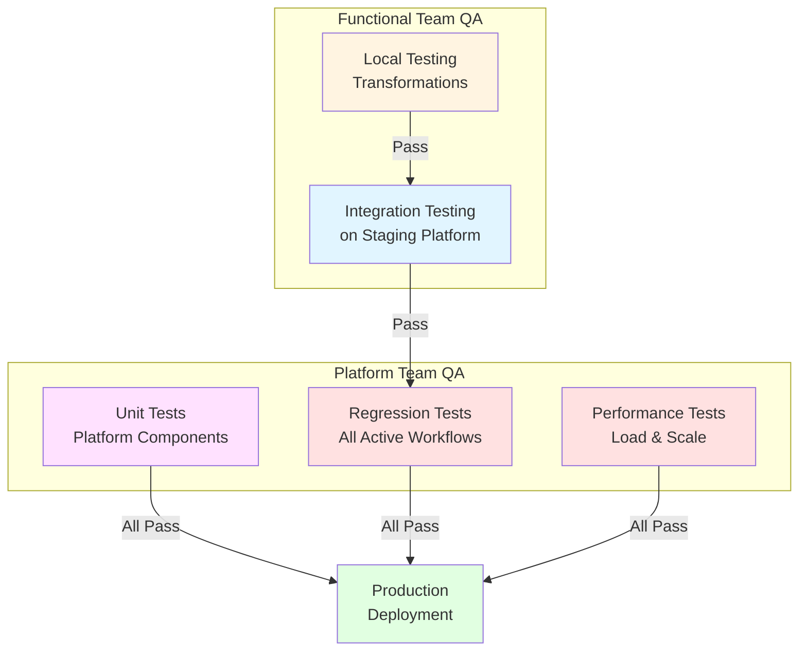

# Architecture Overview

## Purpose

This document provides a high-level architectural blueprint for the Retail Data Streaming platform—an ETL system that captures database changes, applies client-specific transformations, and delivers data to external endpoints.

**Status**: Early design phase - no technical decisions finalized

---

## System Context

**Core Function**: Capture → Transform → Deliver data reliably and independently per client.

---

## Stakeholder Views

### Client Perspective

**Key Requirements**:
- ✓ Turnkey solution (no technical knowledge needed)
- ✓ Reliable, accurate data delivery
- ✓ Isolated from other clients' operations
- ✗ No system downtime or data quality issues
- ✗ No hidden complexity or costs

---

### Functional Team Perspective

**Key Requirements**:
- ✓ Clear input/output contract
- ✓ Local development + testing capability
- ✓ Version control & rollback support
- ✓ Detailed error visibility & debugging tools
- ✗ No platform coupling or opaque failures
- ✗ No breaking changes without warning

---

### Platform Team Perspective

**Key Requirements**:
- ✓ Modular, scalable architecture
- ✓ Comprehensive monitoring & incident response
- ✓ Automated testing & deployment
- ✓ Backward compatibility guarantees
- ✗ No breaking changes to existing workflows
- ✗ No cascading failures across clients

---

### Product Owner Perspective

**Key Requirements**:
- ✓ Clear platform capabilities understanding
- ✓ Visibility into progress & quality
- ✓ Predictable delivery timelines
- ✓ SLA tracking & compliance
- ✗ No unmet expectations or hidden limitations
- ✗ No multi-client conflicts

---

## Logical Architecture

**Key Characteristics**:
- **Isolation**: Each workflow operates independently
- **Scalability**: Support multiple databases and clients in parallel
- **Observability**: Comprehensive logging and metrics at every layer
- **Reliability**: Fault tolerance and error handling throughout

---

## Component Responsibilities

| Component | Purpose | Key Concerns |
|-----------|---------|--------------|
| **Change Data Capture** | Monitor database(s) for changes in configured tables | Performance impact on source DB, reliability, delta accuracy |
| **Configuration Management** | Store and manage workflow definitions, source/destination mappings | Version control, validation, easy updates |
| **Workflow Orchestrator** | Coordinate data flow from capture to delivery per client | Parallel execution, isolation, scheduling |
| **Transformation Execution** | Run functional team scripts/binaries against captured data | Sandboxing, resource limits, error handling, debugging |
| **Delivery Connectors** | Send transformed data to client endpoints | Protocol support, retry logic, failure handling |
| **Logging & Metrics** | Capture operational data for all components | Centralization, searchability, retention |
| **Alerting** | Notify teams of issues or SLA violations | Accuracy, actionability, routing |

---

## Quality Attributes

### Must Have (Non-Negotiable)

| Attribute | Requirement | Rationale |
|-----------|-------------|-----------|
| **Reliability** | 99.9%+ uptime per workflow | Client business dependency |
| **Data Accuracy** | Zero data corruption or loss | Client trust & compliance |
| **Isolation** | Client workflows independent | Fault containment |
| **Observability** | Full visibility into all operations | Debugging & SLA compliance |
| **Backward Compatibility** | No breaking changes to deployed transformations | Functional team stability |

### Should Have (Target Goals)

| Attribute | Target | Benefit |
|-----------|--------|---------|
| **Performance** | < 5 min end-to-end latency | Client satisfaction |
| **Scalability** | Support 100+ concurrent workflows | Business growth |
| **Developer Experience** | < 1 day to develop & test transformation | Faster time-to-market |
| **Deployment Speed** | < 1 hour from code to production | Agility |
| **Self-Service** | Client status visibility without support | Reduced support burden |

---

## Testing Strategy

**Testing Requirements**:
- Functional: Local dev environment + staging platform access
- Platform: Automated regression suite covering all existing workflows
- Both: Representative test data & clear pass/fail criteria

---

## Deployment Model

```mermaid
graph LR
    DEV[Functional<br/>Developer] -->|1. Create| TRANSFORM[Transformation<br/>Code]
    TRANSFORM -->|2. Test Locally| LOCAL[Local Environment]
    LOCAL -->|3. Deploy to| STAGING[Staging Platform]
    STAGING -->|4. QA Validates| TEST_PASS{Tests Pass?}
    TEST_PASS -->|Yes| PROD[Production Platform]
    TEST_PASS -->|No| DEV
    PROD -->|5. Monitor| OBS[Observability<br/>Dashboard]
    OBS -->|6. Issues?| ROLLBACK[Automated<br/>Rollback]
    ROLLBACK -.->|Revert| PREV[Previous Version]
    
    style DEV fill:#fff4e1
    style TRANSFORM fill:#e1f5ff
    style STAGING fill:#ffe1ff
    style PROD fill:#e1ffe1
    style OBS fill:#ffe1e1
```

**Deployment Characteristics**:
- Versioned transformations with rollback capability
- Automated deployment pipeline
- Zero-downtime for platform updates
- Isolated deployment per client workflow

---

## Open Questions

### Technical Decisions Pending

1. **Transformation Format**
   - Scripts (Python, JavaScript, etc.)?
   - Compiled binaries?
   - Containerized applications?
   - Mixed approach based on use case?

2. **Change Data Capture Mechanism**
   - Database triggers?
   - Transaction log parsing?
   - Polling?
   - Third-party CDC tools?

3. **Execution Environment**
   - Serverless (e.g., AWS Lambda, Azure Functions)?
   - Container orchestration (Kubernetes)?
   - Virtual machines?
   - Hybrid?

4. **Configuration Format**
   - YAML/JSON files?
   - Database-driven?
   - UI-based configuration tool?
   - Code-as-configuration?

5. **Delivery Guarantees**
   - At-least-once?
   - Exactly-once?
   - Configurable per client?

### Personas-Driven Considerations

- **Client**: How to provide status transparency without technical complexity?
- **Functional Dev**: What contract/SDK enables local development without platform coupling?
- **Platform Dev**: How to ensure backward compatibility during platform evolution?
- **Product Owner**: What metrics/dashboard provides real-time workflow health visibility?
- **Functional QA**: How to ensure staging accurately reflects production behavior?
- **Platform QA**: How to maintain comprehensive regression coverage as workflows grow?

---

## Next Steps

1. **Requirements Analysis**: Deep-dive sessions with each persona to refine needs
2. **Technology Evaluation**: Assess tools/frameworks against quality attributes
3. **Proof of Concept**: Build minimal viable pipeline to validate core assumptions
4. **Architecture Refinement**: Update this document based on POC learnings
5. **Detailed Design**: Component-level specifications for implementation teams

---

## References

- [Personas Documentation](../personas/README.md)
